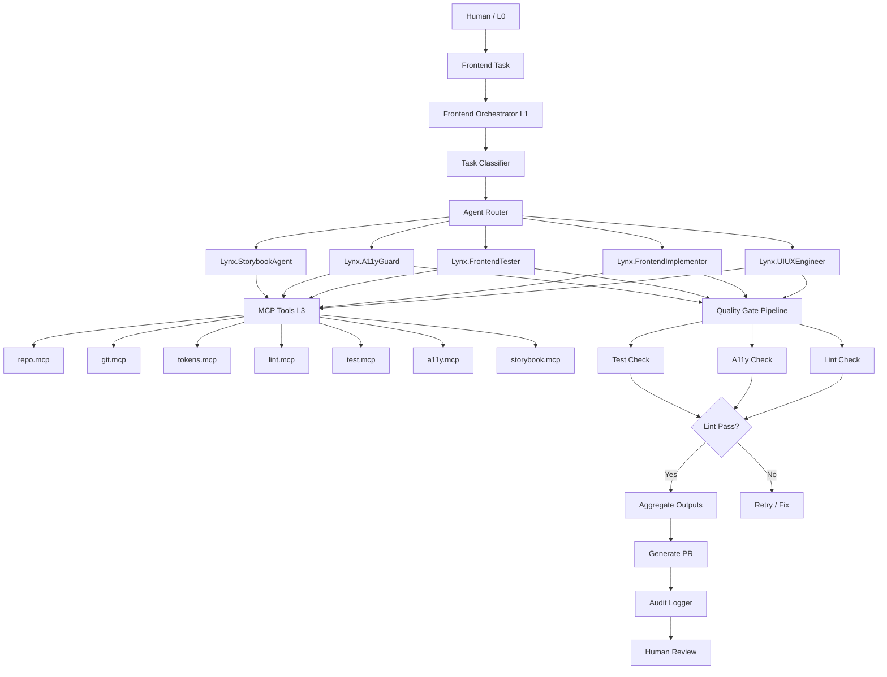

# 🧾 GRCD — Frontend Dev Orchestra — v1.0.0 (MCP‑Governed Edition)

**Version:** 1.0.0  
**Status:** Active (MCP‑Governed SSOT)  
**Last Updated:** 2025-11-29  
**Owner:** Frontend Platform Team, AI Orchestrator Team, Design System Team

> **Purpose of this GRCD**
>
> This GRCD (Governance, Risk, Compliance & Design) is the **single source of truth** for the Frontend Dev Orchestra system within AI‑BOS Nexus.
>
> It defines the orchestration layer (L1) that coordinates specialized frontend agents (L2) using MCP tools (L3) to deliver production-ready frontend code (L4) while enforcing anti-drift rules and maintaining design system compliance.
>
> **Key Anti‑Drift Mechanisms:**
> - Directory structure enforcement (Section 4)
> - Design token compliance (Section 5)
> - Master Control Prompt (MCP) governance (Section 6)
> - Agent contracts & schemas as SSOT (Section 7)
> - Explicit agent hierarchy and boundaries (Section 3)

---

## 1. Purpose & Identity

**Component Name:** `frontend-orchestrator` (Frontend Dev Orchestra)

**Domain:** `Frontend` (UI/UX + Web App Development)

### 1.1 Purpose

**Purpose Statement:**

> The Frontend Dev Orchestra is the **orchestration brain** for all frontend development within AI‑BOS Nexus. It replaces "vibe coding with AI" with a **structured, governed, and repeatable system of specialized agents** working in harmony. The orchestrator receives frontend tasks, routes them to the correct L2 agents (UI/UX Engineer, Implementor, Tester, A11y Guard, etc.), enforces anti-drift rules (tokens, directories, dependencies), and ensures all changes meet quality gates (lint, a11y, tests) before completion. It operates as a domain profile inside the `ai-orchestrator`, using MCP as the universal protocol for all agent interactions and tool access.

**Philosophical Foundation:**

The Frontend Dev Orchestra embodies the principle that **frontend development should be systematic, not chaotic**. By establishing clear agent roles, strict boundaries, and automated quality gates, we create a system where:

1. **Design Tokens Are Law:** No hardcoded colors, spacing, fonts, or visual values. All design must use approved tokens.
2. **Agents Have Clear Roles:** Each agent has a narrow, well-defined scope with explicit boundaries.
3. **Quality Is Built-In:** Lint, a11y, and tests are mandatory gates, not optional checks.
4. **Changes Are Traceable:** Every change includes Design Notes or Implementation Notes explaining patterns and decisions.
5. **Orchestrator Is the Gate:** No agent can operate directly on the repo without going through the orchestrator.

### 1.2 Identity

* **Role:** `Frontend Orchestration Coordinator & Anti-Drift Enforcer` – The orchestrator serves as the central coordinator for all frontend development tasks, routing work to specialized agents, enforcing design token compliance, and ensuring quality gates are met before completion.

* **Scope:**  
  - All frontend task routing and agent coordination.  
  - Design token validation and enforcement.  
  - Directory structure compliance.  
  - MCP tool allocation per agent per task.  
  - Quality gate enforcement (lint, a11y, tests).  
  - Audit logging for all orchestration runs.  
  - Agent output aggregation and PR generation.

* **Boundaries:**  
  - Does **NOT** execute frontend code directly.  
  - Does **NOT** design UI/UX (delegates to `Lynx.UIUXEngineer`).  
  - Does **NOT** implement business logic (delegates to `Lynx.FrontendImplementor`).  
  - Does **NOT** write tests (delegates to `Lynx.FrontendTester`).  
  - Does **NOT** modify design tokens directly (can only validate usage).

* **Non‑Responsibility:**  
  - `MUST NOT` bypass agent boundaries or allow agents to operate outside their scope.  
  - `MUST NOT` skip quality gates (lint, a11y, tests).  
  - `MUST NOT` allow hardcoded design values (must use tokens).  
  - `MUST NOT` create files in wrong directories.  
  - `MUST NOT` operate without MCP governance.

### 1.3 Non‑Negotiables (Constitutional Principles)

> These principles are **non‑negotiable** and form the constitutional foundation of the Frontend Dev Orchestra. They are testable and enforceable through automated checks.

**Constitutional Principles:**

* `MUST NOT` allow agents to operate directly on the repo without orchestrator routing.  
* `MUST NOT` skip quality gates (lint, a11y, tests) before marking tasks as "Done".  
* `MUST NOT` allow hardcoded design values (colors, spacing, fonts, radii, shadows) in frontend code.  
* `MUST NOT` allow agents to work outside their defined scope and boundaries.  
* `MUST` enforce design token usage validation on all frontend changes.  
* `MUST` require Design Notes or Implementation Notes for all UI/UX and implementation changes.  
* `MUST` enforce directory structure compliance (Section 4).  
* `MUST` validate all agent outputs are surgical diffs, not full-file rewrites (unless explicitly requested).  
* `MUST` record telemetry and audit events for every orchestration run.  
* `MUST` require MCP manifests for all agent interactions.

**MCP Governance Principles:**

* `MUST` validate all MCP tool allocations against agent scope.  
* `MUST` enforce MCP tool schemas at runtime.  
* `MUST` audit all MCP tool invocations by agents.  
* `MUST` require MCP contracts for all agent integrations.  
* `MUST` support MCP versioning and backward compatibility.

---

## 2. Requirements

### 2.1 Functional Requirements

| ID  | Requirement                                                            | Priority (MUST/SHOULD/MAY) | Status (✅/⚠️/❌/⚪) | Notes                                        |
| --- | ---------------------------------------------------------------------- | -------------------------- | ------------------- | -------------------------------------------- |
| F-1 | Orchestrator MUST route frontend tasks to correct L2 agents           | MUST                       | ✅                 | Task classification and agent selection      |
| F-2 | Orchestrator MUST enforce design token usage validation                 | MUST                       | ✅                 | Token validation via `tokens.mcp`            |
| F-3 | Orchestrator MUST enforce directory structure compliance                | MUST                       | ✅                 | Directory lint validation                    |
| F-4 | Orchestrator MUST allocate MCP tools per agent per task                 | MUST                       | ✅                 | Tool scope enforcement                       |
| F-5 | Orchestrator MUST enforce quality gates (lint, a11y, tests)           | MUST                       | ✅                 | Pre-completion validation                    |
| F-6 | Orchestrator MUST aggregate agent outputs into PR descriptions          | MUST                       | ✅                 | Design + Implementation + A11y + Testing notes |
| F-7 | Orchestrator MUST record audit events for all orchestration runs       | MUST                       | ✅                 | Immutable audit logs                         |
| F-8 | Orchestrator MUST validate agent outputs are surgical diffs            | MUST                       | ✅                 | Diff validation (not full-file rewrites)     |
| F-9 | Orchestrator MUST enforce agent boundaries and scope                   | MUST                       | ✅                 | Agent scope validation                       |
| F-10| Orchestrator MUST support agent workflow phases (UI/UX → Impl → A11y → Test → Docs) | MUST | ✅                 | Sequential agent execution                  |
| F-11| Orchestrator MUST validate MCP tool invocations against schemas          | MUST                       | ✅                 | Runtime MCP schema validation                |
| F-12| Orchestrator SHOULD support parallel agent execution where safe         | SHOULD                     | ⚪                 | Parallel execution for independent agents    |
| F-13| Orchestrator SHOULD provide agent performance metrics                   | SHOULD                     | ⚪                 | Agent execution time, success rate           |
| F-14| Orchestrator MAY support agent retry logic for transient failures      | MAY                        | ⚪                 | Retry with exponential backoff               |

### 2.2 Non‑Functional Requirements

| ID   | Requirement              | Target                                       | Measurement Source                                         | Status |
| ---- | ------------------------ | -------------------------------------------- | ---------------------------------------------------------- | ------ |
| NF-1 | Orchestration latency    | <500ms per task routing (95th percentile)    | Orchestrator metrics `frontend_orchestrator_routing_duration_seconds` | ✅     |
| NF-2 | Agent coordination time  | <2s per agent phase (95th percentile)        | Agent execution metrics                                    | ✅     |
| NF-3 | Quality gate time        | <30s for lint + a11y + tests                | Quality gate metrics                                       | ✅     |
| NF-4 | Token validation time    | <100ms per file                              | Token validation metrics                                   | ✅     |
| NF-5 | Directory lint time      | <50ms per directory check                    | Directory lint metrics                                     | ✅     |
| NF-6 | Audit log write time     | <10ms per event                              | Audit logger metrics                                       | ✅     |
| NF-7 | MCP tool allocation time | <50ms per tool allocation                   | MCP allocation metrics                                    | ⚪     |
| NF-8 | Agent output aggregation | <200ms per aggregation                      | Aggregation metrics                                        | ⚪     |

### 2.3 Compliance Requirements

| ID  | Requirement                                                         | Standard(s)                       | Evidence (what proves it)              | Status |
| --- | ------------------------------------------------------------------- | --------------------------------- | -------------------------------------- | ------ |
| C-1 | Orchestrator MUST enforce design token compliance                  | Design System Governance          | Token validation logs, audit trails    | ✅     |
| C-2 | Orchestrator MUST produce immutable audit logs for all runs         | SOC2, ISO 27001                   | Hash‑chained audit storage proof       | ✅     |
| C-3 | Orchestrator MUST enforce accessibility gates (WCAG 2.1 AA minimum)  | WCAG 2.1, Section 508, ISO 42001 | A11y audit logs, test results         | ✅     |
| C-4 | Orchestrator MUST enforce test coverage requirements                | Quality Assurance Standards       | Test coverage reports                  | ✅     |
| C-5 | Orchestrator MUST support audit trail queryability                  | SOC2, ISO 27001                   | Audit API endpoint                     | ✅     |
| C-6 | Orchestrator MUST enforce MCP manifest compliance                  | ISO 42001, AI Governance         | MCP manifest validation logs           | ⚪     |
| C-7 | Orchestrator MUST support human‑in‑the‑loop for critical decisions  | EU AI Act, ISO 42001             | Human approval audit logs              | ⚪     |

---

## 3. Architecture & Design Patterns

### 3.1 Architectural Patterns

* **Pattern(s):** `Orchestration Pattern, Agent-Based Architecture, MCP-First Governance, Quality Gate Pipeline, Anti-Drift Enforcement`

* **Justification:**  
  - **Orchestration Pattern:** Central coordinator routes tasks to specialized agents, ensuring proper sequencing and dependency management.  
  - **Agent-Based Architecture:** Each agent has a narrow, well-defined scope with explicit boundaries, preventing scope creep and ensuring maintainability.  
  - **MCP-First Governance:** All agent interactions and tool access flow through MCP, ensuring predictable behavior and auditability.  
  - **Quality Gate Pipeline:** Sequential gates (lint → a11y → tests) ensure quality is built-in, not bolted on.  
  - **Anti-Drift Enforcement:** Automated validation prevents design token violations, directory structure drift, and dependency mismatches.

**Frontend Orchestra Architecture:**

```text
┌─────────────────────────────────────────────────────────┐
│              FRONTEND ORCHESTRATOR (L1)                 │
├─────────────────────────────────────────────────────────┤
│  Task Router  │  Agent Coordinator  │  Quality Gate      │
│  Token Validator  │  Directory Lint  │  Audit Logger   │
└─────────────────────────────────────────────────────────┘
                         │
         ┌───────────────┼───────────────┐
         ▼               ▼               ▼
┌─────────────────┐ ┌─────────────────┐ ┌─────────────────┐
│  L2 AGENTS      │ │  L2 AGENTS      │ │  L2 AGENTS      │
│  UIUXEngineer   │ │  Implementor    │ │  Tester         │
│  A11yGuard      │ │  StorybookAgent │ │  Dependencies   │
└─────────────────┘ └─────────────────┘ └─────────────────┘
         │               │               │
         └───────────────┼───────────────┘
                         ▼
┌─────────────────────────────────────────────────────────┐
│              MCP TOOLS (L3)                              │
├─────────────────────────────────────────────────────────┤
│  repo.mcp  │  git.mcp  │  tokens.mcp  │  lint.mcp      │
│  test.mcp  │  a11y.mcp │  storybook.mcp                │
└─────────────────────────────────────────────────────────┘
                         │
                         ▼
┌─────────────────────────────────────────────────────────┐
│              REALITY / SURFACES (L4)                    │
├─────────────────────────────────────────────────────────┤
│  Next.js App  │  Design Tokens  │  Storybook  │  CI/CD │
└─────────────────────────────────────────────────────────┘
```

### 3.2 Component Interaction Diagram



**Description:**

* `Orchestrator`: Routes tasks to agents, enforces quality gates, aggregates outputs.  
* `Task Classifier`: Determines task type (UI/UX, Implementation, Testing, etc.).  
* `Agent Router`: Selects appropriate agents and execution order.  
* `L2 Agents`: Specialized agents with narrow scopes (UI/UX, Implementation, Testing, A11y, Docs, Dependencies).  
* `MCP Tools`: Capabilities agents can use (repo, git, tokens, lint, test, a11y, storybook).  
* `Quality Gate Pipeline`: Sequential validation (lint → a11y → tests).  
* `Aggregate`: Combines agent outputs into PR description.  
* `Audit Logger`: Records all orchestration events.

### 3.3 Agent Hierarchy (L0-L4)

**L0 — Human Vision & Governance:**
- Owner: Human (Jack) + design/product leadership
- Defines: Brand narrative, visual identity, design tokens, component principles, GRCD rules
- AI agents **must treat this as law**, not suggestion

**L1 — Frontend Orchestrator:**
- Component: `frontend-orchestrator` (domain profile inside `ai-orchestrator`)
- Responsibilities:
  - Receive frontend tasks
  - Route tasks to correct L2 agents
  - Attach correct tool & directory scopes per agent
  - Enforce anti-drift rules
  - Record telemetry and audit events

**L2 — Frontend Agents (Personas / Brains):**
- Specialized agent roles:
  - `Lynx.UIUXEngineer` — Design & Layout
  - `Lynx.FrontendImplementor` — Logic & Wiring
  - `Lynx.FrontendTester` — Testing Gatekeeper
  - `Lynx.A11yGuard` — Accessibility Specialist
  - `Lynx.StorybookAgent` — Component Docs
  - `Lynx.FrontendDependenciesAgent` — Config & Dependencies
- Each agent:
  - Has narrow, well-defined scope
  - Uses only MCP tools allocated by L1
  - Returns structured outputs (diffs, notes, reports)

**L3 — MCP Tools (Hands & Eyes):**
- MCP servers/tools agents can use:
  - `repo.mcp` — read/write diff, list files
  - `git.mcp` — create branch, commit, PR
  - `tokens.mcp` — get tokens, validate usage
  - `lint.mcp` — run ESLint, Stylelint
  - `test.mcp` — run unit/integration tests
  - `a11y.mcp` — run Axe audits
  - `storybook.mcp` — list/run stories
- L1 decides which tools are visible to each agent per task

**L4 — Reality / Surfaces:**
- Where changes become real:
  - Next.js app (components & pages)
  - Design tokens source
  - Storybook/docs
  - CI pipelines & deployments

### 3.4 State Management Model

* **Orchestrator State:**  
  - Task queue and execution state
  - Agent allocation registry
  - Quality gate status per task
  - Audit log buffer

* **Agent State:**  
  - Ephemeral per-task context
  - Tool allocation scope
  - Output buffers (diffs, notes)

* **MCP State:**  
  - MCP tool registry (frozen after boot)
  - Tool schema cache (TTL ~5 minutes)
  - Session state (ephemeral per tool invocation)

* **Caching Strategy:**  
  - Design token registry: in-memory, read-only after boot
  - MCP tool schemas: TTL cache for performance
  - Directory structure: validated on boot, cached
  - Agent output: ephemeral, cleared after aggregation

---

## 4. Directory & File Layout (Anti‑Drift for Vibe Coding)

> **CRITICAL SECTION FOR AI AGENTS**
>
> This section is critical for LLM agents. It tells them **where to write** and **how to keep structure consistent**. Without this, AI agents will create files in the wrong locations, breaking the architecture.

### 4.1 Canonical Directory Tree (Frontend-Aligned)

```text
/AIBOS-PLATFORM/                         # Repository root
  ├── orchestrator/                      # AI Orchestrator
  │   ├── domains/                      # Domain profiles
  │   │   └── frontend/                 # Frontend orchestrator
  │   │       ├── frontend-orchestrator.ts
  │   │       ├── task-classifier.ts
  │   │       ├── agent-router.ts
  │   │       ├── quality-gate.ts
  │   │       ├── token-validator.ts
  │   │       ├── directory-lint.ts
  │   │       └── agent-coordinator.ts
  │   └── ...
  ├── agents/                           # L2 Agents
  │   └── frontend/                     # Frontend agents
  │       ├── uiux-engineer/            # Lynx.UIUXEngineer
  │       │   ├── agent.ts
  │       │   ├── prompts.ts
  │       │   └── types.ts
  │       ├── frontend-implementor/     # Lynx.FrontendImplementor
  │       │   ├── agent.ts
  │       │   ├── prompts.ts
  │       │   └── types.ts
  │       ├── frontend-tester/         # Lynx.FrontendTester
  │       │   ├── agent.ts
  │       │   ├── prompts.ts
  │       │   └── types.ts
  │       ├── a11y-guard/              # Lynx.A11yGuard
  │       │   ├── agent.ts
  │       │   ├── prompts.ts
  │       │   └── types.ts
  │       ├── storybook-agent/        # Lynx.StorybookAgent
  │       │   ├── agent.ts
  │       │   ├── prompts.ts
  │       │   └── types.ts
  │       └── frontend-dependencies/   # Lynx.FrontendDependenciesAgent
  │           ├── agent.ts
  │           ├── prompts.ts
  │           └── types.ts
  ├── mcp/                              # MCP servers & tools
  │   ├── servers/                     # MCP server implementations
  │   │   ├── repo.mcp.ts
  │   │   ├── git.mcp.ts
  │   │   ├── tokens.mcp.ts
  │   │   ├── lint.mcp.ts
  │   │   ├── test.mcp.ts
  │   │   ├── a11y.mcp.ts
  │   │   └── storybook.mcp.ts
  │   └── frontend-orchestrator.mcp.json  # MCP manifest
  ├── apps/                            # Next.js applications
  │   └── web/                         # Main web app
  │       ├── app/                     # App Router
  │       ├── components/               # React components
  │       │   ├── ui/                  # UI components (presentational)
  │       │   └── containers/           # Container components (logic)
  │       ├── lib/                     # Utilities
  │       └── styles/                  # Styles (token-based)
  ├── packages/                         # Shared packages
  │   ├── design-tokens/               # Design tokens (SSOT)
  │   │   ├── tokens.json
  │   │   └── index.ts
  │   ├── ui/                         # Shared UI components
  │   └── utils/                       # Shared utilities
  ├── docs/                            # GRCD docs & ADRs
  │   └── 08-governance/
  │       └── grcd/
  │           ├── GRCD-FRONTEND-ORCHESTRA-v1.0.0.md
  │           └── agents/              # Individual agent GRCDs
  └── .storybook/                      # Storybook configuration
      └── stories/                    # Storybook stories
```

### 4.2 Directory Norms & Enforcement

* **Requirement:** Frontend orchestrator and agents MUST follow this directory layout.  
* **Validator:** `dir-lint` tool at `scripts/dir-lint.ts` (to be implemented).  
* **Conformance Test:** `T-DIR-1`: Invalid directory structure MUST fail CI.

**AI Agent Rules:**

1. Check this GRCD section for canonical location.  
2. Create files ONLY in allowed directories (see Section 4.1).  
3. If a directory doesn't exist, create it following the tree structure.  
4. Never create files in the repo root or ad‑hoc locations.  
5. Use kebab‑case naming conventions.  
6. MCP‑related files MUST go in `mcp/` subdirectories.  
7. Frontend components MUST go in `apps/web/components/` (presentational) or `apps/web/components/containers/` (logic).  
8. Design tokens MUST be in `packages/design-tokens/` (SSOT).

### 4.3 File Naming Conventions

* **TypeScript files:** `kebab-case.ts` (e.g., `frontend-orchestrator.ts`, `task-classifier.ts`).  
* **Test files:** `*.test.ts` or `*.spec.ts` (e.g., `frontend-orchestrator.test.ts`).  
* **Schema files:** `*.schema.ts` (e.g., `task.schema.ts`, `agent-output.schema.ts`).  
* **Type files:** `*.types.ts` (e.g., `orchestrator.types.ts`, `agent.types.ts`).  
* **Config files:** `*.config.ts` (e.g., `orchestrator.config.ts`).  
* **MCP files:** `*.mcp.ts` or `mcp-*.ts` (e.g., `repo.mcp.ts`, `tokens.mcp.ts`).  
* **Component files:** `ComponentName.tsx` (PascalCase) for components, `component-name.ts` (kebab-case) for utilities.

---

## 5. Dependencies & Compatibility Matrix

> **CRITICAL SECTION FOR ANTI‑DRIFT**

### 5.1 Dependency Policy

* **Lockfile Format:** `pnpm-lock.yaml`.  
* **Source of Truth:** `/orchestrator/domains/frontend/package.json`, `/pnpm-lock.yaml` (root level).  
* **Update Policy:** Dependencies updated via PR with compatibility matrix verification. Breaking changes require GRCD update and compatibility matrix review. All updates must pass CI dependency validation.  
* **Version Pinning:** Exact versions in lockfile; semantic ranges (e.g., `^4.x`, `^3.x`) in `package.json`.

### 5.2 Compatibility Matrix

| Library                  | Allowed Version Range | Tested With               | Status | Notes                             | Blocked Versions                |
| ------------------------ | --------------------- | ------------------------- | ------ | --------------------------------- | ------------------------------- |
| `typescript`             | `^5.x`                | All packages              | ✅     | Type checking (v5.9.x tested)    | `^4.x` (deprecated)             |
| `@modelcontextprotocol/sdk` | `^1.x`             | MCP servers               | ✅     | Official MCP SDK                 | `^2.x` (not tested)             |
| `zod`                    | `^3.x`                | Schema validation         | ✅     | Schema validation                 | `^4.x` (incompatible)           |
| `react`                  | `^18.x` or `^19.x`    | Next.js apps              | ✅     | React framework                   | `^17.x` (deprecated)            |
| `next`                   | `^14.x` or `^15.x`    | Web apps                  | ✅     | Next.js framework                 | `^13.x` (deprecated)            |
| `tailwindcss`            | `^3.x`                | Styling                   | ✅     | CSS framework                     | `^4.x` (not tested)             |
| `vitest`                 | `^1.x`                | Testing                   | ✅     | Test framework                    | `^2.x` (not tested)             |
| `@axe-core/react`        | `^4.x`                | A11y testing              | ✅     | Accessibility testing             | `^5.x` (not tested)             |
| `@storybook/react`       | `^8.x`                | Component docs            | ✅     | Storybook framework               | `^9.x` (not tested)             |

### 5.3 Dependency Groups

**Core Orchestration:**
- `@modelcontextprotocol/sdk` – MCP protocol support
- `zod` – Schema validation
- `typescript` – Type checking

**Frontend Runtime:**
- `react`, `next` – React and Next.js frameworks
- `tailwindcss` – CSS framework (token-based)

**Testing & Quality:**
- `vitest` – Test framework
- `@axe-core/react` – Accessibility testing
- `@testing-library/react` – React testing utilities

**Documentation:**
- `@storybook/react` – Component documentation

### 5.4 Dependency Normative Requirements

* `F-DEP-1`: All dependencies MUST align with `package.json` and `pnpm-lock.yaml`.  
* `F-DEP-2`: Incompatible dependency versions MUST block orchestrator boot and CI.  
* `F-DEP-3`: LLM agents MUST NOT introduce new dependencies without explicit manifest updates and compatibility matrix verification.  
* `F-DEP-4`: Dependency updates MUST be tested against compatibility matrix before merge.  
* `F-DEP-5`: All new dependencies MUST be added to the compatibility matrix (Section 5.2) with tested version ranges.  
* `F-DEP-6`: Design token dependencies MUST be compatible with token system version.

---

## 6. Master Control Prompt (MCP) Profile

> **CRITICAL SECTION FOR HUMAN‑AI GOVERNANCE**

### 6.1 MCP Location

* **File:** `/mcp/frontend-orchestrator.mcp.json`  
* **Hash Recorded In:** Audit log under `mcpHash` field  
* **Version:** `1.0.0`  
* **Last Updated:** `2025-11-29`

### 6.2 MCP Schema

```json
{
  "component": "frontend-orchestrator",
  "version": "1.0.0",
  "intent": "Orchestrate frontend development tasks using specialized agents, enforce design token compliance, and ensure quality gates (lint, a11y, tests) are met before completion",
  "constraints": [
    "MUST follow GRCD structure from docs/08-governance/grcd/GRCD-FRONTEND-ORCHESTRA-v1.0.0.md",
    "MUST save files only under allowed directories (see GRCD Section 4)",
    "MUST respect dependency matrix (see GRCD Section 5)",
    "MUST use TypeScript with strict mode",
    "MUST use kebab-case for file names",
    "MUST NOT create files in root directory",
    "MUST NOT introduce dependencies not in compatibility matrix",
    "MUST NOT allow hardcoded design values (must use tokens)",
    "MUST NOT skip quality gates (lint, a11y, tests)",
    "MUST NOT allow agents to operate outside their scope",
    "MUST enforce design token usage validation",
    "MUST require Design Notes or Implementation Notes for all changes",
    "MUST validate all MCP tool invocations against schemas",
    "MUST audit all orchestration runs"
  ],
  "input_sources": [
    "Frontend Dev Orchestra Reference Spec v1",
    "GRCD docs (docs/08-governance/grcd/GRCD-FRONTEND-ORCHESTRA-v1.0.0.md)",
    "Individual agent GRCDs (docs/08-governance/grcd/agents/)",
    "Design tokens (packages/design-tokens/)",
    "Codebase (apps/web/, orchestrator/domains/frontend/)",
    "MCP specification (modelcontextprotocol.io)"
  ],
  "output_targets": {
    "code": "orchestrator/domains/frontend/",
    "agents": "agents/frontend/",
    "docs": "docs/08-governance/grcd/",
    "tests": "orchestrator/domains/frontend/tests/",
    "mcp": "mcp/"
  },
  "style": {
    "normative_language": true,
    "anti_drift": true,
    "type_safety": "strict",
    "error_handling": "typed_errors",
    "logging": "structured",
    "mcp_governance": true,
    "token_compliance": true
  },
  "validation": {
    "pre_commit": [
      "TypeScript type check",
      "Directory structure validation",
      "Dependency compatibility check",
      "GRCD conformance check",
      "MCP manifest validation",
      "Design token validation",
      "Lint check",
      "A11y check",
      "Test check"
    ]
  },
  "mcp_governance": {
    "manifest_validation": true,
    "schema_enforcement": true,
    "audit_required": true,
    "version_compatibility": "semver",
    "tool_allocation": "scope_based"
  },
  "agent_coordination": {
    "sequential_phases": ["uiux", "implementation", "a11y", "testing", "docs"],
    "parallel_allowed": false,
    "retry_policy": "exponential_backoff",
    "max_retries": 2
  }
}
```

### 6.3 MCP Usage Instructions

1. **Load MCP:** Read `/mcp/frontend-orchestrator.mcp.json` at session start.  
2. **Validate MCP:** Check hash matches audit log (if available).  
3. **Load GRCD:** Read `docs/08-governance/grcd/GRCD-FRONTEND-ORCHESTRA-v1.0.0.md` for canonical specifications.  
4. **Load Agent GRCDs:** Reference individual agent GRCDs in `docs/08-governance/grcd/agents/`.  
5. **Load Design Tokens:** Reference `packages/design-tokens/` for token system.  
6. **Check Directory:** Verify file locations against GRCD Section 4.  
7. **Check Dependencies:** Verify all dependencies against GRCD Section 5.  
8. **Validate MCP Manifests:** Ensure all MCP-related code follows MCP schema.  
9. **Generate Code:** Follow MCP constraints and GRCD requirements.  
10. **Validate Output:** Run pre‑commit checks from MCP validation section.

### 6.4 MCP Normative Requirements

* `F-MCP-1`: All AI coding sessions MUST start from a valid MCP seed (`/mcp/frontend-orchestrator.mcp.json`).  
* `F-MCP-2`: MCP changes MUST be audited and hash‑logged in audit system.  
* `F-MCP-3`: MCP violation events MUST trigger alerts (e.g., file created in wrong directory, hardcoded design value, quality gate skipped).  
* `F-MCP-4`: MCP MUST reference the current GRCD version for the component (**v1.0.0**).  
* `F-MCP-5`: MCP MUST NOT be altered by autonomous AI agents – human intent is the supreme authority.  
* `F-MCP-6`: All MCP tool allocations MUST validate against agent scope.  
* `F-MCP-7`: All MCP tool invocations MUST validate against tool schemas at runtime.

---

## 7. Contracts & Schemas (MCP‑Enhanced)

### 7.1 Orchestrator Task Schema (Zod)

```ts
import { z } from "zod";

export const frontendTaskSchema = z.object({
  taskId: z.string().uuid(),
  tenantId: z.string(),
  type: z.enum(["UIUX_UPDATE", "IMPLEMENTATION", "TESTING", "A11Y_FIX", "DOCS_UPDATE", "DEPENDENCY_UPDATE"]),
  description: z.string().min(1),
  targetFiles: z.array(z.string()).optional(),
  targetRoutes: z.array(z.string()).optional(),
  priority: z.enum(["low", "medium", "high", "critical"]).default("medium"),
  metadata: z.record(z.any()).optional()
});

export type FrontendTask = z.infer<typeof frontendTaskSchema>;
```

### 7.2 Agent Output Schema (Zod)

```ts
import { z } from "zod";

export const agentOutputSchema = z.object({
  agentId: z.string(), // e.g., "Lynx.UIUXEngineer"
  taskId: z.string().uuid(),
  status: z.enum(["success", "failure", "partial"]),
  changedFiles: z.array(z.string()),
  diff: z.string(), // Surgical diff, not full-file rewrite
  notes: z.string(), // Design Notes or Implementation Notes
  errors: z.array(z.string()).optional(),
  warnings: z.array(z.string()).optional(),
  metadata: z.record(z.any()).optional()
});

export type AgentOutput = z.infer<typeof agentOutputSchema>;
```

### 7.3 Quality Gate Result Schema (Zod)

```ts
import { z } from "zod";

export const qualityGateResultSchema = z.object({
  taskId: z.string().uuid(),
  lint: z.object({
    status: z.enum(["pass", "fail", "warning"]),
    errors: z.array(z.string()).optional(),
    warnings: z.array(z.string()).optional()
  }),
  a11y: z.object({
    status: z.enum(["pass", "fail", "warning"]),
    violations: z.array(z.object({
      id: z.string(),
      severity: z.enum(["critical", "serious", "moderate", "minor"]),
      description: z.string()
    })).optional()
  }),
  tests: z.object({
    status: z.enum(["pass", "fail", "warning"]),
    coverage: z.number().min(0).max(100).optional(),
    failures: z.array(z.string()).optional()
  }),
  overall: z.enum(["pass", "fail", "warning"])
});

export type QualityGateResult = z.infer<typeof qualityGateResultSchema>;
```

### 7.4 Schema Validation Strategy

* **Schema Format:** Zod schemas in `orchestrator/domains/frontend/schemas/`.  
* **Source of Truth:** Zod schemas are SSOT; OpenAPI generated from them.  
* **Validation:**
  - All tasks validated at orchestrator entry.  
  - All agent outputs validated before aggregation.  
  - All quality gate results validated before completion.

---

## 8. Error Handling & Recovery

### 8.1 Error Taxonomy

| Error Class           | When Thrown                          | Recovery Strategy                                  | HTTP Status |
| --------------------- | ------------------------------------ | ------------------------------------------------- | ----------- |
| `OrchestratorError`   | Base class for orchestrator errors   | Log and standard 5xx response                     | 500         |
| `TaskError`           | Invalid task schema                  | Reject, audit, and guide remediation              | 400         |
| `AgentError`          | Agent execution failure              | Retry with exponential backoff, then fail         | 500         |
| `TokenError`          | Design token violation               | Block, audit, suggest token usage                 | 400         |
| `DirectoryError`      | Directory structure violation        | Block, audit, suggest correct location            | 400         |
| `QualityGateError`    | Quality gate failure                 | Block completion, return detailed failure report | 422         |
| `McpError`            | MCP protocol or schema violation     | Reject request, log MCP details, trigger alerts   | 400/422     |
| `AgentScopeError`     | Agent operating outside scope        | Block, audit, raise security alert                | 403         |

### 8.2 Retry & Circuit Breaker Policy

| Operation        | Retry Count | Backoff Strategy                | Timeout | Circuit Breaker Threshold |
| ---------------- | ----------- | ------------------------------ | ------- | ------------------------- |
| Agent execution  | 2           | Exponential (1s, 2s)           | 30s     | 5 errors/60s              |
| MCP tool call    | 3           | Exponential (500ms, 1s, 2s)    | 10s     | 10 errors/60s              |
| Quality gate     | 1           | None                           | 60s     | N/A                       |
| Token validation | 0           | None                           | 5s      | N/A                       |

---

## 9. Observability (Summary)

### 9.1 Metrics (Prometheus)

| Metric Name                                      | Type      | Labels                    | Purpose              | Target        |
| ------------------------------------------------ | --------- | ------------------------- | -------------------- | ------------- |
| `frontend_orchestrator_tasks_total`              | Counter   | type, status              | Task volume          | N/A           |
| `frontend_orchestrator_routing_duration_seconds` | Histogram | task_type                 | Routing latency      | <500ms p95    |
| `frontend_orchestrator_agent_executions_total`    | Counter   | agent, status             | Agent execution      | N/A           |
| `frontend_orchestrator_quality_gate_total`       | Counter   | gate, status              | Quality gate results | N/A           |
| `frontend_orchestrator_token_validations_total`  | Counter   | status                    | Token validation     | N/A           |
| `frontend_orchestrator_audit_events_total`       | Counter   | category, severity        | Audit event volume   | N/A           |
| `frontend_orchestrator_mcp_tool_invocations_total` | Counter | server, tool, status    | MCP tool usage       | N/A           |

### 9.2 Traces (OpenTelemetry)

* **Span Names:** `frontend.orchestrator.task`, `frontend.orchestrator.agent`, `frontend.orchestrator.quality_gate`, `frontend.orchestrator.token_validation`, `frontend.orchestrator.mcp`.  
* **Attributes:** task_id, tenant_id, task_type, agent_id, tool_name, gate_name, token_violation.

### 9.3 Logging Schema

```json
{
  "timestamp": "2025-11-29T10:30:00Z",
  "level": "info",
  "trace_id": "abc123",
  "tenant_id": "tenant-456",
  "component": "frontend-orchestrator",
  "message": "Task orchestrated successfully",
  "metadata": {
    "task_id": "task-789",
    "task_type": "UIUX_UPDATE",
    "agents_executed": ["Lynx.UIUXEngineer", "Lynx.FrontendImplementor"],
    "quality_gates": {
      "lint": "pass",
      "a11y": "pass",
      "tests": "pass"
    },
    "duration_ms": 1250,
    "files_changed": 3
  }
}
```

---

## 10. Agent Workflow & Orchestration Logic

### 10.1 Task Classification

The orchestrator classifies incoming tasks into types:

- `UIUX_UPDATE` — UI/UX design changes
- `IMPLEMENTATION` — Business logic and data wiring
- `TESTING` — Test creation or updates
- `A11Y_FIX` — Accessibility fixes
- `DOCS_UPDATE` — Documentation updates
- `DEPENDENCY_UPDATE` — Dependency management

### 10.2 Agent Selection & Routing

Based on task type, the orchestrator selects agents and execution order:

**For `UIUX_UPDATE`:**
1. `Lynx.UIUXEngineer` (design & layout)
2. `Lynx.FrontendImplementor` (wiring, if needed)
3. `Lynx.A11yGuard` (accessibility audit)
4. `Lynx.FrontendTester` (test coverage)
5. `Lynx.StorybookAgent` (documentation)

**For `IMPLEMENTATION`:**
1. `Lynx.FrontendImplementor` (logic & wiring)
2. `Lynx.FrontendTester` (test coverage)
3. `Lynx.A11yGuard` (accessibility check)

**For `TESTING`:**
1. `Lynx.FrontendTester` (test creation/updates)

**For `A11Y_FIX`:**
1. `Lynx.A11yGuard` (accessibility fixes)

**For `DOCS_UPDATE`:**
1. `Lynx.StorybookAgent` (documentation)

**For `DEPENDENCY_UPDATE`:**
1. `Lynx.FrontendDependenciesAgent` (dependency analysis)

### 10.3 Quality Gate Pipeline

All tasks must pass quality gates before completion:

1. **Lint Check:** ESLint (and optionally Stylelint) must pass
2. **A11y Check:** Axe audit must pass (WCAG 2.1 AA minimum)
3. **Test Check:** Unit/integration tests must pass

If any gate fails, the task is blocked and detailed failure report is returned.

### 10.4 Agent Output Aggregation

The orchestrator aggregates agent outputs into:
- `affectedFiles` — Union of all agent changed files
- `prDescription` — Combined Design Notes + Implementation Notes + A11y Notes + Testing Notes
- `qualityGateResults` — Lint, A11y, Test results
- `auditTrail` — Complete orchestration event log

---

## 11. Anti-Drift Rules (Must Always Hold)

To prevent the system from collapsing back into "prompt chaos", the following rules are **non-negotiable**:

1. **Tokens Are Law**
   - No agent (human or AI) may hardcode colors, spacing, fonts, radii, or shadows in frontend code.
   - All visual design must use approved tokens from `packages/design-tokens/`.

2. **Orchestrator Is the Gate**
   - No agent can operate directly on the repo without going through the orchestrator.
   - Orchestrator defines allowed tools and directories per task.

3. **Agents Work in Diffs, Not Blobs**
   - All agents must output **surgical diffs**, not full-file rewrites, unless explicitly requested.

4. **Every Change Has Notes**
   - UI/UX and implementation changes must include:
     - Design Notes or Implementation Notes.
     - What pattern was used.
     - Why this layout/structure was chosen.

5. **Lint + A11y + Tests Before Done**
   - No frontend task is considered "Done" until:
     - ESLint passes.
     - A basic a11y audit passes or is explicitly waived.
     - Unit/integration tests pass.

6. **Agent Boundaries Are Enforced**
   - Agents MUST NOT operate outside their defined scope.
   - Orchestrator MUST validate agent outputs against agent boundaries.

---

## 12. Implementation Phases

### Phase 1 — Minimal Orchestra

- One combined agent ("Frontend Brain") that internally respects:
  - Presentational vs container split.
  - Token usage rules.
- A simple orchestrator function (`orchestrateFrontendTask`) that:
  - Calls the combined agent for design + implementation.
  - Runs tests via a basic Tester function.

### Phase 2 — Split Personas

- Physically split into:
  - `Lynx.UIUXEngineer`
  - `Lynx.FrontendImplementor`
  - `Lynx.FrontendTester`
  - `Lynx.A11yGuard`
  - `Lynx.StorybookAgent`
  - `Lynx.FrontendDependenciesAgent`
- Add more precise tool & directory policies.

### Phase 3 — Advanced Quality & Metrics

- Introduce:
  - `Lynx.PerfProfiler`
  - Visual regression tooling.
  - Telemetry agent for UX metrics.

---

## 13. Testing Strategy

**Principle:** Start with **unit + integration tests only** using Vitest/Jest. Defer AI-driven E2E (Playwright/Cypress) to later phases.

- `Lynx.FrontendTester`:
  - Focuses on running `npm test` / `vitest` suites.
  - Ensures changed components/pages are covered.
  - Produces high-signal reports and missing-test suggestions.
- E2E / browser-based tests:
  - Left to human QA or future, more advanced agents.

This keeps the system:
- Fast to run.
- Understandable for LLMs.
- Less flaky than full browser automation.

---

## 14. Glossary

- **Agent:** An L2 persona (LLM + tools) with a narrow, well-defined responsibility.
- **Orchestrator:** L1 service that routes tasks to agents and enforces policies.
- **MCP (Model Context Protocol):** A protocol for exposing tools/capabilities to LLMs.
- **Design Tokens:** The single source of truth for colors, spacing, typography, radius, etc.
- **GRCD:** Governance/Requirements/Controls/Definition document that formalizes rules per component.
- **Quality Gate:** Mandatory validation step (lint, a11y, tests) before task completion.
- **Surgical Diff:** Minimal, targeted code changes (not full-file rewrites).

---

## 15. Linked Configuration Artifacts

Configuration files are **first-class GRCD artifacts** and must remain synchronized with this GRCD document.

| Artifact                          | Path                               | Config Version | Status |
|-----------------------------------|------------------------------------|----------------|--------|
| Orchestrator Config (Frontend)    | `config/orchestrator.frontend.yaml` | 1.0.0          | ✅ Active |
| Agents Config (Frontend)          | `config/agents.frontend.yaml`       | 1.0.0          | ✅ Active |
| MCP Servers Registry (Core)       | `config/mcp-servers.core.yaml`      | 1.0.0          | ✅ Active |

**Change Management:**
- Any change to configuration files must be:
  1. Reviewed under this GRCD
  2. Recorded in configuration changelog
  3. Validated for cross-file consistency
  4. Tested with golden flows (see `config/golden-tasks.md`)

**Operational Modes:**
- Configuration files support three operational modes (see `config/README.md`):
  - **Mode 0 (OFF):** Read-only analysis
  - **Mode 1 (SHADOW):** Writes to scratch only
  - **Mode 2 (GUARDED ACTIVE):** Full operation with HITL

**Related Documentation:**
- `config/README.md` — Configuration usage guide
- `config/VALIDATION_REPORT.md` — Validation results
- `config/golden-tasks.md` — Golden flow definitions
- `config/orchestra.run.md` — Run playbook
- `config/loader.ts` — TypeScript configuration loader

---

## 16. References

- **Frontend Dev Orchestra Reference Spec v1** — Human-approved baseline specification
- **GRCD Template v4** — Template structure for GRCD documents
- **GRCD-KERNEL v4.0.0** — Kernel GRCD for MCP governance patterns
- **Individual Agent GRCDs** — See `docs/08-governance/grcd/agents/` for agent-specific GRCDs

---

> ✅ **Status:** GRCD-FRONTEND-ORCHESTRA has been created as **v1.0.0** and serves as the **SSOT** for the Frontend Dev Orchestra system. All future AI-generated code and agent configurations must remain consistent with this GRCD, unless explicitly superseded by a newer human-approved version.

