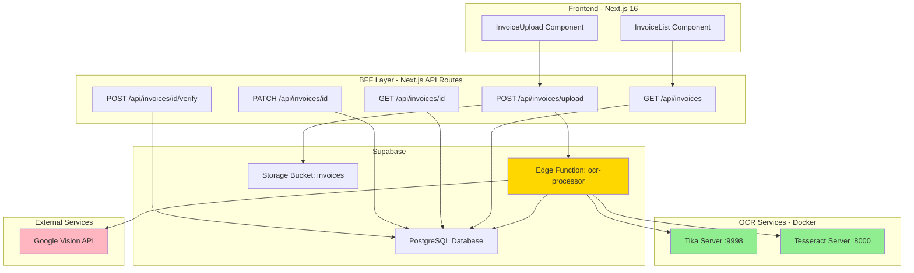

# 🎯 BFF Complete Implementation Guide & Development Flow

**Date:** November 27, 2025  
**Status:** Production-Ready Architecture  
**Next Phase:** OCR Integration + Testing  

---

## 📋 Current BFF Status

### ✅ **What's Already Implemented**

1. **Multi-Tenant Database** ✅
   - `invoices`, `invoice_line_items`, `invoice_comments`, `suppliers` tables
   - RLS policies (16 total: 12 database + 4 storage)
   - Performance optimized
   - Migration files: `016`, `017`, `018`

2. **BFF API Endpoints** ✅
   - `POST /api/invoices/upload` - File upload with tenant isolation
   - `GET /api/invoices` - List invoices (filtered by tenant)
   - `GET /api/invoices/[id]` - Get single invoice
   - `PATCH /api/invoices/[id]` - Update invoice
   - `DELETE /api/invoices/[id]` - Delete invoice
   - `POST /api/invoices/[id]/verify` - Verify/approve invoice

3. **Authentication & Multi-Tenancy** ✅
   - JWT-based auth with Supabase
   - `tenant_id` extraction from session
   - Cross-tenant access prevention

4. **Frontend Components** ✅
   - `InvoiceUpload.tsx` - File upload with drag-and-drop
   - `InvoiceList.tsx` - Invoice listing with filters

5. **OCR Strategy Defined** ✅
   - 3-tier fallback: Tika → Tesseract → Google Vision
   - Cost optimization (90% free coverage)
   - Smart-ledger-pro integration

---

## 🚧 **What Needs to be Implemented**

### **Phase 1: OCR Services Deployment** (Current Priority)

#### 1.1 Create OCR Service Structure

```bash
# Project structure to create
AIBOS-PLATFORM/
├── docker-compose.yml          # ← Create this
├── ocr-service/                # ← Create this folder
│   ├── Dockerfile
│   ├── main.py
│   └── requirements.txt
├── supabase/
│   └── functions/
│       └── ocr-processor/      # ← Create this
│           └── index.ts
└── apps/web/
    └── app/api/invoices/
        └── upload/route.ts     # ← Update with OCR trigger
```

#### 1.2 Implementation Checklist

- [ ] Create `docker-compose.yml` for Tika + Tesseract
- [ ] Create `ocr-service/` folder with Python FastAPI service
- [ ] Create `supabase/functions/ocr-processor/` Edge Function
- [ ] Update `apps/web/app/api/invoices/upload/route.ts` to trigger OCR
- [ ] Add environment variables to `.env.local`
- [ ] Deploy and test

---

## 🏗️ **Complete Architecture Overview**



---

## 📝 **Development Flow (DevFlow)**

### **Step-by-Step Implementation**

```
┌─────────────────────────────────────────────────────────┐
│ PHASE 1: OCR Services Setup (2-3 days)                 │
└─────────────────────────────────────────────────────────┘
   │
   ├─ Day 1: Docker Services
   │  ├─ Create docker-compose.yml
   │  ├─ Create ocr-service/ (Tesseract FastAPI)
   │  └─ Test: docker-compose up -d
   │
   ├─ Day 2: Supabase Edge Function
   │  ├─ Create supabase/functions/ocr-processor/
   │  ├─ Implement 3-tier fallback logic
   │  ├─ Add Google Vision integration
   │  └─ Deploy: supabase functions deploy ocr-processor
   │
   └─ Day 3: BFF Integration
      ├─ Update upload/route.ts to call Edge Function
      ├─ Test with sample invoices
      └─ Verify OCR results in database

┌─────────────────────────────────────────────────────────┐
│ PHASE 2: Invoice Data Parsing (2-3 days)               │
└─────────────────────────────────────────────────────────┘
   │
   ├─ Day 1: Enhanced Regex Parsing
   │  ├─ Improve invoice number extraction
   │  ├─ Improve supplier name extraction
   │  └─ Add line item parsing
   │
   ├─ Day 2: NLP Enhancement (Optional)
   │  ├─ Integrate GPT-4 for structured extraction
   │  └─ Add confidence scoring
   │
   └─ Day 3: Supplier Matching
      ├─ Auto-match suppliers from database
      └─ Suggest new suppliers for approval

┌─────────────────────────────────────────────────────────┐
│ PHASE 3: Workflow Automation (3-4 days)                │
└─────────────────────────────────────────────────────────┘
   │
   ├─ Day 1-2: Approval Workflow
   │  ├─ Email notifications for pending invoices
   │  ├─ Role-based approval (verifier → approver)
   │  └─ Rejection flow with comments
   │
   ├─ Day 3: GL Account Validation
   │  ├─ Add GL account table
   │  ├─ Validate line items against GL accounts
   │  └─ Flag missing/invalid accounts
   │
   └─ Day 4: Duplicate Detection
      ├─ Check for duplicate invoice numbers
      └─ Fuzzy matching for similar invoices

┌─────────────────────────────────────────────────────────┐
│ PHASE 4: Analytics & Reporting (2-3 days)              │
└─────────────────────────────────────────────────────────┘
   │
   ├─ Day 1: Cost Analytics Dashboard
   │  ├─ OCR cost breakdown by method
   │  ├─ Cost allocation per tenant
   │  └─ Usage trends
   │
   ├─ Day 2: Invoice Analytics
   │  ├─ Processing time metrics
   │  ├─ OCR accuracy tracking
   │  └─ Supplier spending analysis
   │
   └─ Day 3: Export & Reporting
      ├─ Export to Excel/CSV
      └─ Generate AP aging reports

┌─────────────────────────────────────────────────────────┐
│ PHASE 5: Production Hardening (2-3 days)               │
└─────────────────────────────────────────────────────────┘
   │
   ├─ Day 1: Error Handling
   │  ├─ Graceful OCR failures
   │  ├─ Retry logic for failed uploads
   │  └─ Dead letter queue for failures
   │
   ├─ Day 2: Performance Optimization
   │  ├─ Add Redis caching
   │  ├─ Implement request queuing
   │  └─ Load testing (100+ concurrent uploads)
   │
   └─ Day 3: Security Audit
      ├─ Penetration testing
      ├─ Rate limiting
      └─ API key rotation
```

---

## 🚀 **Immediate Next Steps (Start Here)**

### **Step 1: Create Docker Compose for OCR Services**

Create `docker-compose.yml` in the root:

```yaml
version: "3.8"

services:
  # Apache Tika Server (Tier 1 OCR)
  tika-server:
    image: apache/tika:latest-full
    container_name: aibos-tika-server
    ports:
      - "9998:9998"
    environment:
      - TIKA_CONFIG=/config/tika-config.xml
    healthcheck:
      test: ["CMD", "curl", "-f", "http://localhost:9998/tika"]
      interval: 30s
      timeout: 10s
      retries: 3
    restart: unless-stopped
    networks:
      - aibos-network

  # Tesseract OCR Server (Tier 2 OCR)
  tesseract-ocr:
    build:
      context: ./ocr-service
      dockerfile: Dockerfile
    container_name: aibos-tesseract-ocr
    ports:
      - "8000:8000"
    environment:
      - TESSDATA_PREFIX=/usr/share/tesseract-ocr/4.00/tessdata
      - LOG_LEVEL=INFO
    healthcheck:
      test: ["CMD", "curl", "-f", "http://localhost:8000/health"]
      interval: 30s
      timeout: 10s
      retries: 3
    restart: unless-stopped
    networks:
      - aibos-network

networks:
  aibos-network:
    driver: bridge
```

**Deploy:**
```bash
docker-compose up -d
```

---

### **Step 2: Create Tesseract OCR Service**

Create folder structure:

```bash
mkdir -p ocr-service
cd ocr-service
```

Create `ocr-service/Dockerfile`:

```dockerfile
FROM python:3.11-slim

# Install Tesseract and dependencies
RUN apt-get update && \
    apt-get install -y \
      tesseract-ocr \
      tesseract-ocr-eng \
      libtesseract-dev \
      curl \
      poppler-utils && \
    rm -rf /var/lib/apt/lists/*

WORKDIR /app

COPY requirements.txt .
RUN pip install --no-cache-dir -r requirements.txt

COPY main.py .

EXPOSE 8000

CMD ["uvicorn", "main:app", "--host", "0.0.0.0", "--port", "8000", "--workers", "2"]
```

Create `ocr-service/requirements.txt`:

```txt
fastapi==0.109.0
uvicorn[standard]==0.27.0
pytesseract==0.3.10
Pillow==10.2.0
python-multipart==0.0.6
pdf2image==1.16.3
```

Create `ocr-service/main.py`:

```python
from fastapi import FastAPI, UploadFile, File, HTTPException
from fastapi.responses import JSONResponse
from PIL import Image
import pytesseract
import io
import logging

app = FastAPI(
    title="AIBOS Tesseract OCR Service",
    description="OCR service for invoice processing",
    version="1.0.0"
)

logging.basicConfig(level=logging.INFO)
logger = logging.getLogger(__name__)

@app.get("/")
async def root():
    return {"service": "AIBOS Tesseract OCR", "status": "running"}

@app.get("/health")
async def health_check():
    return {
        "status": "healthy",
        "service": "tesseract-ocr",
        "version": pytesseract.get_tesseract_version()
    }

@app.post("/ocr")
async def perform_ocr(file: UploadFile = File(...)):
    """
    Perform OCR on uploaded image or PDF
    Returns: text, confidence, metadata
    """
    try:
        logger.info(f"Processing file: {file.filename}, content_type: {file.content_type}")
        
        # Read file
        file_bytes = await file.read()
        
        # Handle PDF vs Image
        if file.content_type == "application/pdf":
            # Convert PDF to image (first page only for now)
            from pdf2image import convert_from_bytes
            images = convert_from_bytes(file_bytes, first_page=1, last_page=1)
            image = images[0]
        else:
            # Open as image
            image = Image.open(io.BytesIO(file_bytes))
        
        logger.info(f"Image size: {image.size}, mode: {image.mode}")
        
        # Perform OCR
        text = pytesseract.image_to_string(image, config='--psm 1')
        
        # Get detailed data with confidence
        data = pytesseract.image_to_data(
            image,
            output_type=pytesseract.Output.DICT,
            config='--psm 1'
        )
        
        # Calculate average confidence (skip -1 values which mean no text)
        confidences = [c for c in data['conf'] if c != -1]
        avg_confidence = sum(confidences) / len(confidences) if confidences else 0
        
        logger.info(f"OCR completed: {len(text)} chars, confidence: {avg_confidence:.2f}%")
        
        return JSONResponse({
            "success": True,
            "text": text,
            "confidence": round(avg_confidence, 2),
            "method": "tesseract",
            "metadata": {
                "char_count": len(text),
                "word_count": len(text.split()),
                "line_count": len(text.split('\n')),
                "has_numbers": any(c.isdigit() for c in text),
                "has_currency": any(c in '$£€¥' for c in text),
            }
        })
        
    except Exception as e:
        logger.error(f"OCR error: {str(e)}", exc_info=True)
        raise HTTPException(
            status_code=500,
            detail={"error": str(e), "method": "tesseract"}
        )

@app.post("/ocr-with-layout")
async def ocr_with_layout(file: UploadFile = File(...)):
    """
    OCR with bounding box information - useful for structured data extraction
    """
    try:
        file_bytes = await file.read()
        
        if file.content_type == "application/pdf":
            from pdf2image import convert_from_bytes
            images = convert_from_bytes(file_bytes, first_page=1, last_page=1)
            image = images[0]
        else:
            image = Image.open(io.BytesIO(file_bytes))
        
        # Get detailed layout data
        data = pytesseract.image_to_data(
            image,
            output_type=pytesseract.Output.DICT,
            config='--psm 1'
        )
        
        # Filter out empty entries and structure the results
        results = []
        for i in range(len(data['text'])):
            if data['conf'][i] != -1 and data['text'][i].strip():
                results.append({
                    'text': data['text'][i],
                    'confidence': data['conf'][i],
                    'bbox': {
                        'left': data['left'][i],
                        'top': data['top'][i],
                        'width': data['width'][i],
                        'height': data['height'][i],
                    },
                    'level': data['level'][i],
                })
        
        return JSONResponse({
            "success": True,
            "results": results,
            "method": "tesseract-layout",
            "total_words": len(results)
        })
        
    except Exception as e:
        logger.error(f"Layout OCR error: {str(e)}", exc_info=True)
        raise HTTPException(
            status_code=500,
            detail={"error": str(e)}
        )
```

**Test the service:**

```bash
# Build and start
docker-compose up -d tesseract-ocr

# Test health endpoint
curl http://localhost:8000/health

# Test OCR (with a sample image)
curl -X POST http://localhost:8000/ocr \
  -F "file=@sample-invoice.pdf"
```

---

### **Step 3: Create Supabase Edge Function**

Create folder:

```bash
mkdir -p supabase/functions/ocr-processor
```

**Copy the complete Edge Function code from `OCR_PRIORITY_FALLBACK_IMPLEMENTATION.md`** into:

```
supabase/functions/ocr-processor/index.ts
```

Deploy:

```bash
# Set secrets
supabase secrets set GOOGLE_CLOUD_CREDENTIALS='{"type":"service_account",...}'
supabase secrets set TIKA_SERVER_URL='http://tika-server:9998'
supabase secrets set TESSERACT_SERVER_URL='http://tesseract-ocr:8000'

# Deploy function
supabase functions deploy ocr-processor
```

---

### **Step 4: Update BFF Upload Endpoint**

Modify `apps/web/app/api/invoices/upload/route.ts`:

```typescript
// Change the triggerOCR function to call the new Edge Function

async function triggerOCR(invoiceId: string, filePath: string): Promise<void> {
  try {
    const response = await fetch(
      `${process.env.SUPABASE_URL}/functions/v1/ocr-processor`,
      {
        method: 'POST',
        headers: {
          'Authorization': `Bearer ${process.env.SUPABASE_SERVICE_ROLE_KEY}`,
          'Content-Type': 'application/json',
        },
        body: JSON.stringify({ invoiceId, filePath }),
      }
    );

    if (!response.ok) {
      const error = await response.json();
      throw new Error(`OCR Edge Function failed: ${error.message}`);
    }

    const result = await response.json();
    console.log(`[OCR] Processing initiated for invoice ${invoiceId}`, result);
  } catch (error) {
    console.error(`[OCR] Failed to trigger OCR for invoice ${invoiceId}:`, error);
    // Update invoice status to failed
    const supabase = createServerClient();
    await supabase
      .from('invoices')
      .update({ ocr_status: 'failed', ocr_error: error.message })
      .eq('id', invoiceId);
  }
}
```

---

## 📊 **What to Develop Next (Priority Order)**

### **Immediate (Week 1-2)**

1. ✅ **OCR Services Deployment** (Steps above)
2. 🔄 **Test End-to-End Flow**
   - Upload invoice → OCR processing → Data extraction
   - Verify multi-tenant isolation
   - Check cost tracking

3. 🔄 **Enhanced Invoice Parsing**
   - Better regex patterns for invoice numbers
   - Line item extraction from tables
   - Date normalization

### **Short-term (Week 3-4)**

4. **Supplier Auto-Matching**
   - Match extracted supplier names to database
   - Fuzzy matching for similar names
   - New supplier approval workflow

5. **GL Account Validation**
   - Create GL accounts table
   - Add validation rules
   - Flag invalid assignments

6. **Approval Workflow**
   - Email notifications
   - Multi-level approval (verifier → approver)
   - Rejection with comments

### **Medium-term (Month 2)**

7. **Analytics Dashboard**
   - OCR cost breakdown
   - Processing time metrics
   - Supplier spending analysis
   - AP aging reports

8. **Duplicate Detection**
   - Check invoice number duplicates
   - Fuzzy matching for similar invoices
   - Alert on potential duplicates

9. **Batch Processing**
   - Upload multiple invoices
   - Bulk approval/rejection
   - Queue management

### **Long-term (Month 3+)**

10. **Advanced Features**
    - 3-way matching (PO → Receipt → Invoice)
    - Payment scheduling
    - Vendor portal
    - Mobile app for invoice capture

11. **AI Enhancements**
    - GPT-4 for intelligent field extraction
    - Auto-categorization of line items
    - Anomaly detection (unusual amounts)

12. **Integrations**
    - QuickBooks / Xero sync
    - ERP integration
    - Bank payment automation

---

## 🎯 **Recommended DevFlow This Week**

```
Monday: 
  ☐ Create docker-compose.yml
  ☐ Create ocr-service/ folder
  ☐ Deploy Docker services
  ☐ Test Tika & Tesseract health endpoints

Tuesday:
  ☐ Create supabase/functions/ocr-processor/
  ☐ Deploy Edge Function
  ☐ Test Edge Function manually
  ☐ Verify database updates

Wednesday:
  ☐ Update BFF upload endpoint
  ☐ Test end-to-end upload flow
  ☐ Verify OCR results in database
  ☐ Check cost logging

Thursday:
  ☐ Test with various invoice types
  ☐ Verify 3-tier fallback logic
  ☐ Monitor OCR accuracy
  ☐ Fix any issues

Friday:
  ☐ Improve invoice data parsing
  ☐ Add unit tests
  ☐ Documentation
  ☐ Deploy to staging
```

---

## 📦 **Summary**

### ✅ **Current Status**
- Multi-tenant database with RLS
- BFF API endpoints (6 routes)
- Frontend components
- OCR strategy defined

### 🚧 **Next Immediate Steps**
1. Deploy Docker services (Tika + Tesseract)
2. Create Supabase Edge Function
3. Update BFF upload endpoint
4. Test end-to-end flow

### 🎯 **Development Priorities**
1. **Week 1-2:** OCR integration + testing
2. **Week 3-4:** Enhanced parsing + supplier matching
3. **Month 2:** Workflow automation + analytics
4. **Month 3+:** Advanced features + integrations

---

**Ready to start?** Begin with **Step 1** (Docker Compose) and work through the checklist! 🚀

**Need help with any step?** Just let me know! I can assist with:
- Deployment issues
- Code debugging
- Architecture decisions
- Performance optimization

