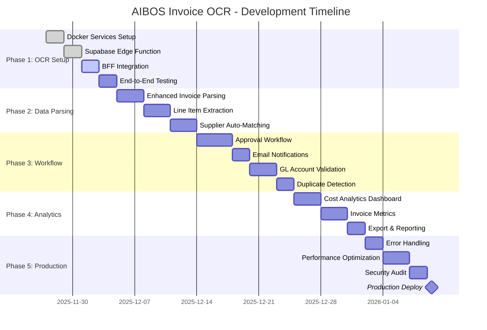

# 🗺️ AIBOS Invoice OCR - Complete DevFlow Roadmap

**Last Updated:** November 27, 2025  
**Project Phase:** OCR Integration  
**Timeline:** 12 weeks to production  

---

## 📅 **12-Week Development Roadmap**



---

## 🎯 **Current Sprint (Week 1-2): OCR Integration**

### **Sprint Goal**
Complete OCR services deployment and achieve end-to-end invoice processing with 3-tier fallback.

### **Daily Tasks Breakdown**

#### **Day 1 (Monday) - Docker Services**
```
Morning (9 AM - 12 PM):
├─ Create docker-compose.yml in project root
├─ Create ocr-service/ folder structure
│  ├─ Dockerfile
│  ├─ main.py
│  └─ requirements.txt
└─ Deploy Docker services: docker-compose up -d

Afternoon (1 PM - 5 PM):
├─ Test Tika health: curl http://localhost:9998/tika
├─ Test Tesseract health: curl http://localhost:8000/health
├─ Test Tesseract OCR with sample PDF
└─ Document any issues

Deliverable: ✅ Docker services running and healthy
```

#### **Day 2 (Tuesday) - Supabase Edge Function**
```
Morning (9 AM - 12 PM):
├─ Create supabase/functions/ocr-processor/
├─ Copy 3-tier fallback code from OCR_PRIORITY_FALLBACK_IMPLEMENTATION.md
├─ Set environment variables:
│  ├─ GOOGLE_CLOUD_CREDENTIALS
│  ├─ TIKA_SERVER_URL
│  └─ TESSERACT_SERVER_URL
└─ Deploy: supabase functions deploy ocr-processor

Afternoon (1 PM - 5 PM):
├─ Test Edge Function manually (curl)
├─ Upload test invoice to storage
├─ Trigger OCR manually
├─ Verify database updates
└─ Check ocr_usage_logs table

Deliverable: ✅ Edge Function processing invoices successfully
```

#### **Day 3 (Wednesday) - BFF Integration**
```
Morning (9 AM - 12 PM):
├─ Update apps/web/app/api/invoices/upload/route.ts
├─ Replace mock triggerOCR with Edge Function call
├─ Add error handling for OCR failures
└─ Update environment variables in .env.local

Afternoon (1 PM - 5 PM):
├─ Test upload via frontend (InvoiceUpload component)
├─ Monitor OCR processing in real-time
├─ Verify invoice status updates (draft → processing → completed)
├─ Check file storage and database records
└─ Test multi-tenant isolation

Deliverable: ✅ End-to-end upload → OCR → database flow working
```

#### **Day 4 (Thursday) - Testing & Validation**
```
Morning (9 AM - 12 PM):
├─ Test Tier 1 (text-based PDF) → Should use Tika
├─ Test Tier 2 (scanned PDF) → Should use Tesseract
├─ Test Tier 3 (poor quality) → Should use Google Vision
└─ Verify cost tracking in ocr_usage_logs

Afternoon (1 PM - 5 PM):
├─ Test error scenarios:
│  ├─ Invalid file types
│  ├─ Corrupted PDFs
│  ├─ Network failures
│  └─ Service downtime
├─ Verify error handling and logging
└─ Performance testing (10+ concurrent uploads)

Deliverable: ✅ All 3 tiers tested, error handling validated
```

#### **Day 5 (Friday) - Polish & Document**
```
Morning (9 AM - 12 PM):
├─ Improve invoice data parsing regex
├─ Add unit tests for parsing functions
├─ Optimize Edge Function performance
└─ Add retry logic for failed OCR

Afternoon (1 PM - 5 PM):
├─ Update documentation
├─ Create runbook for common issues
├─ Deploy to staging environment
├─ Sprint retrospective
└─ Plan next sprint

Deliverable: ✅ Production-ready OCR system deployed to staging
```

---

## 🔄 **Weekly Sprints Overview**

### **Week 3-4: Enhanced Data Extraction**

```
Sprint Goals:
1. Improve invoice field extraction accuracy to 95%+
2. Implement line item extraction from tables
3. Auto-match suppliers from database
4. Handle edge cases (multi-page invoices, handwritten notes)

Key Deliverables:
├─ Enhanced parsing library with 20+ regex patterns
├─ Table detection and line item extraction
├─ Supplier fuzzy matching algorithm
├─ New supplier approval workflow
└─ Unit tests (80%+ coverage)
```

**Effort Estimation:**
- Enhanced Parsing: 3 days
- Line Item Extraction: 3 days
- Supplier Matching: 2 days
- Testing & Documentation: 2 days

---

### **Week 5-6: Approval Workflow**

```
Sprint Goals:
1. Multi-level approval system (verifier → approver)
2. Email notifications for pending invoices
3. GL account validation
4. Duplicate invoice detection

Key Deliverables:
├─ Approval workflow state machine
├─ Email templates (SendGrid/Resend integration)
├─ GL accounts table + validation rules
├─ Duplicate detection algorithm
└─ Workflow UI components
```

**Effort Estimation:**
- Approval Workflow: 4 days
- Email Notifications: 2 days
- GL Validation: 3 days
- Duplicate Detection: 2 days

---

### **Week 7-8: Analytics & Reporting**

```
Sprint Goals:
1. Real-time analytics dashboard
2. Cost allocation per tenant
3. Invoice processing metrics
4. Export capabilities (Excel, PDF)

Key Deliverables:
├─ Analytics dashboard (Recharts/Tremor)
├─ OCR cost breakdown charts
├─ Processing time heatmaps
├─ Excel export (XLSX generation)
└─ PDF invoice reports
```

**Effort Estimation:**
- Dashboard UI: 3 days
- Backend Analytics APIs: 2 days
- Export Features: 2 days
- Testing & Optimization: 1 day

---

### **Week 9-10: Production Hardening**

```
Sprint Goals:
1. Comprehensive error handling
2. Performance optimization (sub-2s processing)
3. Security audit & fixes
4. Load testing (100+ concurrent users)

Key Deliverables:
├─ Dead letter queue for failed OCR jobs
├─ Redis caching for frequent queries
├─ Rate limiting per tenant
├─ Security fixes (OWASP Top 10)
└─ Load test results + optimizations
```

**Effort Estimation:**
- Error Handling: 2 days
- Performance Optimization: 3 days
- Security Audit: 2 days
- Load Testing: 1 day

---

### **Week 11-12: Beta Launch**

```
Sprint Goals:
1. Deploy to production
2. Onboard beta users (5-10 tenants)
3. Monitor and fix production issues
4. Gather feedback for v2

Key Deliverables:
├─ Production deployment
├─ Monitoring dashboards (Grafana/Sentry)
├─ User onboarding docs
├─ Beta feedback collection
└─ Hotfix process established
```

---

## 📊 **Development Metrics to Track**

### **OCR Performance**
```sql
-- Track OCR accuracy over time
SELECT 
  DATE(ocr_processed_at) as date,
  AVG(ocr_confidence) as avg_confidence,
  COUNT(*) as invoices_processed,
  provider as ocr_method
FROM invoices
WHERE ocr_status = 'completed'
GROUP BY DATE(ocr_processed_at), provider
ORDER BY date DESC;
```

### **Cost Optimization**
```sql
-- Track cost savings vs Google Vision only
SELECT 
  DATE(created_at) as date,
  SUM(CASE WHEN provider = 'tika' THEN 1 ELSE 0 END) as free_tika,
  SUM(CASE WHEN provider = 'tesseract' THEN 1 ELSE 0 END) as free_tesseract,
  SUM(CASE WHEN provider = 'google-vision' THEN 1 ELSE 0 END) as paid_google,
  SUM(cost) as total_cost,
  (COUNT(*) * 0.0015) as google_only_cost,
  ROUND((1 - (SUM(cost) / (COUNT(*) * 0.0015))) * 100, 2) as savings_percent
FROM ocr_usage_logs
GROUP BY DATE(created_at)
ORDER BY date DESC;
```

### **Processing Time**
```sql
-- Track processing time by method
SELECT 
  provider,
  ROUND(AVG(processing_time_ms), 2) as avg_time_ms,
  ROUND(MAX(processing_time_ms), 2) as max_time_ms,
  COUNT(*) as total_processed
FROM ocr_usage_logs
GROUP BY provider;
```

---

## 🚦 **Quality Gates (Must Pass Before Moving to Next Phase)**

### **Phase 1: OCR Setup**
- [ ] Docker services healthy (99%+ uptime)
- [ ] Edge Function deployed and accessible
- [ ] End-to-end flow working (upload → OCR → DB)
- [ ] Multi-tenant isolation verified
- [ ] Cost logging accurate

### **Phase 2: Data Parsing**
- [ ] Invoice field extraction accuracy ≥ 90%
- [ ] Line item extraction working for 80%+ of invoices
- [ ] Supplier matching accuracy ≥ 85%
- [ ] Unit test coverage ≥ 80%

### **Phase 3: Workflow**
- [ ] Approval workflow state machine tested
- [ ] Email notifications sent within 1 minute
- [ ] GL validation catches 100% of invalid accounts
- [ ] Duplicate detection accuracy ≥ 95%

### **Phase 4: Analytics**
- [ ] Dashboard loads in < 2 seconds
- [ ] All charts render correctly
- [ ] Export generates valid Excel/PDF
- [ ] Data accuracy verified

### **Phase 5: Production**
- [ ] Error rate < 0.1%
- [ ] Average processing time < 2 seconds
- [ ] Security audit passed (no critical/high issues)
- [ ] Load test: 100 concurrent users, no degradation

---

## 🎯 **Success Criteria (End of 12 Weeks)**

### **Technical**
- ✅ OCR processing 1,000+ invoices/day
- ✅ 90%+ accuracy on invoice field extraction
- ✅ 80%+ cost savings vs Google Vision only
- ✅ < 2 second average processing time
- ✅ 99.9% uptime

### **Business**
- ✅ 10+ beta tenants onboarded
- ✅ $500+/month cost savings demonstrated
- ✅ 50% reduction in manual data entry
- ✅ Positive user feedback (NPS > 8)

---

## 🛠️ **Tools & Stack**

### **Development**
- **IDE:** Cursor (AI-assisted)
- **Version Control:** Git + GitHub
- **Package Manager:** pnpm
- **Testing:** Vitest + Playwright

### **Infrastructure**
- **Backend:** Next.js 16 (BFF) + Supabase (PostgreSQL + Storage + Edge Functions)
- **OCR Services:** Docker (Tika + Tesseract)
- **External:** Google Cloud Vision API
- **Monitoring:** Sentry + Grafana
- **Deployment:** Vercel (Next.js) + Supabase Cloud

---

## 📚 **Documentation Checklist**

- [x] Architecture overview (BFF_COMPLETE_IMPLEMENTATION_GUIDE.md)
- [x] OCR strategy (OCR_PRIORITY_FALLBACK_IMPLEMENTATION.md)
- [x] Multi-tenant compliance (MULTI_TENANT_COMPLIANCE_COMPLETE.md)
- [x] DevFlow roadmap (this document)
- [ ] API documentation (Swagger/OpenAPI)
- [ ] User onboarding guide
- [ ] Admin guide
- [ ] Troubleshooting runbook

---

## 🎓 **Learning Resources**

### **For Team Members**
- Next.js 16 App Router: https://nextjs.org/docs
- Supabase Edge Functions: https://supabase.com/docs/guides/functions
- Tesseract OCR: https://tesseract-ocr.github.io/
- Apache Tika: https://tika.apache.org/

### **For Advanced Features**
- Google Vision API: https://cloud.google.com/vision/docs
- PostgreSQL RLS: https://www.postgresql.org/docs/current/ddl-rowsecurity.html
- Multi-tenancy patterns: https://docs.microsoft.com/en-us/azure/architecture/patterns/

---

## ✅ **Next Actions (Start Now)**

```bash
# 1. Create Docker services
cd /d/AIBOS-PLATFORM
# Copy docker-compose.yml from BFF_COMPLETE_IMPLEMENTATION_GUIDE.md
docker-compose up -d

# 2. Create OCR service
mkdir ocr-service
# Copy files from BFF_COMPLETE_IMPLEMENTATION_GUIDE.md
docker-compose build tesseract-ocr
docker-compose up -d tesseract-ocr

# 3. Test services
curl http://localhost:9998/tika
curl http://localhost:8000/health

# 4. Create Edge Function
mkdir -p supabase/functions/ocr-processor
# Copy index.ts from OCR_PRIORITY_FALLBACK_IMPLEMENTATION.md
supabase functions deploy ocr-processor

# 5. Update BFF
# Edit apps/web/app/api/invoices/upload/route.ts
# Replace mock triggerOCR with Edge Function call

# 6. Test end-to-end
# Upload invoice via frontend
# Monitor processing in Supabase dashboard
```

---

**Ready to build?** Start with Day 1 tasks and track your progress! 🚀

**Questions or blockers?** I'm here to help! Just ask! 💬

