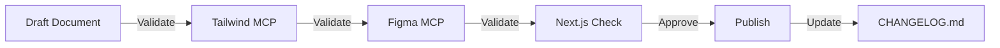

# Documentation Governance

> **Document Control and Quality Standards** for AI-BOS UI Documentation

This document defines the governance rules, validation requirements, and maintenance procedures for all UI and design-related documentation.

---


## Overview

This document defines documentation governance.

---

## 1. Document Control Principles

### 1.1 Single Source of Truth (SSOT)

- **Primary SSOT:** `packages/ui/ui-docs/` is the authoritative source for UI documentation
- **Cross-references:** Other documentation (e.g., `docs/design-system-guide.md`) should link to `ui-docs/`, not duplicate
- **Version Control:** All documentation is version-controlled in Git
- **Change Tracking:** All changes must be documented in `CHANGELOG.md`

### 1.2 Document Hierarchy

```
Root Documentation (docs/)
  └── design-system-guide.md (High-level overview, links to ui-docs/)
  
UI Package Documentation (packages/ui/ui-docs/)
  └── Detailed component, token, and pattern documentation
```

### 1.3 Document Ownership

- **Design System Team** - Overall governance and approval
- **Component Authors** - Component-specific documentation
- **Designers** - Figma integration and design tokens
- **Developers** - API references and integration guides

---

## 2. Validation Requirements

### 2.1 Mandatory Validations

All documentation **MUST** be validated against:

#### ✅ Tailwind Tokens MCP
- **Tool:** `mcp_tailwind-tokens_read_tailwind_config`
- **Purpose:** Verify token names and values match `globals.css`
- **When:** Before publishing token documentation
- **Validation:** Token references must exist in actual CSS

#### ✅ Figma MCP
- **Tool:** `mcp_Figma_get_variable_defs`, `mcp_Figma_get_design_context`
- **Purpose:** Ensure design-code sync accuracy
- **When:** Before publishing component documentation
- **Validation:** Component specs must match Figma designs

#### ✅ Next.js Best Practices
- **Tool:** Next.js documentation and runtime checks
- **Purpose:** Verify App Router compatibility
- **When:** Before publishing integration guides
- **Validation:** Code examples must work in Next.js 14+

### 2.2 Validation Workflow



**Validation Script:**
```bash
# Run validation before committing
pnpm validate:ui-docs
```

---

## 3. Document Structure Standards

### 3.1 Required Sections

Every document **MUST** include:

1. **Title & Metadata**
   ```markdown
   # Document Title
   
   > **Status:** Draft | Review | Published
   > **Last Updated:** YYYY-MM-DD
   > **Validated:** ✅ Tailwind | ✅ Figma | ✅ Next.js
   ```

2. **Overview** - Brief description and purpose

3. **Usage** - How to use (with code examples)

4. **API Reference** - Props, types, interfaces (for components)

5. **Examples** - Real-world usage patterns

6. **Related Links** - Cross-references to other docs

### 3.2 Code Example Standards

- **Language:** TypeScript + React
- **Framework:** Next.js App Router
- **Styling:** Tailwind v4 with design tokens
- **Validation:** All examples must be runnable

**Example Format:**
```tsx
// ✅ Good: Uses design tokens
import { Button } from "@aibos/ui";
import { colorTokens } from "@aibos/ui/design/tokens";

export function Example() {
  return (
    <Button className={colorTokens.accent.primaryBg}>
      Click me
    </Button>
  );
}
```

---

## 4. Content Quality Standards

### 4.1 Accuracy Requirements

- ✅ All token names must match actual tokens (validated via MCP)
- ✅ All component APIs must match actual implementations
- ✅ All Figma references must link to actual Figma files
- ✅ All code examples must be tested and working

### 4.2 Completeness Requirements

- ✅ Every component must have full API documentation
- ✅ Every token must have usage examples
- ✅ Every pattern must have multiple use cases
- ✅ Every integration must have step-by-step guide

### 4.3 Clarity Requirements

- ✅ Use clear, concise language
- ✅ Avoid jargon without explanation
- ✅ Include visual examples where helpful
- ✅ Provide troubleshooting sections

---

## 5. Maintenance Procedures

### 5.1 Update Frequency

- **Weekly:** Review for accuracy and broken links
- **Monthly:** Validate against MCP tools
- **Quarterly:** Comprehensive review and updates
- **On Change:** Immediate update when tokens/components change

### 5.2 Change Process

1. **Create Draft** - Document changes in appropriate file
2. **Validate** - Run MCP validation checks
3. **Review** - Get design system team approval
4. **Update CHANGELOG** - Document changes
5. **Publish** - Merge to main branch

### 5.3 Deprecation Process

1. **Mark as Deprecated** - Add deprecation notice
2. **Migration Guide** - Provide upgrade path
3. **Grace Period** - Maintain for 2 major versions
4. **Remove** - Delete after grace period

---

## 6. MCP Integration Rules

### 6.1 Tailwind Tokens Validation

**Before Publishing Token Docs:**
```typescript
// Validate token exists
const tokens = await mcp_tailwind-tokens_read_tailwind_config();
const tokenExists = tokens.content.includes('--aibos-primary');
if (!tokenExists) {
  throw new Error('Token --aibos-primary not found in globals.css');
}
```

### 6.2 Figma Sync Validation

**Before Publishing Component Docs:**
```typescript
// Validate Figma component exists
const figmaContext = await mcp_Figma_get_design_context({
  fileKey: FIGMA_FILE_KEY,
  nodeId: COMPONENT_NODE_ID
});
// Verify component matches code
```

### 6.3 Next.js Compatibility

**Before Publishing Integration Docs:**
- Verify code examples use App Router syntax
- Test in Next.js 14+ environment
- Validate Server/Client Component usage

---

## 7. Document Categories

### 7.1 Foundation Documents
- **Purpose:** Core design system principles
- **Audience:** All team members
- **Update Frequency:** Quarterly
- **Validation:** Tailwind + Figma MCP

### 7.2 Component Documents
- **Purpose:** Component API and usage
- **Audience:** Developers
- **Update Frequency:** On component changes
- **Validation:** Figma + Code implementation

### 7.3 Pattern Documents
- **Purpose:** Design patterns and recipes
- **Audience:** Designers + Developers
- **Update Frequency:** Monthly
- **Validation:** Figma + Real-world usage

### 7.4 Integration Documents
- **Purpose:** Framework and tool integration
- **Audience:** Developers
- **Update Frequency:** On framework updates
- **Validation:** Next.js + Tool-specific checks

---

## 8. Quality Metrics

### 8.1 Documentation Coverage

- **Target:** 100% component coverage
- **Current:** Tracked in README.md status table
- **Gap Analysis:** Quarterly review

### 8.2 Validation Pass Rate

- **Target:** 100% validation pass rate
- **Measurement:** Automated MCP validation
- **Reporting:** Monthly validation report

### 8.3 User Feedback

- **Collection:** GitHub issues, team feedback
- **Response Time:** Within 1 week
- **Action:** Update documentation based on feedback

---

## 9. Enforcement

### 9.1 Pre-Commit Hooks

- Validate token references
- Check code example syntax
- Verify links are not broken

### 9.2 CI/CD Checks

- Run MCP validation on PR
- Check documentation coverage
- Validate code examples compile

### 9.3 Review Process

- All documentation changes require PR
- Design system team approval required
- MCP validation must pass

---

## 10. Exceptions and Escalation

### 10.1 Emergency Updates

- Critical bug fixes may bypass full review
- Must be validated post-merge
- Must update CHANGELOG immediately

### 10.2 Disputes

- Escalate to design system team lead
- Document decision in GOVERNANCE.md
- Update process if needed

---

**Last Updated:** 2024  
**Version:** 1.0.0  
**Next Review:** Quarterly

