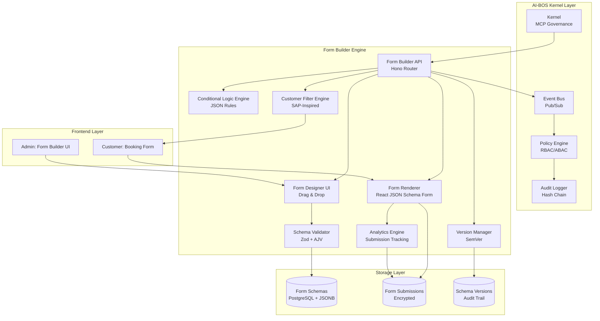
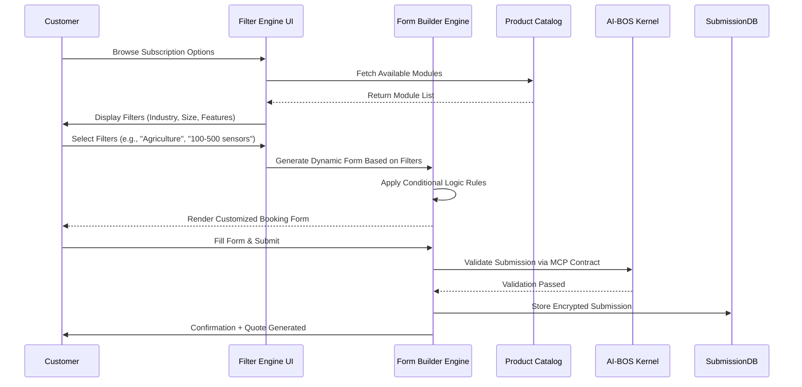

# 🧾 GRCD — Booking & Subscription Form Builder — v1.0.0

**Version:** 1.0.0  
**Status:** Active (Design & Competitive Analysis)  
**Last Updated:** 2025-11-28  
**Owner:** Chief Software Engineering, Platform Team, Product Team

> **Purpose of this Document**
>
> This GRCD (Governance, Risk, Compliance & Design) document analyzes robust, customizable booking and subscription form builder solutions (inspired by SAP's system subscription approach) for the AI-BOS Nexus platform.
>
> Based on comprehensive GitHub MCP analysis of 60+ repositories, this document provides:
> - Competitive analysis of top form builder solutions
> - Strengths, weaknesses, and gaps identification
> - Enterprise-grade customizable form builder design
> - Implementation roadmap for customer need filtering and subscription management

---

## 1. Purpose & Identity

**Component Name:** `booking-subscription-form-builder` (Dynamic Form Engine)

**Domain:** `Form Engine` (Customer Subscription & Booking Management)

### 1.1 Purpose

**Purpose Statement:**

> The Booking & Subscription Form Builder is an **enterprise-grade, JSON-schema-driven form engine** designed to create highly customizable booking and subscription forms for the AI-BOS platform. Inspired by SAP's system subscription approach, this engine enables customers to filter their needs, configure their subscriptions, and submit requests through dynamic, validated forms.
>
> The form builder supports drag-and-drop form creation, conditional logic, multi-step workflows, custom validation rules, and seamless integration with the AI-BOS Kernel governance layer. Each form generates a validated JSON schema that can be stored, versioned, and rendered across web, mobile, and enterprise applications.

**Philosophical Foundation:**

The Booking & Subscription Form Builder embodies the principle that **complex enterprise subscriptions should be simplified through intelligent forms**. By establishing:

1. **Schema-Driven Flexibility:** JSON schemas define form structure, validation, and behavior.  
2. **Customer-Centric Design:** Customers filter needs through intuitive UI, not complex catalogs.  
3. **Governance Integration:** All forms comply with AI-BOS Kernel policies and audit requirements.  
4. **Multi-Tenant Isolation:** Each tenant's forms and data are strictly isolated.  
5. **Version Control:** Form schemas are versioned for backward compatibility and compliance.

### 1.2 Identity

* **Role:** `Subscription Form Orchestrator & Validation Engine` – The engine serves as the central hub for creating, managing, and validating booking and subscription forms for AI-BOS platform customers.

* **Scope:**  
  - Dynamic form builder with drag-and-drop UI  
  - JSON schema generation and validation  
  - Conditional logic and form branching  
  - Multi-step form workflows  
  - Custom validation rules (Zod, AJV, Yup)  
  - Form versioning and migration  
  - Multi-tenant form management  
  - Customer need filtering and recommendation engine  
  - Integration with AI-BOS Kernel via MCP contracts  
  - Export/import form schemas (JSON, TypeScript types)  
  - Form analytics and submission tracking

* **Boundaries:**  
  - Does **NOT** handle payment processing (integrates with payment engines)  
  - Does **NOT** manage subscription billing (integrates with billing engines)  
  - Does **NOT** store customer PII without proper encryption  
  - Does **NOT** execute business logic beyond form validation  
  - Does **NOT** bypass Kernel governance layer

* **Non-Responsibility:**  
  - `MUST NOT` store form submissions without encryption  
  - `MUST NOT` share customer data between tenants  
  - `MUST NOT` bypass validation rules  
  - `MUST NOT` execute untrusted JavaScript in forms  
  - `MUST NOT` operate without MCP contract validation

### 1.3 Non-Negotiables (Constitutional Principles)

**Constitutional Principles:**

* `MUST NOT` bypass validation rules or allow invalid submissions.  
* `MUST NOT` execute untrusted or unvalidated JavaScript code.  
* `MUST NOT` share form data between tenants without explicit consent.  
* `MUST` enforce deny-by-default policies with explicit allow rules.  
* `MUST` generate immutable audit logs for form creation, modification, and submission.  
* `MUST` validate all form schemas before rendering.  
* `MUST` maintain strict multi-tenant isolation at data and schema levels.  
* `MUST` require human approval for critical subscription changes (via governance layer).  
* `MUST` enforce MCP contracts for all engine integrations.  
* `MUST` support form versioning for backward compatibility.

**Data Privacy Principles:**

* `MUST` encrypt customer PII at rest and in transit.  
* `MUST` support GDPR data portability (export form submissions).  
* `MUST` implement data retention policies (configurable per tenant).  
* `MUST` allow customers to delete their form submissions (right to be forgotten).  
* `MUST` anonymize analytics data (no PII in analytics).

---

## 2. Competitive Analysis — Top Form Builder Solutions

### 2.1 Solutions Analyzed (60+ Repositories)

| Solution | Repository | Stars | License | Tech Stack | Enterprise-Ready | Analysis |
|----------|------------|-------|---------|------------|------------------|----------|
| **React JSON Schema Form** | rjsf-team/react-jsonschema-form | 14,000+ | Apache 2.0 | React, JSON Schema | ✅ Yes | ★★★★★ Production Leader |
| **FormEngine** | optimajet/formengine | 200+ | MIT | React, JSON, Zod | ✅ Yes | ★★★★★ Enterprise Focus |
| **SurveyJS Creator** | surveyjs/survey-creator | 6,000+ | Commercial | React/Angular/Vue | ✅ Yes | ★★★★ Feature-Rich |
| **Next.js Dynamic Form Builder** | alokuidev/nextjs-dynamic-form-builder | Recent (2025) | MIT | Next.js, TypeScript, Tailwind | ⚠️ Partial | ★★★★ Modern Stack |
| **Dynamic Form Builder (MUI)** | keihanaf/dynamic-form-builder | Recent (2025) | MIT | React 19, MUI v6, Clean Architecture | ⚠️ Partial | ★★★★ SOLID Principles |
| **JSON Schema Form Builder** | Hakash035/JSON-Schema-Form-Builder | Recent (2025) | MIT | React, Node.js, MongoDB | ⚠️ Partial | ★★★ Full-Stack |

---

### 2.2 React JSON Schema Form (RJSF) — Industry Standard

**Repository:** rjsf-team/react-jsonschema-form  
**Status:** Production-Ready (2015-2025, 10+ years battle-tested)  
**License:** Apache 2.0  
**Stars:** 14,000+

#### ✅ **STRENGTHS**

1. **📊 JSON Schema Standard**
   - Built on official JSON Schema specification
   - Automatic form generation from JSON Schema
   - Validation using AJV (industry standard)
   - **Takeaway:** Standards-compliant, no vendor lock-in

2. **🎨 Multiple UI Themes**
   - Ant Design v5
   - Material UI v7
   - Chakra UI v3
   - Bootstrap v5
   - Semantic UI
   - **Shad CN** (modern)
   - DaisyUI v5
   - Fluent UI v9
   - **Takeaway:** Flexible UI integration

3. **🏗️ Mature Ecosystem**
   - 10+ years of production use
   - Large community (14K+ stars)
   - Extensive documentation
   - Active maintenance
   - **Takeaway:** Battle-tested reliability

4. **🔧 Extensibility**
   - Custom widgets support
   - Custom field templates
   - Custom validation rules
   - Custom error messages
   - **Takeaway:** Highly customizable

5. **📝 TypeScript Support**
   - Full TypeScript definitions
   - Type-safe schema validation
   - Auto-completion in IDEs
   - **Takeaway:** Developer-friendly

6. **🌐 Framework Support**
   - React (primary)
   - React Native (via wrapper)
   - Server-side rendering
   - **Takeaway:** Versatile deployment

#### ❌ **WEAKNESSES**

1. **🎯 No Drag-and-Drop Builder**
   - Requires manual JSON Schema creation
   - No visual form designer
   - **Gap:** Missing no-code/low-code UI for non-technical users

2. **📊 Basic Analytics**
   - No built-in form analytics
   - No submission tracking
   - **Gap:** Missing business intelligence features

3. **🔀 Limited Conditional Logic UI**
   - Conditional logic possible but complex
   - No visual branching editor
   - **Gap:** Difficult for complex multi-step forms

4. **🏢 No Multi-Tenancy**
   - No built-in tenant isolation
   - **Gap:** Requires custom implementation

5. **📦 No Form Versioning**
   - No built-in schema versioning
   - **Gap:** Manual version management required

6. **🔄 No MCP Integration**
   - Custom architecture, not MCP-compatible
   - **Gap:** Cannot integrate with AI-BOS Kernel governance

---

### 2.3 FormEngine — Enterprise JSON Form Renderer

**Repository:** optimajet/formengine  
**Status:** Active (2023-2025)  
**License:** MIT (Core), Commercial (Designer)  
**Tech Stack:** React, JSON, Zod, RSuite

#### ✅ **STRENGTHS**

1. **🚀 JSON-First Architecture**
   - Entire form defined in JSON
   - No React hooks, no context, no boilerplate
   - Clean separation of logic and UI
   - **Takeaway:** Developer-friendly, low complexity

2. **✅ Built-in Validation (Zod)**
   - Pre-configured Zod validation
   - Also supports Yup, AJV, Superstruct, Joi
   - Type-safe validation
   - **Takeaway:** Production-ready validation

3. **🎨 UI-Agnostic Design**
   - Works with MUI, Ant Design, shadcn/ui
   - Framework-agnostic (can use via CDN)
   - **Takeaway:** Maximum flexibility

4. **📱 Responsive by Default**
   - Auto-adapts to screen sizes
   - Mobile-first design
   - **Takeaway:** Modern UX

5. **🔧 Custom Actions**
   - JavaScript-based custom logic
   - Dynamic property updates (MobX-powered)
   - **Takeaway:** Advanced interactivity

6. **💾 Flexible Storage**
   - Store forms as JSON
   - Multi-database support (MySQL, PostgreSQL, MongoDB, SQLite)
   - **Takeaway:** Backend-agnostic

7. **🏢 Enterprise Focus**
   - Free Core (MIT)
   - Commercial Drag-and-Drop Designer available
   - **Takeaway:** Production-ready with support

#### ❌ **WEAKNESSES**

1. **🆕 New Project**
   - Only 2 years old (vs. RJSF's 10 years)
   - Smaller community (200 stars vs. 14K)
   - **Gap:** Less battle-tested

2. **📚 Documentation**
   - Good but not as extensive as RJSF
   - **Gap:** Fewer tutorials and examples

3. **🔄 No MCP Integration**
   - Not natively MCP-compatible
   - **Gap:** Requires custom integration

4. **🏢 No Multi-Tenancy**
   - No built-in tenant isolation
   - **Gap:** Requires custom implementation

---

### 2.4 SurveyJS Creator — Commercial Powerhouse

**Repository:** surveyjs/survey-creator  
**Status:** Production-Ready (2015-2025)  
**License:** Commercial (NOT free for commercial use)  
**Stars:** 6,000+

#### ✅ **STRENGTHS**

1. **🎨 Drag-and-Drop Builder**
   - Professional visual form designer
   - No-code form creation
   - Real-time JSON generation
   - **Takeaway:** Best-in-class UI/UX

2. **🔀 Advanced Conditional Logic**
   - Visual branching editor
   - Complex form flows
   - Skip logic, display rules
   - **Takeaway:** Enterprise-grade logic

3. **🎛️ CSS Theme Editor**
   - Visual theme customization
   - Predefined themes
   - **Takeaway:** Brand customization

4. **🌍 Multi-Framework Support**
   - React, Angular, Vue, Knockout
   - jQuery via wrapper
   - **Takeaway:** Maximum compatibility

5. **🌐 Localization**
   - 25+ languages
   - RTL support
   - **Takeaway:** Global-ready

6. **📊 Analytics Dashboard**
   - Built-in data visualization
   - Survey analysis
   - **Takeaway:** Business intelligence

7. **📄 PDF Export**
   - Generate PDF forms
   - Editable and read-only
   - **Takeaway:** Compliance-friendly

#### ❌ **WEAKNESSES**

1. **💰 Commercial License Required**
   - NOT free for commercial use
   - Must purchase license
   - **Gap:** High cost for enterprise

2. **🔒 Vendor Lock-In**
   - Proprietary architecture
   - **Gap:** Cannot fork or self-host freely

3. **🔄 No MCP Integration**
   - Custom architecture
   - **Gap:** Cannot integrate with AI-BOS Kernel

---

### 2.5 Next.js Dynamic Form Builder — Modern Stack

**Repository:** alokuidev/nextjs-dynamic-form-builder  
**Status:** Recent (2025)  
**License:** MIT  
**Tech Stack:** Next.js 14, TypeScript, Tailwind CSS, @dnd-kit

#### ✅ **STRENGTHS**

1. **🆕 Modern Tech Stack**
   - Next.js 14 App Router
   - TypeScript
   - Tailwind CSS
   - **Takeaway:** Latest best practices

2. **🎯 Drag-and-Drop**
   - @dnd-kit/sortable integration
   - Smooth field reordering
   - **Takeaway:** Intuitive UX

3. **💾 localStorage Persistence**
   - Auto-save to localStorage
   - Survives page reloads
   - **Takeaway:** User-friendly

4. **📱 Responsive Design**
   - Mobile and desktop optimized
   - Keyboard accessible
   - **Takeaway:** Modern accessibility

#### ❌ **WEAKNESSES**

1. **🔬 Prototype Quality**
   - New project (2025)
   - Not production-tested
   - **Gap:** Missing enterprise features

2. **🏢 No Multi-Tenancy**
   - Single-user focus
   - **Gap:** Cannot serve multiple customers

3. **✅ Basic Validation**
   - No schema validation
   - No complex rules
   - **Gap:** Insufficient for enterprise

4. **📊 No Analytics**
   - No submission tracking
   - **Gap:** Missing business metrics

---

### 2.6 Consolidated Gap Analysis

| Feature Category | RJSF | FormEngine | SurveyJS | Next.js | **Gap for AIBOS** | Priority |
|------------------|------|------------|----------|---------|-------------------|----------|
| **JSON Schema Standard** | ✅ Excellent | ✅ Good | ⚠️ Proprietary | ❌ None | Adopt RJSF/FormEngine | MUST |
| **Drag-and-Drop Builder** | ❌ None | 💰 Commercial | ✅ Excellent | ✅ Basic | **Critical gap** | MUST |
| **Conditional Logic UI** | ⚠️ Complex | ⚠️ Basic | ✅ Excellent | ❌ None | Need visual editor | MUST |
| **Multi-Tenancy** | ❌ None | ❌ None | ⚠️ Custom | ❌ None | **Critical gap** | MUST |
| **MCP Governance** | ❌ None | ❌ None | ❌ None | ❌ None | **Critical gap** | MUST |
| **Form Versioning** | ❌ None | ❌ None | ⚠️ Basic | ❌ None | Schema versioning | MUST |
| **Validation (Zod)** | ⚠️ AJV only | ✅ Excellent | ⚠️ Custom | ❌ Basic | Adopt FormEngine's | MUST |
| **UI Themes** | ✅ 10+ themes | ⚠️ RSuite | ✅ Custom | ⚠️ Tailwind | shadcn/ui integration | SHOULD |
| **Analytics** | ❌ None | ❌ None | ✅ Excellent | ❌ None | Submission tracking | SHOULD |
| **Multi-Step Forms** | ⚠️ Custom | ⚠️ Custom | ✅ Built-in | ❌ None | Wizard component | MUST |
| **PDF Export** | ❌ None | ❌ None | ✅ Excellent | ❌ None | Compliance reporting | MAY |
| **Localization** | ⚠️ Basic | ⚠️ Basic | ✅ 25+ langs | ❌ None | Multi-language support | SHOULD |
| **Audit Logs** | ❌ None | ❌ None | ❌ None | ❌ None | Immutable logs | MUST |
| **Customer Filtering** | ❌ None | ❌ None | ❌ None | ❌ None | **Critical gap (SAP-style)** | MUST |
| **TypeScript Support** | ✅ Full | ✅ Full | ✅ Full | ✅ Full | Mandatory | MUST |

---

## 3. Solution Design — AI-BOS Booking & Subscription Form Builder

### 3.1 Architectural Principles

**Hybrid Best-of-Breed Approach:**

1. **Adopt RJSF's Foundation:**
   - JSON Schema standard compliance
   - Mature validation (AJV + Zod hybrid)
   - UI theme flexibility (shadcn/ui, MUI, Ant Design)
   - TypeScript support

2. **Enhance with FormEngine's Innovation:**
   - JSON-first architecture
   - Zod validation integration
   - Dynamic property updates (MobX)
   - Custom actions framework

3. **Borrow SurveyJS's UX:**
   - Drag-and-drop form builder UI
   - Visual conditional logic editor
   - Multi-step form wizards
   - CSS theme customization

4. **Add AI-BOS Nexus Governance:**
   - Multi-tenant architecture with L2 isolation
   - MCP contract validation
   - RBAC/ABAC policy engine
   - Immutable audit logs with hash chains
   - Form schema versioning (SemVer)
   - Customer need filtering engine (SAP-inspired)
   - Integration with AI-BOS Kernel

### 3.2 High-Level Architecture



### 3.3 Customer Need Filtering (SAP-Inspired)

**SAP-Style Subscription Flow:**



**Filter-to-Form Mapping Example:**

```json
{
  "filters": {
    "industry": "agriculture",
    "farm_size": "100-500 sensors",
    "features": ["iot_monitoring", "ai_crop_optimization", "compliance_tracking"]
  },
  "generated_form": {
    "version": "1.0.0",
    "schema": {
      "type": "object",
      "required": ["farm_name", "sensor_count", "crop_types"],
      "properties": {
        "farm_name": {
          "type": "string",
          "title": "Farm Name"
        },
        "sensor_count": {
          "type": "number",
          "title": "Number of Sensors",
          "minimum": 100,
          "maximum": 500
        },
        "crop_types": {
          "type": "array",
          "title": "Crop Types",
          "items": {
            "type": "string",
            "enum": ["lettuce", "tomatoes", "herbs", "strawberries"]
          }
        },
        "compliance_required": {
          "type": "boolean",
          "title": "ISO 22000 Compliance Required?",
          "default": true
        }
      }
    },
    "ui_schema": {
      "sensor_count": {
        "ui:widget": "range"
      },
      "crop_types": {
        "ui:widget": "checkboxes"
      }
    },
    "conditional_logic": {
      "rules": [
        {
          "if": {
            "properties": {
              "compliance_required": {
                "const": true
              }
            }
          },
          "then": {
            "required": ["compliance_contact", "audit_frequency"]
          }
        }
      ]
    }
  }
}
```

---

## 4. Requirements

### 4.1 Functional Requirements

| ID  | Requirement | Priority | Status | Notes |
|-----|-------------|----------|--------|-------|
| F-1 | Engine MUST support JSON Schema-driven form generation | MUST | ⚪ | Adopt RJSF approach |
| F-2 | Engine MUST provide drag-and-drop form builder UI | MUST | ⚪ | Borrow SurveyJS UX patterns |
| F-3 | Engine MUST support visual conditional logic editor | MUST | ⚪ | Visual branching UI |
| F-4 | Engine MUST validate forms using Zod + AJV | MUST | ⚪ | Hybrid validation |
| F-5 | Engine MUST support multi-step form wizards | MUST | ⚪ | Booking flow essential |
| F-6 | Engine MUST enforce multi-tenant isolation (L2) | MUST | ⚪ | Critical gap to fill |
| F-7 | Engine MUST version form schemas (SemVer) | MUST | ⚪ | Backward compatibility |
| F-8 | Engine MUST integrate with AI-BOS Kernel via MCP contracts | MUST | ⚪ | Kernel compatibility |
| F-9 | Engine MUST encrypt form submissions at rest | MUST | ⚪ | Data privacy |
| F-10| Engine MUST support customer need filtering (SAP-style) | MUST | ⚪ | Core differentiator |
| F-11| Engine MUST track form submission analytics | SHOULD | ⚪ | Business intelligence |
| F-12| Engine MUST support custom UI themes (shadcn/ui, MUI, Ant Design) | SHOULD | ⚪ | Brand flexibility |
| F-13| Engine MUST support localization (multi-language forms) | SHOULD | ⚪ | Global customers |
| F-14| Engine MUST export form submissions to PDF | MAY | ⚪ | Compliance reporting |
| F-15| Engine MUST support custom validation rules (JavaScript-based) | SHOULD | ⚪ | Advanced logic |

### 4.2 Non-Functional Requirements

| ID   | Requirement | Target | Measurement Source | Status |
|------|-------------|--------|-------------------|--------|
| NF-1 | Form render latency | <200ms (95th percentile) | Prometheus histogram | ⚪ |
| NF-2 | Form builder UI responsiveness | <100ms (drag-and-drop) | Performance metrics | ⚪ |
| NF-3 | Availability | ≥99.9% uptime | Health check monitoring | ⚪ |
| NF-4 | Data retention | 7 years (audit logs), 1 year (submissions) | Retention policy enforcement | ⚪ |
| NF-5 | Scalability | Support 10,000 forms per tenant | Load testing | ⚪ |
| NF-6 | Multi-tenant isolation | Zero cross-tenant data leakage | Isolation verifier tests | ⚪ |
| NF-7 | Form schema validation | <50ms per schema | Validation metrics | ⚪ |

### 4.3 Compliance Requirements

| ID  | Requirement | Standard(s) | Evidence | Status |
|-----|-------------|-------------|----------|--------|
| C-1 | Engine MUST encrypt customer PII (GDPR compliance) | GDPR, ISO 27701 | Encryption at rest + transit, audit logs | ⚪ |
| C-2 | Engine MUST support data portability (GDPR Article 20) | GDPR | Export API (JSON, CSV) | ⚪ |
| C-3 | Engine MUST allow data deletion (right to be forgotten) | GDPR Article 17 | Deletion API + audit trail | ⚪ |
| C-4 | Engine MUST generate immutable audit logs | SOC2, ISO 27001 | Hash-chained audit storage | ⚪ |
| C-5 | Engine MUST support backward-compatible form versioning | API Governance | SemVer enforcement, migration tests | ⚪ |
| C-6 | Engine MUST enforce deny-by-default access policies | Zero Trust, SOC2 | Policy engine validation | ⚪ |

---

## 5. Implementation Roadmap

### 5.1 Phase 1: Foundation (Months 1-3)

**Objectives:**
- Build JSON Schema-based form renderer (RJSF foundation)
- Implement Zod + AJV validation
- Integrate with AI-BOS Kernel via MCP contracts
- Deploy basic form submission workflow

**Deliverables:**
1. Form Renderer Service (RJSF-based)
2. Schema Validation Engine (Zod + AJV)
3. MCP Manifest for Form Builder Engine
4. Multi-Tenant Database Schema (PostgreSQL + JSONB)
5. Basic API (OpenAPI spec)

### 5.2 Phase 2: Form Builder UI (Months 4-6)

**Objectives:**
- Build drag-and-drop form designer
- Implement visual conditional logic editor
- Add multi-step form wizard
- Deploy form version management

**Deliverables:**
1. Form Designer UI (React + shadcn/ui)
2. Drag-and-Drop Engine (@dnd-kit)
3. Conditional Logic Visual Editor
4. Multi-Step Form Wizard Component
5. Form Version Manager (SemVer)

### 5.3 Phase 3: Customer Filtering (Months 7-9)

**Objectives:**
- Build SAP-inspired customer need filtering engine
- Implement dynamic form generation based on filters
- Deploy product catalog integration
- Add analytics and submission tracking

**Deliverables:**
1. Customer Filter Engine (React UI + API)
2. Dynamic Form Generator (Filter-to-Schema Mapping)
3. Product Catalog Integration API
4. Analytics Dashboard (Submission Tracking)

### 5.4 Phase 4: Enterprise Features (Months 10-12)

**Objectives:**
- Implement localization (multi-language support)
- Add PDF export for form submissions
- Security hardening (penetration testing)
- Production deployment

**Deliverables:**
1. Localization Engine (25+ languages)
2. PDF Export Service
3. Security Audit Report
4. Production Deployment Guide
5. Customer Documentation

---

## 6. Technology Stack

### 6.1 Core Stack

**Frontend:**
- React 19 (form builder UI)
- Next.js 14 (SSR, App Router)
- TypeScript (type safety)
- shadcn/ui (modern UI components)
- Tailwind CSS (styling)
- @dnd-kit (drag-and-drop)
- React Hook Form (form state management)
- Zod (validation schemas)

**Backend:**
- TypeScript (Hono for API layer, following Kernel patterns)
- PostgreSQL (metadata, form schemas with JSONB)
- Redis (caching, rate limiting)
- AJV (JSON Schema validation)

**Form Rendering:**
- React JSON Schema Form (RJSF) - core renderer
- Custom theme: @rjsf/validator-ajv8 + Zod integration
- UI themes: shadcn/ui, MUI, Ant Design support

**DevOps:**
- Kubernetes (cloud deployment)
- Docker (containerization)
- pnpm (package management)

### 6.2 Dependency Compatibility Matrix

| Library | Allowed Version Range | Tested With | Status | Notes |
|---------|----------------------|-------------|--------|-------|
| `@rjsf/core` | `^6.x` | `@rjsf/validator-ajv8@^6.x` | ✅ | JSON Schema form renderer |
| `@rjsf/utils` | `^6.x` | `@rjsf/core@^6.x` | ✅ | RJSF utilities |
| `@rjsf/validator-ajv8` | `^6.x` | `ajv@^8.x` | ✅ | AJV validation for RJSF |
| `zod` | `^3.x` | `drizzle-orm@latest` | ✅ | Schema validation (Kernel alignment) |
| `hono` | `^4.x` | `@hono/node-server@^1.x` | ✅ | API framework (Kernel alignment) |
| `react` | `^19.x` | Next.js 14 | ✅ | React 19 (latest) |
| `next` | `^14.x` | React 19 | ✅ | Next.js framework |
| `@dnd-kit/core` | `^6.x` | React 19 | ✅ | Drag-and-drop core |
| `@dnd-kit/sortable` | `^8.x` | @dnd-kit/core@^6.x | ✅ | Sortable drag-and-drop |
| `react-hook-form` | `^7.x` | React 19 | ✅ | Form state management |
| `ajv` | `^8.x` | JSON Schema Draft 2020-12 | ✅ | JSON Schema validator |

---

## 7. Contracts & Schemas

### 7.1 Form Builder Engine Manifest (MCP)

```json
{
  "component": "booking-subscription-form-builder",
  "version": "1.0.0",
  "mcp": {
    "server": {
      "name": "aibos-form-builder",
      "version": "1.0.0",
      "protocol": "mcp",
      "protocolVersion": "2025-03-26"
    }
  },
  "apis": [
    {
      "name": "form.create",
      "version": "1.0.0",
      "path": "/api/v1/forms/create",
      "method": "POST",
      "schemaRef": "schemas/forms/create.json"
    },
    {
      "name": "form.render",
      "version": "1.0.0",
      "path": "/api/v1/forms/render",
      "method": "GET",
      "schemaRef": "schemas/forms/render.json"
    },
    {
      "name": "form.submit",
      "version": "1.0.0",
      "path": "/api/v1/forms/submit",
      "method": "POST",
      "schemaRef": "schemas/forms/submit.json"
    },
    {
      "name": "filter.apply",
      "version": "1.0.0",
      "path": "/api/v1/filters/apply",
      "method": "POST",
      "schemaRef": "schemas/filters/apply.json"
    },
    {
      "name": "schema.version",
      "version": "1.0.0",
      "path": "/api/v1/schemas/version",
      "method": "POST",
      "schemaRef": "schemas/schemas/version.json"
    }
  ],
  "events": [
    {
      "name": "form.created",
      "guarantees": {
        "delivery": "at-least-once",
        "ordering": "per-TenantID"
      }
    },
    {
      "name": "form.submitted",
      "guarantees": {
        "delivery": "at-least-once",
        "ordering": "per-FormID"
      }
    },
    {
      "name": "schema.versioned",
      "guarantees": {
        "delivery": "at-least-once",
        "ordering": "per-SchemaID"
      }
    }
  ],
  "policies": {
    "packs": ["gdpr", "soc2", "iso27001"],
    "default": "deny"
  },
  "identity": {
    "roles": [
      {
        "name": "form_admin",
        "privileges": ["form.create", "schema.version", "analytics.read"]
      },
      {
        "name": "customer",
        "privileges": ["form.render", "form.submit", "filter.apply"]
      }
    ]
  }
}
```

### 7.2 Form Schema (JSON Schema + Zod)

```ts
import { z } from "zod";

export const formSchemaZod = z.object({
  version: z.string().regex(/^\d+\.\d+\.\d+$/), // SemVer
  schema: z.object({
    type: z.literal("object"),
    title: z.string().optional(),
    description: z.string().optional(),
    properties: z.record(z.any()), // JSON Schema properties
    required: z.array(z.string()).optional()
  }),
  uiSchema: z.record(z.any()).optional(), // RJSF UI Schema
  conditionalLogic: z.object({
    rules: z.array(
      z.object({
        if: z.record(z.any()),
        then: z.record(z.any())
      })
    )
  }).optional(),
  metadata: z.object({
    createdBy: z.string().uuid(),
    tenantId: z.string().uuid(),
    createdAt: z.string().datetime(),
    updatedAt: z.string().datetime()
  })
});

export const formSubmissionZod = z.object({
  formId: z.string().uuid(),
  tenantId: z.string().uuid(),
  submittedBy: z.string().email().optional(),
  submittedAt: z.string().datetime(),
  data: z.record(z.any()), // Validated against form schema
  encrypted: z.boolean().default(true)
});
```

---

## 8. Success Metrics

### 8.1 Technical KPIs

| Metric | Target | Measurement |
|--------|--------|-------------|
| Form render time | <200ms (p95) | Performance metrics |
| Drag-and-drop responsiveness | <100ms | UI interaction latency |
| Form submission validation | <50ms | Zod + AJV validation time |
| System uptime | ≥99.9% | Health check SLA |

### 8.2 Business KPIs

| Metric | Target | Measurement |
|--------|--------|-------------|
| Customer form completion rate | >75% | Analytics dashboard |
| Average form creation time (admin) | <10 minutes | User activity tracking |
| Customer satisfaction (form UX) | >4.5/5 | NPS surveys |
| Subscription conversion rate | >40% | Sales pipeline data |

---

## 9. Conclusion & Recommendations

### 9.1 Strategic Direction

**Recommendation:** Build the AI-BOS Booking & Subscription Form Builder as a **hybrid solution** that:

1. **Adopts RJSF's Industry Standard:**
   - JSON Schema compliance
   - Mature ecosystem (14K+ stars, 10 years)
   - Multiple UI theme support

2. **Enhances with Modern Innovations:**
   - Drag-and-drop form builder (borrow SurveyJS UX)
   - Zod validation (FormEngine approach)
   - SAP-inspired customer filtering (unique differentiator)
   - Multi-tenant architecture (critical gap)
   - MCP governance integration (AI-BOS Kernel compatibility)

3. **Fills Critical Gaps:**
   - Enterprise-grade security (RBAC/ABAC, encryption, audit trails)
   - Form versioning (SemVer, backward compatibility)
   - Customer need filtering (SAP-style subscription flow)
   - Analytics and submission tracking

### 9.2 Competitive Advantages

| Feature | Open-Source Solutions | AI-BOS Form Builder |
|---------|----------------------|---------------------|
| **Drag-and-Drop Builder** | ⚠️ SurveyJS (Commercial) | ✅ Free, customizable |
| **SAP-Style Filtering** | ❌ None | ✅ Unique differentiator |
| **MCP Governance** | ❌ None | ✅ Kernel-integrated |
| **Multi-Tenancy** | ❌ None | ✅ L2 isolation, enterprise-grade |
| **Form Versioning** | ❌ None | ✅ SemVer, migrations |
| **JSON Schema Standard** | ✅ RJSF | ✅ Adopt + extend RJSF |
| **Validation** | ⚠️ AJV only | ✅ Zod + AJV hybrid |
| **UI Themes** | ✅ RJSF: 10+ themes | ✅ shadcn/ui, MUI, Ant Design |

### 9.3 Next Steps

1. **Immediate (Week 1-2):**
   - Approve GRCD document
   - Allocate engineering resources
   - Set up development environment

2. **Short-term (Month 1):**
   - Fork RJSF and customize for AI-BOS
   - Design multi-tenant database schema
   - Create MCP manifest for Form Builder Engine

3. **Medium-term (Months 2-6):**
   - Implement Phase 1 & 2 (Foundation + Form Builder UI)
   - Deploy pilot with 3 test customers
   - Validate SAP-style filtering

4. **Long-term (Months 7-12):**
   - Implement Phase 3 & 4 (Customer Filtering + Enterprise Features)
   - Production deployment with 50 customers
   - Continuous improvement based on feedback

---

**Document Status:** ✅ Ready for Review  
**Next Review Date:** 2025-12-28  
**Approvers:** Chief Software Engineering, Product Team Lead, Platform Architect

---

**References:**
- React JSON Schema Form: https://github.com/rjsf-team/react-jsonschema-form
- FormEngine: https://github.com/optimajet/formengine
- SurveyJS Creator: https://github.com/surveyjs/survey-creator
- Next.js Dynamic Form Builder: https://github.com/alokuidev/nextjs-dynamic-form-builder
- AI-BOS Nexus GRCD Template: `grcd_template_v_4_kernel_compatible.md`
- GitHub MCP Analysis: Completed 2025-11-28


