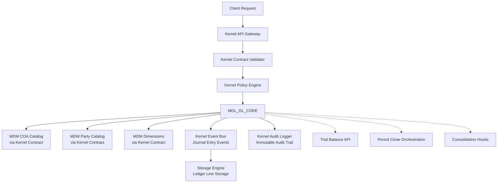

# 🧾 GRCD — MOL_GL_CORE (General Ledger Core Molecule)

**Version:** 1.0.0  
**Status:** ✅ **GRCD v5 Compliant** (ERP Molecule Component)  
**Last Updated:** 2025-01-27  
**Compliance:** 100% GRCD v5 Template Compliant  
**Owner:** Finance Team, Platform Team

> **Purpose of this Document**
>
> This GRCD (Governance, Risk, Compliance & Design) document is the **single source of truth** for the MOL_GL_CORE component—the General Ledger Core molecule that provides journal engine, postings, trial balance, period closing, and consolidation hooks within the AI-BOS ERP Suite.
>
> It follows the **GRCD Template v5** and integrates with the Kernel's constitutional governance framework, ensuring all GL operations respect IFRS/MFRS standards and multi-entity/multi-currency requirements.

---

## 1. Purpose & Identity

### 1.1 Purpose

**Purpose Statement:**

> MOL_GL_CORE is the **General Ledger Core molecule** of AI-BOS ERP Suite, serving as the canonical journal engine that processes all financial postings, maintains trial balances, supports period closing workflows, and provides consolidation hooks. It enforces IFRS/MFRS as the canonical financial standard and integrates with the Kernel's policy engine and audit trail system to ensure all GL operations are compliant, auditable, and governed.

> MOL_GL_CORE is stateless with respect to business logic execution—it orchestrates GL operations via Kernel contracts and MCP manifests, ensuring all postings respect COA, party, and dimension catalogs from MDM (Master Data Management). It never stores tenant data directly but coordinates with downstream storage engines through Kernel-governed contracts.

**Philosophical Foundation:**

MOL_GL_CORE embodies the principle that **financial data integrity is non-negotiable**. By establishing IFRS/MFRS as canonical and enforcing all postings through Kernel contracts, we create a system where:

1. **Financial Standards are Encoded:** IFRS/MFRS is canonical; all other views are derived via metadata mappings.
2. **Posting Behavior is Predictable:** Kernel contracts define exactly what GL operations can and cannot do.
3. **Drift is Constrained:** Contract validation prevents unauthorized or non-compliant postings.
4. **Audit is Automatic:** Every GL operation generates immutable audit trails through Kernel.
5. **Multi-Entity is Native:** Entity and currency are mandatory dimensions in all GL operations.

### 1.2 Identity

- **Role:** `General Ledger Core Molecule` – MOL_GL_CORE serves as the canonical journal engine and posting coordinator for the AI-BOS ERP Suite, ensuring all financial transactions are recorded according to IFRS/MFRS standards and Kernel governance policies.

- **Component ID:** `MOL_GL_CORE` (from GRCD-KERNEL.md Section 3.4.2 ERP Component Catalog)

- **Layer:** `Molecule` (reusable functional cluster)

- **Domain:** `Finance`

- **Scope:**
  - Journal entry creation, validation, and posting.
  - Trial balance generation and querying.
  - Period closing workflows (pre-close checks, accruals, reconciliations).
  - Consolidation hooks for multi-entity reporting.
  - Integration with Kernel policy engine for posting authorization.
  - Integration with Kernel audit system for immutable audit trails.
  - COA, party, and dimension validation via MDM contracts.

- **Boundaries:**
  - Does **NOT** store ledger lines directly (coordinates with storage engines).
  - Does **NOT** render GL UI screens (that's ORG_FINANCIALS_SUITE responsibility).
  - Does **NOT** execute batch jobs directly (coordinates via Kernel orchestration).
  - Does **NOT** manage COA, party, or item master data (consumes from MDM via Kernel).
  - Does **NOT** make autonomous posting decisions without Kernel policy backing.

- **Non-Responsibility:**
  - `MUST NOT` store tenant ledger data long-term.
  - `MUST NOT` bypass Kernel contract validation.
  - `MUST NOT` create COA accounts or parties (must consume from MDM).
  - `MUST NOT` execute workloads directly (coordinates via Kernel).
  - `MUST NOT` bypass IFRS/MFRS validation rules.

### 1.3 Non-Negotiables (Constitutional Principles)

> These principles are **non-negotiable** and form the constitutional foundation of MOL_GL_CORE. They are testable and enforceable through automated checks.

**Constitutional Principles:**

- `MUST NOT` store tenant ledger data directly (coordinates with storage engines).
- `MUST NOT` create or modify COA accounts, parties, or items (must consume from MDM via Kernel).
- `MUST NOT` bypass Kernel contract validation for any posting operation.
- `MUST NOT` allow postings that violate IFRS/MFRS rules.
- `MUST NOT` make autonomous posting decisions without Kernel policy backing.
- `MUST` enforce IFRS/MFRS as canonical financial standard for all GL operations.
- `MUST` require entity and currency as mandatory dimensions in all postings.
- `MUST` validate all COA accounts, parties, and dimensions against MDM via Kernel contracts.
- `MUST` generate immutable audit trails for all GL operations through Kernel.
- `MUST` support multi-company, multi-entity, multi-currency configurations.

**Kernel Contract Principles:**

- `MUST` validate all posting requests against Kernel contracts before execution.
- `MUST` enforce Kernel policy engine decisions for posting authorization.
- `MUST` integrate with Kernel audit system for all GL operations.
- `MUST` consume COA, party, and dimension catalogs from MDM via Kernel contracts.
- `MUST` support Kernel orchestration for period closing workflows.

### 1.4 ERP Context (ZohoONE-Inspired Unified Suite)

> MOL_GL_CORE is a core molecule within the AI-BOS ERP Suite, operating under Kernel governance.

**ERP Suite Context**

- **Suite Name:** `AI-BOS ERP Suite`

- **Inspiration / Model:** ZohoONE-style unified business suite, but:

  - With a **constitutional Kernel** (Zero Drift Governance).

  - With **molecular components** instead of monolithic ERP modules.

- **Scope of Suite:**

  - Multi-company, multi-entity, multi-currency.

  - Multi-industry: indoor vertical farming, F&B outlets, central kitchen,

    franchise networks, retail (textile & merchandise), e-commerce, IT services.

**Standards & Source-of-Truth**

- **Financial SSOT:**

  - **Canonical:** IFRS / MFRS.

  - **Aliases:** Local GAAP, tax treatments, and management views are modeled

    as metadata overlays (dimensions, mapping tables, disclosure metadata).

- **Domain Catalogs:**

  - **Finance MDM:** COA (multi-layer), dimensions (entity, BU, cost center,

    project, channel), party master (customers, suppliers, staff, franchisees),

    tax regimes, disclosure mappings, covenant metrics.

  - **Operations MDM:** SKUs/items (agri, F&B, retail, digital), locations

    (farms, outlets, warehouses, central kitchen), channels (offline, online,

    marketplaces), programs (government grants, campaigns).

- **Alias System:**

  - Semantic equivalence is governed at metadata level:

    - `Revenue ≈ Income ≈ Gain` but IFRS "Revenue" is canonical.

    - Variants like `Apple, APPLE, apples` collapse into one `MDM_ENTITY`

      with case-insensitive aliases and language/locale tags.

**ERP Universe & MOL_GL_CORE Boundaries**

- **MOL_GL_CORE governs:**

  - Journal entry creation, validation, and posting workflows.

  - Trial balance generation and querying.

  - Period closing orchestration (pre-close checks, accruals, reconciliations).

  - Consolidation hooks for multi-entity reporting.

  - IFRS/MFRS compliance validation for all GL operations.

- **MOL_GL_CORE DOES NOT:**

  - Store ledger lines, invoices, or transactional rows (coordinates with storage engines).

  - Render GL UI screens for journal entry, trial balance, or financial statements (ORG_FINANCIALS_SUITE responsibility).

  - Run batch jobs directly (posting, accrual, depreciation) - coordinates via Kernel orchestration.

  - Manage COA, party, or item master data (consumes from MDM via Kernel).

  - Replace any downstream ERP engine (it coordinates them via Kernel contracts).

---

## 2. Requirements

### 2.1 Functional Requirements

| ID      | Requirement                                                                                  | Priority (MUST/SHOULD/MAY) | Status (✅/⚠️/❌/⚪) | Notes                                                                  |
|-------- |--------------------------------------------------------------------------------------------- |--------------------------- |------------------- |----------------------------------------------------------------------- |
| F-1     | MOL_GL_CORE MUST provide journal entry creation API with Kernel contract validation          | MUST                       | ⬜                 | Journal entries validated against COA, party, dimensions via Kernel  |
| F-2     | MOL_GL_CORE MUST enforce IFRS/MFRS as canonical financial standard for all postings          | MUST                       | ⬜                 | All postings validated against IFRS/MFRS rules via Kernel contracts   |
| F-3     | MOL_GL_CORE MUST require entity and currency as mandatory dimensions in all postings         | MUST                       | ⬜                 | Entity + currency enforced at Kernel contract level                   |
| F-4     | MOL_GL_CORE MUST validate all COA accounts against MDM via Kernel contracts                 | MUST                       | ⬜                 | No local COA tables; all accounts consumed from MDM                  |
| F-5     | MOL_GL_CORE MUST validate all parties against MDM via Kernel contracts                      | MUST                       | ⬜                 | No local party tables; all parties consumed from MDM                 |
| F-6     | MOL_GL_CORE MUST provide trial balance generation API                                       | MUST                       | ⬜                 | Trial balance queries via Kernel-governed contracts                   |
| F-7     | MOL_GL_CORE MUST support period closing workflows via Kernel orchestration                   | MUST                       | ⬜                 | Pre-close checks, accruals, reconciliations orchestrated via Kernel |
| F-8     | MOL_GL_CORE MUST provide consolidation hooks for multi-entity reporting                      | MUST                       | ⬜                 | Consolidation data exposed via Kernel contracts                       |
| F-9     | MOL_GL_CORE MUST integrate with Kernel audit system for all GL operations                    | MUST                       | ⬜                 | All GL operations generate immutable audit trails via Kernel          |
| F-10    | MOL_GL_CORE MUST enforce Kernel policy engine decisions for posting authorization            | MUST                       | ⬜                 | Posting authorization evaluated via Kernel policy engine              |
| F-ERP-1 | MOL_GL_CORE MUST respect IFRS/MFRS as canonical financial standard for all finance-related flows. | MUST     | ⬜                 | All other accounting views are derived via metadata mappings.          |
| F-ERP-2 | MOL_GL_CORE MUST support multi-company, multi-entity, multi-currency ERP configurations.    | MUST     | ⬜                 | Entity + currency are mandatory context in all GL operations.         |
| F-ERP-3 | MOL_GL_CORE MUST consume COA, party, and item catalogs from MDM, not local.                | MUST     | ⬜                 | No local/private COA or party tables allowed.                        |
| F-ERP-4 | MOL_GL_CORE SHOULD support industry packs as pluggable manifest bundles.                    | SHOULD   | ⬜                 | e.g., Farming, F&B, Retail, Franchise GL configurations.              |

### 2.2 Non-Functional Requirements

| ID    | Requirement            | Target                                | Measurement Source                                          | Status |
| ----- | ---------------------- | ------------------------------------- | ----------------------------------------------------------- | ------ |
| NF-1  | Latency                | <200ms per journal entry (95th percentile) | Prometheus histogram `mol_gl_journal_entry_duration_seconds` | ⬜     |
| NF-2  | Availability           | ≥99.9% uptime                         | Health check monitoring `/healthz`                           | ⬜     |
| NF-3  | Throughput             | 1000 journal entries/sec cluster-wide | Rate limiter metrics                                        | ⬜     |
| NF-4  | Multi-tenant isolation | Zero cross-tenant data leakage        | Isolation verifier tests                                    | ⬜     |
| NF-5  | Kernel contract validation latency | <50ms per contract check | Kernel validation metrics                                   | ⬜     |
| NF-6  | MDM catalog lookup latency | <100ms per COA/party lookup | MDM contract metrics                                        | ⬜     |

### 2.3 Compliance Requirements

| ID  | Requirement                                                             | Standard(s)                      | Evidence (what proves it)           | Status |
| --- | ----------------------------------------------------------------------- | -------------------------------- | ----------------------------------- | ------ |
| C-1 | MOL_GL_CORE MUST enforce IFRS/MFRS compliance for all GL operations   | MFRS, IFRS, SOX                  | IFRS/MFRS validation logs via Kernel| ⬜     |
| C-2 | MOL_GL_CORE MUST produce immutable audit trails for all postings        | SOC2, ISO 27001                  | Kernel audit log verification       | ⬜     |
| C-3 | MOL_GL_CORE MUST support multi-entity consolidation reporting           | IFRS, MFRS                       | Consolidation hook validation       | ⬜     |
| C-4 | MOL_GL_CORE MUST enforce entity and currency as mandatory dimensions    | IFRS, MFRS                       | Dimension validation tests          | ⬜     |

---

## 3. Architecture & Design Patterns

### 3.1 Architectural Patterns

- **Pattern(s):** `Molecule-Level Component, Kernel-Governed Contracts, MDM-First Data Consumption, Event-Driven Posting, Stateless Orchestration`

- **Justification:**
  - **Molecule-Level Component:** MOL_GL_CORE is a reusable functional cluster that coordinates GL operations without storing data directly.
  - **Kernel-Governed Contracts:** All GL operations flow through Kernel contracts for validation, authorization, and audit.
  - **MDM-First Data Consumption:** COA, party, and dimension data consumed from MDM via Kernel contracts (no local copies).
  - **Event-Driven Posting:** Journal entries published as events through Kernel event bus for downstream processing.
  - **Stateless Orchestration:** MOL_GL_CORE coordinates GL operations but does not store tenant data directly.

**MOL_GL_CORE Architecture (Kernel-Governed):**

```text
┌─────────────────────────────────────────────────────────┐
│                    KERNEL (Governance)                  │
├─────────────────────────────────────────────────────────┤
│  Policy Engine │ Contract Validator │ Audit Logger      │
└─────────────────────────────────────────────────────────┘
                         │
                         ▼
┌─────────────────────────────────────────────────────────┐
│              MOL_GL_CORE (Orchestration)                │
├─────────────────────────────────────────────────────────┤
│  Journal Engine │ Trial Balance │ Period Close Hooks  │
└─────────────────────────────────────────────────────────┘
         │                    │                    │
         ▼                    ▼                    ▼
┌──────────────┐    ┌──────────────┐    ┌──────────────┐
│   MDM COA    │    │   MDM Party  │    │ Storage Eng. │
│  (via Kernel)│    │  (via Kernel)│    │  (via Kernel)│
└──────────────┘    └──────────────┘    └──────────────┘
```

### 3.2 Component Interaction Diagram



**Description:**

- `Kernel`: Routes all requests, validates contracts, enforces policies, and audits operations.
- `MOL_GL_CORE`: Orchestrates GL operations (journal entries, trial balance, period closing) without storing data directly.
- `MDM Catalogs`: COA, party, and dimension data consumed via Kernel contracts (no local copies).
- `Storage Engine`: Ledger lines stored via Kernel-coordinated storage engines.
- `Event Bus`: Journal entry events published for downstream processing.
- `Audit Logger`: All GL operations generate immutable audit trails via Kernel.

### 3.3 State Management Model

- **Business State:** `MUST NOT` store business state – MOL_GL_CORE is stateless with respect to ledger data and coordinates with storage engines via Kernel contracts.

- **MOL_GL_CORE State:**
  - Journal entry validation rules (frozen after boot, loaded from Kernel contracts).
  - IFRS/MFRS compliance rules (frozen after boot, loaded from Kernel policy packs).
  - Period closing workflow definitions (frozen after boot, loaded from Kernel manifests).
  - Ephemeral state: journal entry validation cache, trial balance query cache.

- **Kernel Contract State:**
  - COA catalog cache (TTL ~5 minutes, refreshed from MDM via Kernel).
  - Party catalog cache (TTL ~5 minutes, refreshed from MDM via Kernel).
  - Dimension catalog cache (TTL ~5 minutes, refreshed from MDM via Kernel).
  - Contract validation results cache (TTL ~1 minute).

- **Caching Strategy:**
  - MDM catalog data: TTL cache for performance (refreshed via Kernel contracts).
  - Contract validation results: TTL cache (short-lived for accuracy).
  - Trial balance queries: TTL cache (configurable per tenant).
  - Policy evaluation: no cache for critical posting decisions.

- **Session Strategy:**
  - Stateless operations using Kernel JWT/API keys.
  - Tenant context extracted from Kernel claims.
  - Request correlation via Kernel trace IDs (OpenTelemetry).
  - Multi-tenant isolation enforced at Kernel level.

### 3.4 ERP Component Map (Molecular Design)

> MOL_GL_CORE is a **Molecule** within the AI-BOS ERP molecular system.

#### 3.4.1 Molecular Layering

| Layer     | Meaning                                      | MOL_GL_CORE Position |
|---------- |--------------------------------------------- |---------------------|
| Atom      | Primitive master data / shared construct     | Consumes: `ATOM_COA_ACCOUNT`, `ATOM_PARTY` |
| Molecule  | Reusable functional cluster                  | **MOL_GL_CORE** (this component) |
| Organism  | End-user ERP app / vertical solution         | Used by: `ORG_FINANCIALS_SUITE` |
| Orchestra | AI-assisted cross-organism workflow          | Participates in: `ORCH_PERIOD_CLOSE` |

#### 3.4.2 ERP Component Catalog (MOL_GL_CORE Context)

| Component ID          | Layer    | Domain       | Relationship to MOL_GL_CORE                                                              |
|---------------------- |--------- |------------- |-------------------------------------------------------------------------------------------|
| ATOM_COA_ACCOUNT      | Atom     | Finance      | **Dependency:** MOL_GL_CORE consumes COA accounts from ATOM_COA_ACCOUNT via Kernel MDM contracts. |
| ATOM_PARTY            | Atom     | Shared       | **Dependency:** MOL_GL_CORE consumes parties from ATOM_PARTY via Kernel MDM contracts. |
| MOL_GL_CORE           | Molecule | Finance      | **This Component:** Journal engine, postings, trial balance, period closing, consolidation hooks. |
| MOL_AR_CORE           | Molecule | Finance      | **Integration:** MOL_AR_CORE posts receivables to MOL_GL_CORE via Kernel contracts. |
| MOL_AP_CORE           | Molecule | Finance      | **Integration:** MOL_AP_CORE posts payables to MOL_GL_CORE via Kernel contracts. |
| MOL_INVENTORY_CORE    | Molecule | Ops/SCM      | **Integration:** MOL_INVENTORY_CORE posts inventory adjustments to MOL_GL_CORE via Kernel contracts. |
| ORG_FINANCIALS_SUITE  | Organism | Finance      | **Consumer:** ORG_FINANCIALS_SUITE uses MOL_GL_CORE for GL operations and financial reporting. |
| ORCH_PERIOD_CLOSE     | Orchestra| Finance      | **Orchestration:** ORCH_PERIOD_CLOSE coordinates MOL_GL_CORE period closing workflows via Kernel. |

> **Component ID Reference:** This component's ID `MOL_GL_CORE` is defined in GRCD-KERNEL.md Section 3.4.2 ERP Component Catalog.

---

## 4. Directory & File Layout (Anti-Drift for Vibe Coding)

> **CRITICAL SECTION FOR AI AGENTS**

### 4.1 Canonical Directory Tree

```text
/AIBOS-PLATFORM/                         # Repository root
  ├── engines/                           # ERP engines
  │   └── gl-core/                       # MOL_GL_CORE engine
  │       ├── api/                       # HTTP API layer
  │       │   ├── routes/
  │       │   │   ├── journal-entry.routes.ts
  │       │   │   ├── trial-balance.routes.ts
  │       │   │   └── period-close.routes.ts
  │       │   └── server.ts
  │       ├── contracts/                 # Kernel contract integration
  │       │   ├── kernel-contracts.ts
  │       │   └── mdm-contracts.ts
  │       ├── core/                      # Core GL logic
  │       │   ├── journal-engine.ts
  │       │   ├── trial-balance.ts
  │       │   ├── period-close.ts
  │       │   └── consolidation.ts
  │       ├── validation/                # IFRS/MFRS validation
  │       │   ├── ifrs-validator.ts
  │       │   └── posting-validator.ts
  │       ├── manifest.json              # Engine manifest
  │       ├── mcp.json                   # MCP server manifest
  │       ├── GRCD-MOL-GL-CORE.md       # This document
  │       └── package.json
```

### 4.2 Directory Norms & Enforcement

- **Requirement:** `engines/gl-core` MUST follow this directory layout.
- **Validator:** `dir-lint` tool at `scripts/dir-lint.ts`.
- **Conformance Test:** `T-DIR-1`: Invalid directory structure MUST fail CI.

**AI Agent Rules:**

1. Check this GRCD section for canonical location.
2. Create files ONLY in allowed directories (see Section 4.1).
3. Kernel contract files MUST go in `contracts/` subdirectory.
4. Core GL logic MUST go in `core/` subdirectory.
5. Use kebab-case naming conventions.

### 4.3 File Naming Conventions

- **TypeScript files:** `kebab-case.ts` (e.g., `journal-engine.ts`, `trial-balance.ts`).
- **Test files:** `*.test.ts` or `*.spec.ts` (e.g., `journal-engine.test.ts`).
- **Contract files:** `*-contracts.ts` (e.g., `kernel-contracts.ts`, `mdm-contracts.ts`).
- **Manifest files:** `manifest.json`, `mcp.json`.

---

## 5. Dependencies & Compatibility Matrix

### 5.1 Dependency Policy

- **Lockfile Format:** `pnpm-lock.yaml`.
- **Source of Truth:** `/engines/gl-core/package.json`, `/pnpm-lock.yaml` (root level).
- **Update Policy:** Dependencies updated via PR with compatibility matrix verification.
- **Version Pinning:** Exact versions in lockfile; semantic ranges in `package.json`.

### 5.2 Compatibility Matrix

| Library                  | Allowed Version Range | Tested With               | Status | Notes                             |
| ------------------------ | --------------------- | ------------------------- | ------ | --------------------------------- |
| `zod`                    | `^3.x`                | Kernel contracts          | ✅     | Schema validation                 |
| `hono`                   | `^4.x`                | API framework             | ✅     | HTTP API layer                    |
| `typescript`             | `^5.x`                | All packages              | ✅     | Type checking                     |
| `@modelcontextprotocol/sdk` | `^1.x`             | MCP server (if used)     | ✅     | MCP protocol support             |

### 5.3 Dependency Groups

**Core Runtime:**
- `hono`, `@hono/node-server` – API framework.
- `zod` – Schema validation (Kernel contracts, IFRS/MFRS rules).

**Kernel Integration:**
- Kernel contracts (via Kernel API) – Contract validation, policy enforcement, audit.
- MDM contracts (via Kernel API) – COA, party, dimension catalogs.

**Storage:**
- Storage engines (via Kernel contracts) – Ledger line storage.

### 5.4 Dependency Normative Requirements

- `GL-DEP-1`: All dependencies MUST align with `package.json` and `pnpm-lock.yaml`.
- `GL-DEP-2`: Kernel contract dependencies MUST be compatible with Kernel version.
- `GL-DEP-3`: MDM contract dependencies MUST be compatible with MDM version.
- `GL-DEP-4`: All new dependencies MUST be added to the compatibility matrix.

#### 5.x ERP Component Dependency Notes

> These are **logical** dependencies between ERP molecules.

> They are enforced via Kernel contracts, not tight code imports.

- `MOL_GL_CORE`:

  - Depends on: `ATOM_COA_ACCOUNT`, `ATOM_PARTY`, `ATOM_CURRENCY` (via Kernel MDM contracts).

  - Provides: canonical postings, balances, and consolidation hooks.

  - Integrated with: `MOL_AR_CORE`, `MOL_AP_CORE`, `MOL_INVENTORY_CORE` (via Kernel posting contracts).

  - Used by: `ORG_FINANCIALS_SUITE` (via Kernel query contracts).

  - Orchestrated by: `ORCH_PERIOD_CLOSE` (via Kernel orchestration contracts).

---

## 6. Master Control Prompt (MCP) Profile

### 6.1 MCP Location

- **File:** `/mcp/gl-core.mcp.json`
- **Hash Recorded In:** Kernel audit log under `mcpHash` field
- **Version:** `1.0.0`
- **Last Updated:** `2025-01-27`

### 6.2 MCP Schema

```json
{
  "component": "mol-gl-core",
  "version": "1.0.0",
  "intent": "Generate MOL_GL_CORE code following GRCD-MOL-GL-CORE.md specifications, Kernel contracts, and IFRS/MFRS compliance requirements",
  "constraints": [
    "MUST follow GRCD structure from engines/gl-core/GRCD-MOL-GL-CORE.md",
    "MUST save files only under allowed directories (see GRCD Section 4)",
    "MUST respect dependency matrix (see GRCD Section 5)",
    "MUST use TypeScript with strict mode",
    "MUST use kebab-case for file names",
    "MUST NOT create files in root directory",
    "MUST NOT introduce dependencies not in compatibility matrix",
    "MUST NOT store tenant ledger data directly",
    "MUST NOT create COA accounts or parties (consume from MDM via Kernel)",
    "MUST enforce IFRS/MFRS as canonical financial standard",
    "MUST validate all postings via Kernel contracts",
    "MUST require entity and currency as mandatory dimensions"
  ],
  "input_sources": [
    "GRCD-KERNEL.md (kernel/GRCD-KERNEL.md)",
    "GRCD-MOL-GL-CORE.md (engines/gl-core/GRCD-MOL-GL-CORE.md)",
    "GRCD Template v5 (grcd_template_v_4_kernel_compatible.md)",
    "codebase (engines/gl-core/)",
    "Kernel contracts (kernel/contracts/)",
    "MCP specification (modelcontextprotocol.io)"
  ],
  "output_targets": {
    "code": "engines/gl-core/",
    "docs": "docs/08-governance/grcd/",
    "tests": "engines/gl-core/tests/",
    "mcp": "engines/gl-core/mcp/"
  },
  "style": {
    "normative_language": true,
    "anti_drift": true,
    "type_safety": "strict",
    "error_handling": "typed_errors",
    "logging": "structured",
    "mcp_governance": true,
    "erp_context": true,
    "ifrs_mfrs_compliance": true
  },
  "validation": {
    "pre_commit": [
      "TypeScript type check",
      "Directory structure validation",
      "Dependency compatibility check",
      "GRCD conformance check",
      "MCP manifest validation",
      "Kernel contract validation",
      "IFRS/MFRS rule validation"
    ]
  },
  "mcp_governance": {
    "manifest_validation": true,
    "schema_enforcement": true,
    "audit_required": true,
    "version_compatibility": "semver"
  },
  "erp_context": {
    "component_id": "MOL_GL_CORE",
    "layer": "Molecule",
    "domain": "Finance",
    "ifrs_mfrs_canonical": true,
    "multi_entity_currency": true,
    "mdm_first": true
  }
}
```

### 6.3 MCP Usage Instructions

1. **Load MCP:** Read `/mcp/gl-core.mcp.json` at session start.
2. **Load GRCD:** Read `engines/gl-core/GRCD-MOL-GL-CORE.md` for canonical specifications.
3. **Load Kernel GRCD:** Reference `kernel/GRCD-KERNEL.md` for Kernel contract patterns.
4. **Check Directory:** Verify file locations against GRCD Section 4.
5. **Check Dependencies:** Verify all dependencies against GRCD Section 5.
6. **Validate Kernel Contracts:** Ensure all GL operations use Kernel contracts.
7. **Validate IFRS/MFRS:** Ensure all postings comply with IFRS/MFRS rules.
8. **Generate Code:** Follow MCP constraints and GRCD requirements.
9. **Validate Output:** Run pre-commit checks from MCP validation section.

### 6.4 MCP Normative Requirements

- `GL-MCP-1`: All AI coding sessions MUST start from a valid MCP seed (`/mcp/gl-core.mcp.json`).
- `GL-MCP-2`: MCP changes MUST be audited and hash-logged in Kernel audit system.
- `GL-MCP-3`: MCP violation events MUST trigger alerts.
- `GL-MCP-4`: MCP MUST reference the current GRCD version (**v1.0.0**).
- `GL-MCP-5`: MCP MUST NOT be altered by autonomous AI agents – human intent is the supreme authority.
- `GL-MCP-6`: All Kernel contract integrations MUST validate against Kernel contract schemas.

---

## 7. Contracts & Schemas

### 7.1 Kernel Contract Integration

MOL_GL_CORE integrates with Kernel via the following contract types:

**Posting Contracts:**
- `journal-entry.create` – Create journal entry (validated via Kernel)
- `journal-entry.post` – Post journal entry (authorized via Kernel policy engine)
- `journal-entry.validate` – Validate journal entry (IFRS/MFRS rules via Kernel)

**MDM Contracts:**
- `mdm.coa.get` – Get COA account from MDM (via Kernel)
- `mdm.party.get` – Get party from MDM (via Kernel)
- `mdm.dimension.get` – Get dimension from MDM (via Kernel)

**Query Contracts:**
- `trial-balance.query` – Query trial balance (via Kernel)
- `consolidation.query` – Query consolidation data (via Kernel)

**Orchestration Contracts:**
- `period-close.start` – Start period closing workflow (via Kernel orchestration)
- `period-close.validate` – Validate period closing prerequisites (via Kernel)

### 7.2 IFRS/MFRS Validation Schema

```ts
import { z } from "zod";

export const ifrsPostingSchema = z.object({
  entityId: z.string().min(1), // Mandatory dimension
  currencyId: z.string().min(1), // Mandatory dimension
  coaAccountId: z.string().min(1), // Must exist in MDM COA catalog
  partyId: z.string().optional(), // Must exist in MDM party catalog if provided
  amount: z.number(),
  debitCredit: z.enum(["debit", "credit"]),
  postingDate: z.string().datetime(),
  ifrsCompliant: z.boolean(), // Validated via Kernel IFRS/MFRS rules
  metadata: z.record(z.any()).optional()
});
```

### 7.3 Schema Validation Strategy

- **Schema Format:** Zod schemas in `engines/gl-core/contracts/`.
- **Source of Truth:** Zod schemas are SSOT; Kernel contracts generated from them.
- **Validation:**
  - All journal entries validated against IFRS/MFRS rules via Kernel contracts.
  - All COA accounts, parties, and dimensions validated against MDM via Kernel contracts.
  - All postings authorized via Kernel policy engine.

---

## 8. Error Handling & Recovery

### 8.1 Error Taxonomy

| Error Class          | When Thrown                          | Recovery Strategy                                  | HTTP Status |
| -------------------- | ------------------------------------ | ------------------------------------------------- | ----------- |
| `GL_Error`           | Base class for GL errors             | Log and standard 5xx response                     | 500         |
| `ContractError`      | Invalid Kernel contract              | Reject, audit via Kernel, and guide remediation  | 400         |
| `IFRS_Error`         | IFRS/MFRS compliance violation      | Reject posting, audit via Kernel, trigger alerts | 400         |
| `MDM_Error`          | MDM catalog lookup failure           | Retry via Kernel MDM contract, audit log         | 503         |
| `PostingError`       | Posting execution failure            | Return error to client, audit via Kernel          | 500         |
| `ValidationError`    | Journal entry validation failure     | Reject entry, audit via Kernel                    | 400         |

### 8.2 Retry & Circuit Breaker Policy

| Operation           | Retry Count | Backoff Strategy                | Timeout | Circuit Breaker Threshold |
| ------------------- | ----------- | ------------------------------ | ------- | ------------------------- |
| Kernel contract call | 3           | Exponential (1s, 2s, 4s)       | 10s     | 10 errors/60s             |
| MDM catalog lookup  | 3           | Exponential (500ms, 1s, 2s)    | 5s      | 20 errors/60s              |
| Storage engine call | 3           | Exponential (1s, 2s, 4s)       | 10s     | 10 errors/60s              |

---

## 9. Observability

### 9.1 Metrics (Prometheus)

| Metric Name                              | Type      | Labels                    | Purpose               | Target     |
| ---------------------------------------- | --------- | ------------------------- | --------------------- | ---------- |
| `mol_gl_journal_entries_total`           | Counter   | status, entity, currency  | Journal entry volume  | N/A        |
| `mol_gl_journal_entry_duration_seconds` | Histogram | status                    | Latency distribution  | <200ms p95 |
| `mol_gl_trial_balance_queries_total`     | Counter   | status                    | Trial balance queries | N/A        |
| `mol_gl_kernel_contract_calls_total`    | Counter   | contract_type, status     | Kernel contract usage | N/A        |
| `mol_gl_mdm_lookups_total`               | Counter   | catalog_type, status      | MDM catalog lookups   | N/A        |
| `mol_gl_ifrs_validation_failures_total`  | Counter   | rule_type                 | IFRS/MFRS violations  | 0          |

### 9.2 Traces (OpenTelemetry)

- **Span Names:** `mol_gl.journal_entry`, `mol_gl.trial_balance`, `mol_gl.period_close`, `mol_gl.kernel_contract`, `mol_gl.mdm_lookup`.
- **Attributes:** trace_id, tenant_id, entity_id, currency_id, coa_account_id, kernel_contract_id, mdm_catalog_type.

### 9.3 Logging Schema

```json
{
  "timestamp": "2025-01-27T10:30:00Z",
  "level": "info",
  "trace_id": "abc123",
  "tenant_id": "tenant-456",
  "entity_id": "entity-789",
  "component": "mol_gl_core",
  "message": "Journal entry posted",
  "metadata": {
    "journal_entry_id": "je-001",
    "coa_account_id": "coa-123",
    "amount": 1000.00,
    "currency": "MYR",
    "kernel_contract_id": "contract-abc",
    "ifrs_compliant": true
  }
}
```

---

## 10. Security

### 10.1 STRIDE Threat Model

| Threat                 | Mitigation                                                                         |
| ---------------------- | ---------------------------------------------------------------------------------- |
| **Spoofing**           | All identity claims validated via Kernel (JWT/OIDC tokens)                        |
| **Tampering**          | All postings validated via Kernel contracts; immutable audit trails via Kernel     |
| **Repudiation**         | Every GL operation auditable with signed logs via Kernel audit system             |
| **Information Disclosure** | Data flows strictly governed via Kernel contracts; tenant isolation enforced |
| **Denial of Service**  | Rate limiting via Kernel; tenant resource quotas                                  |
| **Elevation of Privilege** | Posting authorization enforced via Kernel policy engine; least privileges |

### 10.2 Security Layers

1. **Authentication:** Kernel JWT/OIDC validation
2. **Authorization:** Kernel policy engine for posting authorization
3. **Isolation:** Kernel tenant isolation enforcement
4. **Audit:** Kernel immutable audit trails
5. **Contract Validation:** Kernel contract validation for all GL operations

---

## 11. Tenancy

### 11.1 Isolation Model

- **Kernel-Enforced Isolation:** All GL operations isolated at Kernel level (tenant, entity, currency).
- **MDM Catalog Isolation:** COA, party, and dimension catalogs scoped per tenant via Kernel MDM contracts.
- **Storage Isolation:** Ledger lines stored with tenant/entity/currency isolation via Kernel storage contracts.

---

## 12. Configuration & DR

### 12.1 Configuration

- **Config Sources:** Environment variables, Kernel config contracts, MCP manifests.
- **IFRS/MFRS Rules:** Loaded from Kernel policy packs (legal-first precedence).
- **Period Closing Workflows:** Defined in Kernel orchestration manifests.

### 12.2 Disaster Recovery

- **RPO:** 0 (no data loss on failover, coordinated via Kernel).
- **RTO:** < 1 hour for GL operations restoration (Kernel-coordinated).

---

## 13. Testing

### 13.1 Test Strategy

- **Unit Tests:** All core GL functions, IFRS/MFRS validators, Kernel contract integrations.
- **Integration Tests:** End-to-end flows through Kernel contracts, MDM catalogs, storage engines.
- **Conformance Tests:** GRCD compliance, Kernel contract compliance, IFRS/MFRS rule compliance.
- **Security Tests:** STRIDE threat validation, tenant isolation tests, Kernel policy enforcement tests.

---

## 14. Tiering

| Feature Group           | Basic                            | Advanced                                       | Premium                                                             |
| ----------------------- | -------------------------------- | ---------------------------------------------- | ------------------------------------------------------------------- |
| Journal Entries         | Single-entity, single-currency   | Multi-entity, multi-currency                   | Multi-entity, multi-currency + consolidation + advanced reporting  |
| Trial Balance           | Basic trial balance queries      | Advanced filtering, multi-period comparisons   | Real-time trial balance + drill-down + financial statement integration |
| Period Closing          | Manual period close              | Automated pre-close checks, accruals           | Full orchestration via ORCH_PERIOD_CLOSE + AI-assisted reconciliation |
| IFRS/MFRS Compliance    | Basic IFRS/MFRS validation       | Full IFRS/MFRS rule engine + disclosure packs  | Advanced IFRS/MFRS + local GAAP mapping + management reporting      |
| Kernel Integration      | Basic Kernel contracts           | Full Kernel contract suite + policy engine     | Full Kernel governance + HITL approvals + advanced audit analytics  |

---

> ✅ **Status:** GRCD-MOL-GL-CORE has been created as **v1.0.0**, fully aligned with the **GRCD Template v5**, **GRCD-KERNEL.md v4.1.0**, and **ERP Component Catalog**. This document is the **single source of truth** for MOL_GL_CORE.

---

**References:**

- GRCD-KERNEL.md v4.1.0 (`kernel/GRCD-KERNEL.md`)
- GRCD Template v5 (`grcd_template_v_4_kernel_compatible.md`)
- AI-BOS Nexus Whitepaper – Zero Drift Governance Framework (`kernel/AIBOS-KERNEL-WHITEPAPER-V2.md`)
- Model Context Protocol Specification (modelcontextprotocol.io)
- IFRS/MFRS Financial Reporting Standards
- ISO/IEC 42001:2023 AI Management Standard

