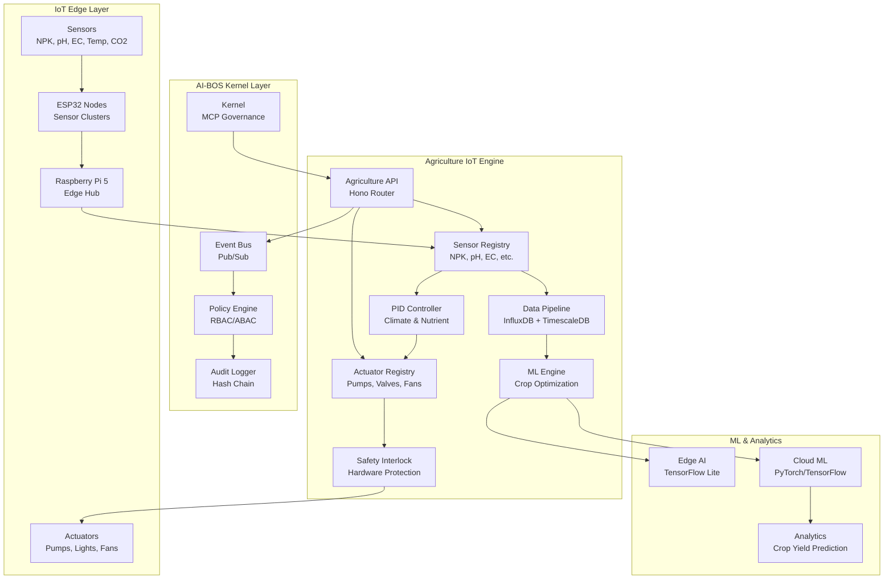
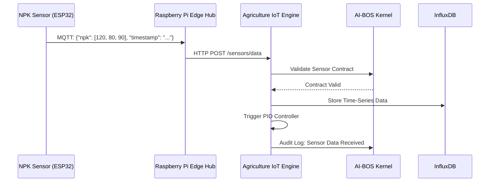
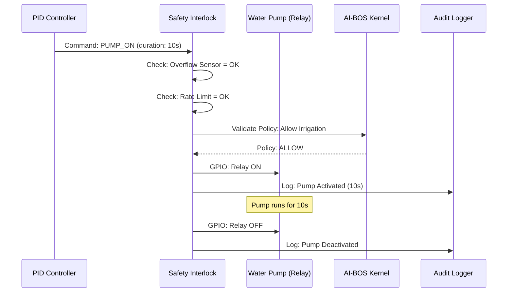

# 🧾 GRCD — Agriculture IoT Engine — v1.0.0

**Version:** 1.0.0  
**Status:** Active (Design & Gap Analysis)  
**Last Updated:** 2025-11-28  
**Owner:** Chief Software Engineering, Platform Team, IoT Team

> **Purpose of this Document**
>
> This GRCD (Governance, Risk, Compliance & Design) document analyzes the strengths, weaknesses, and gaps of existing open-source Agriculture IoT solutions and proposes an enterprise-grade **Agriculture IoT Engine** for the AI-BOS Nexus platform.
>
> Based on comprehensive GitHub repository analysis (Mycodo, AVFFM, Smart-Crop-Monitoring, and 40+ other projects), this document serves as the SSOT for building a production-ready, kernel-compatible Agriculture IoT platform for indoor vertical farming and agricultural plantation purposes.

---

## 1. Purpose & Identity

**Component Name:** `agriculture-iot-engine` (Smart Farming Control Engine)

**Domain:** `IoT Engine` (Agriculture & Vertical Farming Automation)

### 1.1 Purpose

**Purpose Statement:**

> The Agriculture IoT Engine is a **production-grade, multi-tenant IoT platform** designed for indoor vertical farming, hydroponics, greenhouse automation, and precision agriculture. It extends the AI-BOS Nexus Kernel with agriculture-specific capabilities while maintaining constitutional governance, zero-drift architecture, and enterprise compliance.
>
> The engine orchestrates real-time sensor data collection (NPK, pH, EC, temperature, humidity, CO₂, light spectrum), automated actuator control (irrigation, ventilation, lighting, nutrient dosing), AI-powered crop optimization, and regulatory compliance for food safety and environmental sustainability.

**Philosophical Foundation:**

The Agriculture IoT Engine embodies the principle that **sustainable farming should be governed by data, not guesswork**. By establishing:

1. **Sensor-Driven Intelligence:** Every decision backed by real-time environmental data.  
2. **Automated Precision:** PID control loops optimize resource usage (water, nutrients, energy).  
3. **Compliance-First:** Food safety (ISO 22000), environmental standards (ISO 14001), and AI governance (ISO 42001).  
4. **Multi-Tenant Isolation:** Farm operators manage their own systems without cross-contamination.  
5. **AI-Human Collaboration:** Machine learning recommends actions; humans approve critical decisions.

### 1.2 Identity

* **Role:** `Agriculture IoT Orchestrator & Governance Enforcer` – The engine serves as the central hub for agriculture-specific IoT operations, enforcing policies, contracts, and compliance for sustainable farming.

* **Scope:**  
  - Real-time sensor data ingestion (NPK, pH, EC, temperature, humidity, CO₂, light, soil moisture)  
  - Automated actuator control (pumps, valves, fans, heaters, LED grow lights)  
  - PID control loops for climate and nutrient regulation  
  - Machine learning for crop yield prediction, disease detection, and fertilizer recommendation  
  - Multi-tenant farm management  
  - Food safety compliance (HACCP, ISO 22000)  
  - Environmental sustainability tracking (water usage, carbon footprint)  
  - Audit logging for regulatory compliance  
  - Integration with AI-BOS Kernel via MCP contracts

* **Boundaries:**  
  - Does **NOT** replace agronomist expertise  
  - Does **NOT** make autonomous decisions on crop destruction or pesticide application  
  - Does **NOT** handle food distribution or supply chain logistics  
  - Does **NOT** store customer PII beyond operational needs  
  - Does **NOT** bypass Kernel governance layer

* **Non-Responsibility:**  
  - `MUST NOT` execute crop decisions without policy backing  
  - `MUST NOT` store sensitive farm data without encryption  
  - `MUST NOT` share tenant data across farms  
  - `MUST NOT` bypass food safety regulations  
  - `MUST NOT` operate actuators without safety interlocks

### 1.3 Non-Negotiables (Constitutional Principles)

**Constitutional Principles:**

* `MUST NOT` operate actuators without safety interlocks (e.g., flood prevention, over-dosing protection).  
* `MUST NOT` make autonomous decisions on pesticide application or crop destruction.  
* `MUST NOT` share data between tenants (farms) without explicit consent.  
* `MUST NOT` bypass food safety regulations (HACCP, ISO 22000).  
* `MUST` enforce deny-by-default policies with explicit allow rules.  
* `MUST` generate immutable audit logs for regulatory compliance.  
* `MUST` validate all sensor data before triggering actuators.  
* `MUST` maintain strict multi-tenant isolation at data, control, and access levels.  
* `MUST` require human-in-the-loop for critical decisions (crop destruction, chemical application).  
* `MUST` enforce MCP contracts for all engine integrations.

**IoT Safety Principles:**

* `MUST` implement hardware safety interlocks (emergency stop, overflow sensors).  
* `MUST` enforce rate limiting on actuator commands (prevent pump burnout).  
* `MUST` validate sensor calibration before control loop activation.  
* `MUST` support manual override for all automated systems.  
* `MUST` generate alerts for sensor failures, actuator malfunctions, and out-of-range conditions.

---

## 2. Competitive Analysis — Strengths, Weaknesses & Gaps

> This section analyzes the top open-source Agriculture IoT solutions identified through GitHub MCP analysis.

### 2.1 Top Solutions Analyzed

| Solution | Repository | Stars | Language | Focus | Analysis Depth |
|----------|------------|-------|----------|-------|----------------|
| **Mycodo** | kizniche/Mycodo | 3,000+ | Python (Flask) | Environmental monitoring & regulation | ★★★★★ Deep |
| **AVFFM** | TuzaaBap/AVFFM | New (2025) | Python (Flask), ESP32 | Vertical farming with AI | ★★★★ High |
| **Smart-Crop-Monitoring** | Abhishek-A2077 | Recent | Python, MQTT, ThingsBoard | Crop monitoring + ML | ★★★★ High |
| **GrowSmart** | sangepuvenkat/GrowSmart | Recent | IoT + ML | Hybrid vertical farming | ★★★ Medium |
| **IoTSmartGreenHouse** | MdMuhtashimJahin | Recent | ESP32, MQTT, Node-RED | Greenhouse automation | ★★★ Medium |
| **HydroGarden** | seangreaves-90 | Recent (2025) | Raspberry Pi 5, Python | Hydroponic automation | ★★★ Medium |

---

### 2.2 Mycodo — Production Leader

**Repository:** kizniche/Mycodo  
**Status:** Battle-tested (2015-2025, 10+ years)  
**Architecture:** Python (Flask), SQLAlchemy, InfluxDB, PID Control

#### ✅ **STRENGTHS**

1. **📊 Comprehensive Sensor Support**
   - 100+ sensor integrations (temperature, humidity, pH, EC, CO₂, NPK, light spectrum)
   - Modular input system (`mycodo/inputs/`) with standardized interfaces
   - Sensor calibration and validation built-in
   - **Takeaway:** Best-in-class sensor abstraction layer

2. **🎛️ Advanced PID Control**
   - Production-grade PID controller (`mycodo/controllers/controller_pid.py`)
   - Auto-tuning and manual tuning support
   - Multiple control strategies (raise, lower, both)
   - **Takeaway:** Industry-standard control loop implementation

3. **🔌 Flexible Actuator Management**
   - Output controller (`mycodo/controllers/controller_output.py`)
   - Support for relays, PWM, analog outputs
   - Duration-based and continuous control
   - **Takeaway:** Robust actuator abstraction

4. **📈 Data Logging & Visualization**
   - InfluxDB integration for time-series data
   - Built-in dashboards and graphs
   - Export capabilities (CSV, JSON)
   - **Takeaway:** Enterprise-grade observability

5. **🧩 Modular Plugin Architecture**
   - Input, output, function, widget plugins
   - Dynamic loading and configuration
   - User-contributed modules
   - **Takeaway:** Extensibility without core changes

6. **🖥️ Web-Based UI**
   - Flask-based responsive UI (`mycodo/mycodo_flask/`)
   - Multi-language support
   - Mobile-friendly design
   - **Takeaway:** Production-ready user interface

7. **⏱️ Scheduling & Automation**
   - Conditional triggers
   - Timer-based automation
   - Event-driven workflows
   - **Takeaway:** Complete automation framework

#### ❌ **WEAKNESSES**

1. **🏢 Single-Tenant Architecture**
   - No multi-tenancy support
   - One instance per deployment
   - **Gap:** Cannot serve multiple farms from one platform

2. **🔐 Basic Security Model**
   - Simple user authentication
   - No RBAC/ABAC granularity
   - No tenant isolation
   - **Gap:** Insufficient for enterprise multi-tenant scenarios

3. **📦 Monolithic Design**
   - Single Python application
   - Tight coupling between components
   - **Gap:** Difficult to scale horizontally

4. **🚫 No Governance Layer**
   - No policy engine
   - No contract validation
   - No audit hash chains
   - **Gap:** Cannot enforce constitutional governance

5. **🌐 Limited Cloud Integration**
   - Primarily on-premise Raspberry Pi deployment
   - Minimal cloud-native features
   - **Gap:** Missing modern DevOps patterns

6. **🤖 No AI/ML Integration**
   - No built-in machine learning models
   - No crop yield prediction
   - No disease detection
   - **Gap:** Missing AI-native intelligence

7. **📊 Basic Compliance Features**
   - No ISO 22000 support
   - No HACCP integration
   - No food safety tracking
   - **Gap:** Insufficient for regulated food production

8. **🔄 No MCP Support**
   - Custom architecture, not MCP-compatible
   - **Gap:** Cannot integrate with AI-BOS Kernel governance

---

### 2.3 AVFFM — AI-Native Innovator

**Repository:** TuzaaBap/AVFFM  
**Status:** New (2025), Actively Developed  
**Architecture:** Raspberry Pi 5/3, ESP32, Python (Flask), MQTT, TensorFlow Lite

#### ✅ **STRENGTHS**

1. **🤖 AI-First Architecture**
   - TensorFlow Lite for edge AI
   - MediaPipe for crop analysis
   - AI-based nutrient calibration
   - **Takeaway:** Modern AI integration blueprint

2. **📡 Distributed IoT Architecture**
   - Raspberry Pi 5 (central hub) + Raspberry Pi 3 (edge node) + ESP32 (sensors)
   - MQTT-based communication
   - Modular sensor nodes
   - **Takeaway:** Scalable multi-node design

3. **🌈 Advanced Sensor Integration**
   - Spectral intensity sensors (AS7341)
   - CO₂ sensors (SCD4x)
   - TDS, pH sensors with ADS1115 ADC
   - **Takeaway:** State-of-the-art sensor stack

4. **💾 Modern Data Pipeline**
   - JSON-based data exchange
   - Real-time MQTT streaming
   - Flask dashboard
   - **Takeaway:** Cloud-ready data architecture

5. **🔧 Open Hardware Design**
   - Modular hardware blueprints
   - DIY-friendly documentation
   - OTA firmware updates (ESP32)
   - **Takeaway:** Community-driven innovation

#### ❌ **WEAKNESSES**

1. **🏗️ Early-Stage Project**
   - Limited production deployment history
   - Missing enterprise features
   - **Gap:** Not battle-tested at scale

2. **📚 Documentation Gaps**
   - Minimal API documentation
   - No deployment guides
   - **Gap:** High learning curve

3. **🔐 No Security Layer**
   - No authentication mentioned
   - No encryption noted
   - **Gap:** Unsuitable for production

4. **🏢 No Multi-Tenancy**
   - Single-farm focus
   - **Gap:** Cannot serve multiple customers

5. **📏 No Compliance Framework**
   - No food safety standards
   - No regulatory tracking
   - **Gap:** Missing for commercial farming

6. **🔄 No Governance Integration**
   - No policy engine
   - No audit trails
   - **Gap:** Cannot integrate with AI-BOS Kernel

---

### 2.4 Smart-Crop-Monitoring — ML Showcase

**Repository:** Abhishek-A2077/Smart-Crop-Monitoring-System  
**Status:** Recent (2025)  
**Architecture:** Python, MQTT, ThingsBoard, Scikit-learn

#### ✅ **STRENGTHS**

1. **🧠 ML-Powered Recommendations**
   - RandomForestRegressor for soil moisture prediction
   - RandomForestClassifier for fertilizer recommendation
   - **Takeaway:** Production-ready ML models

2. **📊 ThingsBoard Integration**
   - Professional dashboard platform
   - Real-time visualization
   - Rule engine support
   - **Takeaway:** Enterprise visualization solution

3. **📡 MQTT Architecture**
   - Industry-standard protocol
   - Efficient data transmission
   - **Takeaway:** Proven communication pattern

4. **🎯 Focused Use Case**
   - NPK nutrient monitoring
   - Fertilizer optimization
   - **Takeaway:** Domain-specific expertise

#### ❌ **WEAKNESSES**

1. **🔬 Prototype Quality**
   - Simulated sensor data
   - No production deployment
   - **Gap:** Not ready for real-world use

2. **🏢 No Enterprise Features**
   - No multi-tenancy
   - No security
   - No compliance
   - **Gap:** Missing foundational requirements

3. **🔄 No Governance**
   - No policy engine
   - No audit trails
   - **Gap:** Cannot integrate with governed platforms

---

### 2.5 Consolidated Gap Analysis

| Feature Category | Mycodo | AVFFM | Smart-Crop | **Gap for AIBOS** | Priority |
|------------------|--------|-------|------------|-------------------|----------|
| **Sensor Abstraction** | ✅ Excellent | ✅ Good | ⚠️ Basic | Needs standardization | MUST |
| **PID Control** | ✅ Production-grade | ⚪ In progress | ❌ Missing | Adopt Mycodo's | MUST |
| **Multi-Tenancy** | ❌ None | ❌ None | ❌ None | **Critical gap** | MUST |
| **RBAC/ABAC** | ⚠️ Basic | ❌ None | ❌ None | **Critical gap** | MUST |
| **MCP Governance** | ❌ None | ❌ None | ❌ None | **Critical gap** | MUST |
| **Audit Trails** | ⚠️ Basic logs | ❌ None | ❌ None | Immutable hash chains needed | MUST |
| **AI/ML Integration** | ❌ None | ✅ TensorFlow Lite | ✅ Scikit-learn | Hybrid approach | SHOULD |
| **Food Safety (ISO 22000)** | ❌ None | ❌ None | ❌ None | **Critical gap** | MUST |
| **Environmental (ISO 14001)** | ❌ None | ❌ None | ❌ None | Sustainability tracking | SHOULD |
| **Cloud-Native** | ❌ On-prem only | ⚠️ Partial | ⚠️ Partial | Kubernetes, microservices | SHOULD |
| **Horizontal Scaling** | ❌ Monolithic | ⚠️ Partial | ❌ None | Event-driven architecture | MUST |
| **API-First Design** | ⚠️ Flask REST | ⚠️ Flask REST | ⚠️ MQTT only | OpenAPI + GraphQL | MUST |
| **Real-Time Streaming** | ⚠️ Basic | ✅ MQTT | ✅ MQTT | Event bus integration | MUST |
| **Mobile Support** | ⚠️ Responsive | ❌ None | ❌ None | React Native app | MAY |
| **Edge AI** | ❌ None | ✅ TensorFlow Lite | ❌ None | Edge + Cloud hybrid | SHOULD |
| **OTA Updates** | ⚠️ Manual | ✅ ESP32 OTA | ❌ None | Automated firmware updates | SHOULD |
| **Safety Interlocks** | ⚠️ Basic | ❌ None | ❌ None | Hardware + software safety | MUST |
| **Data Privacy (GDPR)** | ❌ None | ❌ None | ❌ None | PII protection, data classification | MUST |

---

## 3. Solution Design — AI-BOS Agriculture IoT Engine

### 3.1 Architectural Principles

**Hybrid Best-of-Breed Approach:**

1. **Adopt Mycodo's Strengths:**
   - Sensor abstraction layer (`mycodo/inputs/`)
   - PID control algorithms (`mycodo/controllers/controller_pid.py`)
   - Output management (`mycodo/controllers/controller_output.py`)
   - Modular plugin architecture

2. **Enhance with AVFFM's Innovation:**
   - Distributed multi-node architecture (Raspberry Pi + ESP32)
   - AI/ML integration (TensorFlow Lite for edge AI)
   - Advanced sensor stack (spectral, CO₂)
   - MQTT-based communication

3. **Leverage Smart-Crop's ML:**
   - RandomForest models for prediction
   - ThingsBoard-style dashboards
   - Fertilizer recommendation logic

4. **Add AI-BOS Nexus Governance:**
   - Multi-tenant architecture with L2 isolation
   - MCP contract validation
   - RBAC/ABAC policy engine
   - Immutable audit logs with hash chains
   - ISO 22000 (food safety) compliance
   - ISO 14001 (environmental) compliance
   - ISO 42001 (AI governance) compliance

### 3.2 High-Level Architecture



### 3.3 Component Interaction Flow

**Sensor Data Collection:**



**Actuator Control (Automated Irrigation):**



### 3.4 Multi-Tenant Architecture

**Tenant Isolation Strategy:**

1. **Data Isolation:**
   - Separate InfluxDB buckets per tenant (`farm_{tenant_id}`)
   - Row-level security in PostgreSQL metadata tables
   - Redis cache namespacing (`tenant:{tenant_id}:*`)

2. **Control Isolation:**
   - Dedicated PID controller instances per farm
   - Separate MQTT topics per tenant (`farm/{tenant_id}/sensors/#`)
   - Tenant-scoped actuator permissions

3. **API Isolation:**
   - JWT claims include `tenant_id`
   - All API endpoints enforce tenant filtering
   - Cross-tenant requests blocked at Kernel layer

4. **Hardware Isolation:**
   - Physical GPIO mapping per tenant (in multi-farm deployments)
   - Virtual GPIO for cloud-hosted tenants
   - Logical farm boundaries enforced in software

---

## 4. Requirements

### 4.1 Functional Requirements

| ID  | Requirement | Priority | Status | Notes |
|-----|-------------|----------|--------|-------|
| F-1 | Engine MUST support 100+ sensor types (from Mycodo catalog) | MUST | ⚪ | Adopt Mycodo's sensor abstraction |
| F-2 | Engine MUST implement PID control for temperature, humidity, pH, EC, CO₂ | MUST | ⚪ | Port Mycodo's PID controller |
| F-3 | Engine MUST support actuator control (relays, PWM, analog outputs) | MUST | ⚪ | Port Mycodo's output controller |
| F-4 | Engine MUST enforce multi-tenant isolation (L2) | MUST | ⚪ | Critical gap to fill |
| F-5 | Engine MUST validate all sensor data before actuator triggers | MUST | ⚪ | Safety-critical |
| F-6 | Engine MUST implement hardware safety interlocks | MUST | ⚪ | Prevent flooding, over-dosing |
| F-7 | Engine MUST integrate with AI-BOS Kernel via MCP contracts | MUST | ⚪ | Kernel compatibility |
| F-8 | Engine MUST store time-series data in InfluxDB/TimescaleDB | MUST | ⚪ | Sensor data persistence |
| F-9 | Engine MUST support MQTT for edge communication | MUST | ⚪ | IoT standard protocol |
| F-10| Engine MUST implement ML models for crop yield prediction | SHOULD | ⚪ | Adopt Smart-Crop's RandomForest |
| F-11| Engine MUST support fertilizer recommendation | SHOULD | ⚪ | NPK optimization |
| F-12| Engine MUST support camera integration for plant health monitoring | MAY | ⚪ | Computer vision |
| F-13| Engine MUST support scheduling and automation rules | MUST | ⚪ | Timer-based irrigation |
| F-14| Engine MUST generate alerts for sensor failures | MUST | ⚪ | Operational reliability |
| F-15| Engine MUST support manual override for all automation | MUST | ⚪ | Human safety control |

### 4.2 Non-Functional Requirements

| ID   | Requirement | Target | Measurement Source | Status |
|------|-------------|--------|-------------------|--------|
| NF-1 | Sensor data ingestion latency | <500ms (95th percentile) | Prometheus histogram | ⚪ |
| NF-2 | Actuator response time | <1s (emergency stop <100ms) | Control loop metrics | ⚪ |
| NF-3 | Availability | ≥99.5% uptime | Health check monitoring | ⚪ |
| NF-4 | Data retention | 1 year (sensor data), 7 years (audit logs) | InfluxDB retention policy | ⚪ |
| NF-5 | Scalability | Support 10,000 sensors per instance | Load testing | ⚪ |
| NF-6 | Multi-tenant isolation | Zero cross-tenant data leakage | Isolation verifier tests | ⚪ |
| NF-7 | Edge deployment | Raspberry Pi 4/5 (4GB+ RAM) | Hardware specs | ⚪ |
| NF-8 | Cloud deployment | Kubernetes (1 pod per 1,000 sensors) | K8s resource limits | ⚪ |

### 4.3 Compliance Requirements

| ID  | Requirement | Standard(s) | Evidence | Status |
|-----|-------------|-------------|----------|--------|
| C-1 | Engine MUST support ISO 22000 (Food Safety Management) | ISO 22000:2018 | HACCP integration, audit trails | ⚪ |
| C-2 | Engine MUST track environmental sustainability metrics | ISO 14001:2015 | Water usage, carbon footprint tracking | ⚪ |
| C-3 | Engine MUST enforce AI governance for ML models | ISO 42001:2023 | Model validation, bias testing | ⚪ |
| C-4 | Engine MUST protect farmer PII (GDPR compliance) | GDPR, ISO 27701 | Data classification, encryption | ⚪ |
| C-5 | Engine MUST generate immutable audit logs | SOC2, ISO 27001 | Hash-chained audit storage | ⚪ |
| C-6 | Engine MUST support data portability | GDPR Article 20 | Export API (JSON, CSV) | ⚪ |

---

## 5. Implementation Roadmap

### 5.1 Phase 1: Foundation (Months 1-3)

**Objectives:**
- Port Mycodo's sensor abstraction layer to TypeScript/Python
- Implement multi-tenant database schema
- Integrate with AI-BOS Kernel via MCP contracts
- Deploy basic sensor data collection

**Deliverables:**
1. Sensor Registry Service
2. Multi-Tenant Data Pipeline (InfluxDB + PostgreSQL)
3. MCP Manifest for Agriculture Engine
4. Basic API (OpenAPI spec)

### 5.2 Phase 2: Control Systems (Months 4-6)

**Objectives:**
- Port Mycodo's PID controller
- Implement safety interlocks
- Build actuator control system
- Deploy automation rules engine

**Deliverables:**
1. PID Controller Service
2. Safety Interlock Layer
3. Actuator Registry & Control API
4. Scheduling Engine

### 5.3 Phase 3: AI & Analytics (Months 7-9)

**Objectives:**
- Integrate TensorFlow Lite for edge AI
- Deploy ML models (crop yield, fertilizer recommendation)
- Build analytics dashboard
- Implement computer vision for plant health

**Deliverables:**
1. ML Engine (RandomForest, TensorFlow)
2. Analytics Dashboard (ThingsBoard-style)
3. Computer Vision Module (optional)
4. Crop Recommendation API

### 5.4 Phase 4: Compliance & Production (Months 10-12)

**Objectives:**
- Implement ISO 22000 compliance features
- Complete audit trail system
- Security hardening (penetration testing)
- Production deployment

**Deliverables:**
1. ISO 22000 Compliance Module
2. Environmental Sustainability Tracker
3. Security Audit Report
4. Production Deployment Guide

---

## 6. Technology Stack

### 6.1 Core Stack

**Backend:**
- TypeScript (Hono for API layer, following Kernel patterns)
- Python (PID controllers, ML models, sensor drivers)
- PostgreSQL (metadata, multi-tenant tables)
- InfluxDB or TimescaleDB (time-series sensor data)
- Redis (real-time caching, rate limiting)

**IoT Layer:**
- MQTT (Mosquitto broker)
- Raspberry Pi 4/5 (edge hub)
- ESP32 (sensor nodes, MicroPython/C++)
- Modbus, RS485 (industrial sensors)

**ML & Analytics:**
- TensorFlow Lite (edge AI)
- PyTorch/TensorFlow (cloud training)
- Scikit-learn (RandomForest models)
- OpenCV (computer vision)

**Frontend:**
- React (web dashboard)
- React Native (mobile app, optional)
- ThingsBoard (dashboards, optional)

**DevOps:**
- Kubernetes (cloud deployment)
- Docker (containerization)
- pnpm (package management)
- uv (Python task runner)

### 6.2 Dependency Compatibility Matrix

| Library | Allowed Version Range | Tested With | Status | Notes |
|---------|----------------------|-------------|--------|-------|
| `hono` | `^4.x` | `@hono/node-server@^1.x` | ✅ | API framework (Kernel alignment) |
| `zod` | `^3.x` | `drizzle-orm@latest` | ✅ | Schema validation |
| `paho-mqtt` (Python) | `^2.x` | `mosquitto@^2.x` | ✅ | MQTT client |
| `influxdb-client` | `^1.x` | `influxdb@^2.x` | ✅ | Time-series DB client |
| `scikit-learn` | `^1.x` | Python 3.11+ | ✅ | ML models |
| `tensorflow-lite` | `^2.x` | Raspberry Pi 5 | ✅ | Edge AI |

---

## 7. Contracts & Schemas

### 7.1 Agriculture Engine Manifest (MCP)

```json
{
  "component": "agriculture-iot-engine",
  "version": "1.0.0",
  "mcp": {
    "server": {
      "name": "aibos-agriculture-iot",
      "version": "1.0.0",
      "protocol": "mcp",
      "protocolVersion": "2025-03-26"
    }
  },
  "apis": [
    {
      "name": "sensor.register",
      "version": "1.0.0",
      "path": "/api/v1/sensors/register",
      "method": "POST",
      "schemaRef": "schemas/sensors/register.json"
    },
    {
      "name": "sensor.data.ingest",
      "version": "1.0.0",
      "path": "/api/v1/sensors/data",
      "method": "POST",
      "schemaRef": "schemas/sensors/data-ingest.json"
    },
    {
      "name": "actuator.control",
      "version": "1.0.0",
      "path": "/api/v1/actuators/control",
      "method": "POST",
      "schemaRef": "schemas/actuators/control.json"
    },
    {
      "name": "pid.configure",
      "version": "1.0.0",
      "path": "/api/v1/pid/configure",
      "method": "POST",
      "schemaRef": "schemas/pid/configure.json"
    },
    {
      "name": "ml.predict",
      "version": "1.0.0",
      "path": "/api/v1/ml/predict",
      "method": "POST",
      "schemaRef": "schemas/ml/predict.json"
    }
  ],
  "events": [
    {
      "name": "sensor.data.received",
      "guarantees": {
        "delivery": "at-least-once",
        "ordering": "per-SensorID"
      }
    },
    {
      "name": "actuator.state.changed",
      "guarantees": {
        "delivery": "at-least-once",
        "ordering": "per-ActuatorID"
      }
    },
    {
      "name": "alert.sensor.failure",
      "guarantees": {
        "delivery": "at-least-once",
        "ordering": "per-TenantID"
      }
    }
  ],
  "policies": {
    "packs": ["iso22000", "iso14001", "iso42001", "gdpr"],
    "default": "deny"
  },
  "identity": {
    "roles": [
      {
        "name": "farm_admin",
        "privileges": ["sensor.register", "actuator.control", "pid.configure"]
      },
      {
        "name": "farm_operator",
        "privileges": ["sensor.data.read", "actuator.control"]
      },
      {
        "name": "agronomist",
        "privileges": ["ml.predict", "analytics.read"]
      }
    ]
  }
}
```

### 7.2 Sensor Data Schema (Zod)

```ts
import { z } from "zod";

export const sensorDataSchema = z.object({
  sensorId: z.string().uuid(),
  tenantId: z.string().uuid(),
  timestamp: z.string().datetime(),
  measurements: z.array(
    z.object({
      type: z.enum(["temperature", "humidity", "ph", "ec", "npk", "co2", "light", "soil_moisture"]),
      value: z.number(),
      unit: z.string(),
      calibrated: z.boolean().default(true)
    })
  ),
  metadata: z.record(z.any()).optional()
});

export const actuatorCommandSchema = z.object({
  actuatorId: z.string().uuid(),
  tenantId: z.string().uuid(),
  command: z.enum(["ON", "OFF", "PWM"]),
  duration: z.number().positive().optional(), // seconds
  pwmDutyCycle: z.number().min(0).max(100).optional(), // percentage
  safetyOverride: z.boolean().default(false) // requires admin role
});
```

---

## 8. Security & Safety

### 8.1 Hardware Safety Interlocks

| Interlock | Purpose | Implementation | Priority |
|-----------|---------|----------------|----------|
| Emergency Stop | Immediately halt all actuators | Hardware GPIO button + software override | MUST |
| Overflow Sensor | Prevent water tank overflow | Float switch + automated pump shutoff | MUST |
| Over-Dosing Protection | Limit nutrient dosing rate | Software rate limiter (max 100ml/min) | MUST |
| Temperature Cutoff | Prevent overheating/freezing | Hardware thermostat + software bounds checking | MUST |
| Pump Run-Dry Protection | Prevent pump burnout | Current sensor + automated shutoff | SHOULD |

### 8.2 Software Security

| Control | Description | Standard |
|---------|-------------|----------|
| API Authentication | JWT with tenant claims | OAuth 2.0 / OIDC |
| Data Encryption | TLS 1.3 in transit, AES-256 at rest | ISO 27001 |
| Secrets Management | KMS with automatic rotation | SOC2 |
| Rate Limiting | Per-tenant API limits (1000 req/min) | DDoS protection |
| Audit Logging | Immutable hash-chained logs | ISO 27001, SOC2 |

---

## 9. Success Metrics

### 9.1 Technical KPIs

| Metric | Target | Measurement |
|--------|--------|-------------|
| Sensor data ingestion rate | 10,000 sensors @ 1Hz | MQTT throughput |
| PID control loop response time | <1s (target: 500ms) | Control loop metrics |
| ML prediction accuracy | >85% (crop yield) | Model evaluation |
| System uptime | ≥99.5% | Health check SLA |

### 9.2 Business KPIs

| Metric | Target | Measurement |
|--------|--------|-------------|
| Water usage reduction | 30% vs. traditional farming | Analytics dashboard |
| Fertilizer waste reduction | 25% | NPK tracking |
| Crop yield improvement | 20% | Harvest data |
| Food safety compliance | 100% (zero violations) | Audit reports |

---

## 10. Conclusion & Recommendations

### 10.1 Strategic Direction

**Recommendation:** Build the AI-BOS Agriculture IoT Engine as a **hybrid refactored solution** that:

1. **Adopts Mycodo's battle-tested foundations:**
   - Sensor abstraction layer (100+ sensors)
   - PID control algorithms (production-grade)
   - Modular plugin architecture

2. **Enhances with modern innovations:**
   - Multi-tenant architecture (critical gap)
   - MCP governance integration (AI-BOS Kernel compatibility)
   - AI/ML intelligence (AVFFM + Smart-Crop patterns)
   - Cloud-native deployment (Kubernetes, event-driven)
   - ISO 22000/14001/42001 compliance (regulatory excellence)

3. **Fills critical gaps:**
   - Enterprise-grade security (RBAC/ABAC, encryption, audit trails)
   - Horizontal scalability (event-driven architecture)
   - Food safety compliance (HACCP integration)
   - Environmental sustainability tracking

### 10.2 Competitive Advantages

| Feature | Open-Source Solutions | AI-BOS Agriculture Engine |
|---------|----------------------|---------------------------|
| **Multi-Tenancy** | ❌ None | ✅ L2 isolation, enterprise-grade |
| **Governance** | ❌ None | ✅ MCP contracts, policy engine |
| **Food Safety** | ❌ None | ✅ ISO 22000 compliant |
| **AI/ML** | ⚠️ Basic | ✅ Edge + Cloud hybrid AI |
| **Scalability** | ⚠️ Limited | ✅ Kubernetes, horizontal scaling |
| **Security** | ⚠️ Basic | ✅ RBAC/ABAC, encryption, audit logs |
| **Sensor Support** | ✅ Mycodo: 100+ | ✅ Adopt + extend Mycodo's catalog |
| **PID Control** | ✅ Mycodo: Production-grade | ✅ Port + enhance with safety interlocks |

### 10.3 Next Steps

1. **Immediate (Week 1-2):**
   - Approve GRCD document
   - Allocate engineering resources
   - Set up development environment

2. **Short-term (Month 1):**
   - Port Mycodo's sensor abstraction layer to TypeScript
   - Design multi-tenant database schema
   - Create MCP manifest for Agriculture Engine

3. **Medium-term (Months 2-6):**
   - Implement Phase 1 & 2 (Foundation + Control Systems)
   - Deploy pilot with 1 test farm
   - Validate PID control loops

4. **Long-term (Months 7-12):**
   - Implement Phase 3 & 4 (AI + Compliance)
   - Production deployment with 10 farms
   - ISO 22000 certification audit

---

**Document Status:** ✅ Ready for Review  
**Next Review Date:** 2025-12-28  
**Approvers:** Chief Software Engineering, IoT Team Lead, Compliance Officer

---

**References:**
- Mycodo Repository: https://github.com/kizniche/Mycodo
- AVFFM Repository: https://github.com/TuzaaBap/AVFFM
- Smart-Crop-Monitoring: https://github.com/Abhishek-A2077/Smart-Crop-Monitoring-System
- AI-BOS Nexus GRCD Template: `grcd_template_v_4_kernel_compatible.md`
- GitHub MCP Analysis: Completed 2025-11-28


