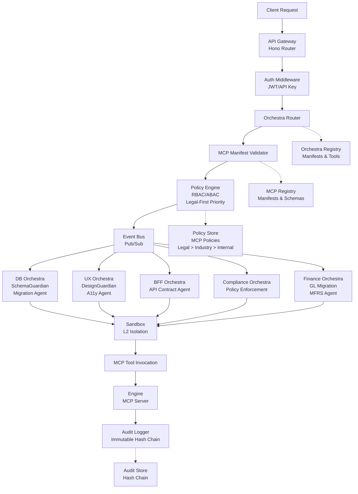

# 🧾 GRCD — Kernel (Core Control Plane Engine)

**Version:** 4.0.0  
**Status:** Active (MCP-Governed Production)  
**Last Updated:** 2025-11-29  
**Owner:** Chief Software Engineering, Platform Team, Security Team

> **Purpose of this Document**
>
> This GRCD (Governance, Risk, Compliance & Design) document is the **single source of truth** for the AI-BOS Nexus Kernel—the constitutional authority and governance brain that ensures all AI systems, engines, and orchestras operate within defined boundaries.
>
> It enforces the **Zero Drift Governance Framework** from the AI-BOS Nexus Whitepaper, ensuring human intent remains supreme and AI behavior remains predictable, compliant, and auditable.

---

## 1. Purpose & Identity

### 1.1 Purpose

**Purpose Statement:**

> The Kernel is the **governance brain** of AI-BOS Nexus, serving as the constitutional authority that ensures all AI systems, engines, agents, and orchestras operate within defined boundaries. It enforces contracts, policies, and compliance at every boundary through the Model Context Protocol (MCP), ensuring zero drift from human intent and organizational standards.

> The Kernel orchestrates **multiple AI Orchestras** (Database, UX/UI, BFF/API, Backend, Compliance, Observability, Finance, DevEx) as a **conductor-of-conductors**, where each orchestra has domain-specific agents but all operate under the Kernel's constitutional law.

> The Kernel is stateless with respect to business logic and never stores tenant data or executes workloads directly. Instead, it orchestrates all AI tools (engines, models, workflows, orchestras) via MCP manifests and policies, creating a **human-in-the-loop governance system** where AI amplifies rather than replaces human judgment.

**Philosophical Foundation:**

The Kernel embodies the principle that **AI should be governed, not feared**. By establishing MCP as the universal protocol for AI interactions and orchestrating multiple domain-specific AI orchestras under one constitutional framework, we create a system where:

1. **Human Intent is Encoded:** Every policy, contract, and manifest represents human decisions.
2. **AI Behavior is Predictable:** MCP schemas and orchestra manifests define exactly what AI can and cannot do.
3. **Drift is Constrained:** Contract validation and continuous governance prevent AI from deviating from specifications.
4. **Audit is Automatic:** Every AI action generates immutable audit trails.
5. **Evolution is Controlled:** Versioning and migration paths ensure safe evolution.
6. **Orchestras are Coordinated:** Multiple AI orchestras work together without chaos, each with clear boundaries and responsibilities.

**AI-Orchestra Integration:**

The Kernel serves as the **global conductor** for the AI-BOS AI Orchestra Ecosystem:

- **Database & Data Governance Orchestra** – schema design, migrations, data quality
- **UX/UI Orchestra** – design tokens, a11y, layout quality
- **BFF/API Orchestra** – contract governance, versioning, security
- **Backend & Infra Orchestra** – service topology, resilience, performance
- **Compliance, Risk & Audit Orchestra** – MFRS/IFRS, GDPR, SOC2, ISO compliance
- **Observability & Telemetry Orchestra** – metrics, logs, traces, anomaly detection
- **Finance Orchestra** – GL migrations, posting, consolidation, forecasting
- **DevEx Orchestra** – code quality, refactoring, architecture governance

Each orchestra operates with domain autonomy **within constitutional boundaries** set by the Kernel.

### 1.2 Identity

- **Role:** `Constitutional Authority, MCP Governance Enforcer & AI Orchestra Conductor` – The Kernel serves as the central orchestrator, policy evaluator, and governance enforcer for the entire AI-BOS Nexus ecosystem, coordinating multiple AI orchestras through MCP as the universal protocol.

- **Scope:**
  - All API requests, event routing, contract validation, policy enforcement.
  - MCP server lifecycle management (boot, register, validate, serve, audit, shutdown).
  - AI Orchestra coordination and governance.
  - Engine manifest validation and enforcement.
  - Tenant isolation at storage, cache, and permission levels.
  - Audit logging with immutable hash chains.
  - AI agent governance through MCP contracts.
  - Security boundary enforcement (STRIDE threat model).
  - Multi-orchestra coordination (DB, UX, BFF, Backend, Compliance, Observability, Finance, DevEx).

- **Boundaries:**
  - Does **NOT** execute business logic directly.
  - Does **NOT** store tenant data long-term.
  - Does **NOT** manage compute resources directly.
  - Does **NOT** perform data warehousing or model training.
  - Does **NOT** make autonomous decisions without policy backing.
  - Does **NOT** allow orchestras to bypass constitutional governance.

- **Non-Responsibility:**
  - `MUST NOT` store business state.
  - `MUST NOT` execute workloads directly.
  - `MUST NOT` persist tenant data beyond ephemeral request context.
  - `MUST NOT` manage infrastructure resources.
  - `MUST NOT` bypass MCP governance layer.
  - `MUST NOT` allow cross-orchestra actions without proper authorization and audit.

### 1.3 Non-Negotiables (Constitutional Principles)

> These principles are **non-negotiable** and form the constitutional foundation of the Kernel. They are testable and enforceable through automated checks.

**Constitutional Principles (from Whitepaper):**

- `MUST NOT` store tenant business data or execute workloads directly.
- `MUST NOT` take autonomous actions without policy backing.
- `MUST NOT` drift from specified contracts or compromise security/privacy.
- `MUST NOT` replace human judgment – it amplifies and enforces it.
- `MUST` enforce deny-by-default policies with explicit allow rules.
- `MUST` generate immutable, tamper-evident audit logs with hash chains.
- `MUST` validate all manifests before engine/orchestra hydration via MCP.
- `MUST` maintain strict tenant isolation at all boundaries.
- `MUST` require MCP manifests for all AI agent interactions.
- `MUST` enforce human-in-the-loop for critical decisions.
- `MUST NOT` allow data storage, warehousing, or model training (control-plane centric).

**MCP Governance Principles:**

- `MUST` validate all MCP server manifests against canonical schema.
- `MUST` enforce MCP tool schemas at runtime.
- `MUST` audit all MCP tool invocations.
- `MUST` require MCP contracts for all engine integrations.
- `MUST` support MCP versioning and backward compatibility.

**AI Orchestra Governance Principles:**

- `MUST` coordinate all orchestras through central event bus and policy engine.
- `MUST` enforce domain boundaries between orchestras (DB orchestra cannot bypass BFF policies).
- `MUST` provide common tools registry accessible to all orchestras.
- `MUST` audit all cross-orchestra interactions.
- `MUST` support orchestra manifest validation and lifecycle management.
- `MUST` enforce legal-first priority: law > industry standards > internal policies.

---

## 2. Requirements

### 2.1 Functional Requirements

| ID   | Requirement                                                         | Priority (MUST/SHOULD/MAY) | Status (✅/⚠️/❌/⚪) | Notes                                                                   |
| ---- | ------------------------------------------------------------------- | -------------------------- | -------------------- | ----------------------------------------------------------------------- |
| F-1  | Kernel MUST provide a universal API gateway (OpenAPI/GraphQL)       | MUST                       | ✅                   | Hono-based router with OpenAPI support                                  |
| F-2  | Kernel MUST validate manifests before hydration via MCP schema      | MUST                       | ✅                   | MCP manifest validation, Zod schema validation                          |
| F-3  | Kernel MUST enforce RBAC/ABAC identity checks                       | MUST                       | ✅                   | Policy engine with deny-by-default                                      |
| F-4  | Kernel MUST route all requests/events via the Kernel event bus      | MUST                       | ✅                   | Event-driven architecture with replay guard                             |
| F-5  | Kernel MUST support engine lifecycle via MCP                        | MUST                       | ✅                   | MCP-based engine registration and lifecycle                             |
| F-6  | Kernel MUST provide tenant isolation at storage, cache, permissions | MUST                       | ✅                   | L2 isolation with hard blocks                                           |
| F-7  | Kernel MUST generate UI schemas from metadata models                | MUST                       | ✅                   | Dynamic UI schema generation                                            |
| F-8  | Kernel MUST support contract versioning with backward compatibility | MUST                       | ✅                   | SemVer enforcement                                                      |
| F-9  | Kernel MUST validate all MCP tool invocations against schemas       | MUST                       | ✅                   | Runtime MCP schema validation                                           |
| F-10 | Kernel MUST audit all MCP server interactions                       | MUST                       | ✅                   | Immutable audit logs for MCP operations                                 |
| F-11 | Kernel MUST enforce MCP manifest signatures                         | MUST                       | ✅                   | Cryptographic signature validation (integrated in manifest validator)   |
| F-12 | Kernel SHOULD support MCP resource discovery                        | SHOULD                     | ✅                   | MCP resource enumeration (HTTP API implemented)                         |
| F-13 | Kernel SHOULD support MCP prompt templates                          | SHOULD                     | ✅                   | Prompt template management (HTTP API implemented)                       |
| F-14 | Kernel MAY provide GraphQL endpoint for advanced queries            | MAY                        | ⚪                   | Optional GraphQL layer (not implemented - acceptable)                   |
| F-15 | Kernel MUST coordinate multiple AI orchestras (DB, UX, BFF, etc.)   | MUST                       | ✅                   | AI-Orchestra conductor-of-conductors (8 orchestras implemented)         |
| F-16 | Kernel MUST provide orchestra manifest validation                   | MUST                       | ✅                   | Validate orchestra.\*.manifest.json files (Zod schema validation)       |
| F-17 | Kernel MUST enforce cross-orchestra authorization                   | MUST                       | ✅                   | DB orchestra cannot bypass Compliance rules (cross-orchestra.ts)        |
| F-18 | Kernel MUST support orchestra-specific tool registries              | MUST                       | ✅                   | Each orchestra has domain-specific tools (8 orchestras with tools)      |
| F-19 | Kernel MUST enforce legal-first policy precedence                   | MUST                       | ✅                   | Law > Industry > Internal policies (precedence-resolver.ts)             |
| F-20 | Kernel MUST support human-in-the-loop orchestration flows           | MUST                       | ✅                   | HITL approval engine integrated into orchestra conductor (Phase 6.1.2) |

### 2.2 Non-Functional Requirements

| ID    | Requirement            | Target                                | Measurement Source                                          | Status |
| ----- | ---------------------- | ------------------------------------- | ----------------------------------------------------------- | ------ | ----------------------------------------------------------------- |
| NF-1  | Latency                | <100ms per request (95th percentile)  | Prometheus histogram `kernel_http_request_duration_seconds` | ✅     |
| NF-2  | Availability           | ≥99.9% uptime                         | Health check monitoring `/healthz`, `/readyz`               | ✅     | Availability tracker integrated into bootstrap and shutdown (Phase 6.4.1) |
| NF-3  | Boot time              | <5 seconds                            | Bootstrap timer in `kernelState`                            | ✅     | Boot tracker integrated into bootstrap sequence with stage tracking (Phase 6.4.2) |
| NF-4  | Memory footprint       | <512MB baseline                       | Process metrics `process.memoryUsage()`                     | ✅     | Memory tracker integrated with periodic snapshots every 60s (Phase 6.4.3) |
| NF-5  | Throughput             | 200 req/sec cluster-wide              | Rate limiter metrics                                        | ✅     |
| NF-6  | Multi-tenant isolation | Zero cross-tenant data leakage        | Isolation verifier tests                                    | ✅     |
| NF-7  | Secrets management     | KMS with automatic rotation           | Audit log verification                                      | ✅     |
| NF-8  | Error recovery         | Auto-recovery from transient failures | Circuit breaker state monitoring                            | ✅     |
| NF-9  | MCP validation latency | <50ms per MCP tool invocation         | MCP validation metrics                                      | ⚪     |
| NF-10 | MCP manifest load time | <200ms per manifest                   | MCP manifest loader metrics                                 | ⚪     |
| NF-11 | Orchestra coordination | <200ms cross-orchestra event routing  | Event bus metrics                                           | ⚪     |
| NF-12 | Policy evaluation      | <10ms per policy check                | Policy engine latency histogram                             | ⚪     |

### 2.3 Compliance Requirements

| ID   | Requirement                                                             | Standard(s)                      | Evidence (what proves it)           | Status |
| ---- | ----------------------------------------------------------------------- | -------------------------------- | ----------------------------------- | ------ | -------------------------------------------------------------------- |
| C-1  | Kernel MUST enforce deny-by-default policy evaluation                   | SOC2, Zero Trust, ISO 42001      | Policy engine logs, config snapshot | ✅     |
| C-2  | Kernel MUST produce immutable, tamper-evident audit logs                | SOC2, GDPR, ISO 27001, ISO 27701 | Hash-chained audit storage proof    | ✅     |
| C-3  | Kernel MUST support data classification (PII, PHI, financial)           | GDPR, HIPAA, ISO 42001           | Contract schema validation          | ✅     |
| C-4  | Kernel MUST support backward compatibility with SemVer enforcement      | API Governance                   | Version validation tests            | ✅     |
| C-5  | Kernel MUST support audit trail queryability                            | SOC2, ISO 27001                  | Audit API endpoint `/auditz`        | ✅     |
| C-6  | Kernel MUST align with legal-first priority (law > industry > internal) | EU AI Act, ISO 42001             | Policy pack validation              | ✅     |
| C-7  | Kernel MUST enforce MCP manifest compliance                             | ISO 42001, AI Governance         | MCP manifest validation logs        | ✅     | ISO 42001 validator integrated in manifest validator                 |
| C-8  | Kernel MUST support human-in-the-loop for critical AI decisions         | EU AI Act, ISO 42001             | Human approval audit logs           | ✅     | HITL engine integrated into orchestra conductor (Phase 6.1.2)       |
| C-9  | Kernel MUST enforce MFRS/IFRS financial reporting standards             | MFRS, IFRS, SOX                  | Finance Orchestra validation        | ✅     | MFRS/IFRS validators integrated into Finance Orchestra actions (Phase 6.2.2) |
| C-10 | Kernel MUST support multi-region data residency                         | GDPR, PDPA                       | Tenant config validation            | ⚪     |

---

## 3. Architecture & Design Patterns

### 3.1 Architectural Patterns

- **Pattern(s):** `Event-Driven Architecture, CQRS, Microservices Kernel, MCP-First Governance, Control-Plane Centric, AI-Orchestra Coordination`

- **Justification:**
  - **Event-Driven Architecture:** All state changes flow through event bus for decoupling. Pub/sub with at-least-once delivery guarantees and replay guard prevents duplicate processing and enables audit replay.
  - **CQRS:** Commands (actions) and queries (metadata) separated for independent scaling. Commands flow through event bus to handlers, queries access registry directly. MCP tools map to commands; MCP resources map to queries.
  - **Microservices Kernel:** Kernel = API Gateway + Policy Engine + Event Bus + MCP Governance Layer + Orchestra Coordinator; Engines = independent MCP servers with manifest contracts; Orchestras = domain-specific agent groups with manifests.
  - **MCP-First Governance:** All AI interactions must flow through MCP. Manifests define capabilities, schemas define boundaries, policies define permissions. This ensures predictable AI behavior.
  - **Control-Plane Centric:** All AI engines, orchestras, and micro-apps connect through the Nexus control layer, isolating business logic from tools and preventing drift by design. The Kernel never stores business data or executes workloads—it orchestrates.
  - **AI-Orchestra Coordination:** Multiple domain-specific orchestras (DB, UX, BFF, Backend, Compliance, Observability, Finance, DevEx) operate autonomously within constitutional boundaries, coordinated by the Kernel as conductor-of-conductors.

**AI-Orchestra Architecture:**

```text
┌─────────────────────────────────────────────────────────────────────┐
│                    KERNEL (Conductor of Conductors)                │
├─────────────────────────────────────────────────────────────────────┤
│  MCP Governance │ Policy Engine │ Event Bus │ Audit Logger │ Auth  │
└─────────────────────────────────────────────────────────────────────┘
                                 │
                 ┌───────────────┼───────────────┐
                 │               │               │
        ┌────────▼────────┐ ┌───▼────┐ ┌────────▼────────┐
        │ DB Orchestra    │ │ UX Orch│ │ Finance Orch    │
        │ SchemaGuardian  │ │ Design │ │ Migration Agent │
        │ Migration Agent │ │ A11y   │ │ Posting Agent   │
        └─────────────────┘ └────────┘ └─────────────────┘
                 │               │               │
        ┌────────▼────────┐ ┌───▼────┐ ┌────────▼────────┐
        │ BFF Orchestra   │ │ Backend│ │ Compliance Orch │
        │ API Contract    │ │ Infra  │ │ Policy Enforce  │
        │ Security Agent  │ │ SLO    │ │ MFRS Compliance │
        └─────────────────┘ └────────┘ └─────────────────┘
                 │               │               │
        ┌────────▼────────┐ ┌───▼────┐
        │ Observability   │ │ DevEx  │
        │ Anomaly Detect  │ │ Code   │
        │ SLO Agent       │ │ Quality│
        └─────────────────┘ └────────┘
```

### 3.2 Component Interaction Diagram



**Description:**

- `APIGateway`: Routes all requests, applies middleware (auth via JWT/API key, tracing via OpenTelemetry, metrics via Prometheus).
- `OrchestraRouter`: Routes requests to appropriate AI orchestra based on domain (DB, UX, BFF, Finance, etc.).
- `MCPValidator`: Validates MCP manifests, tool schemas, and resource schemas before allowing execution.
- `PolicyEngine`: Evaluates RBAC/ABAC policies with legal-first precedence (law > industry > internal), enforces deny-by-default, validates contracts against MCP manifests.
- `EventBus`: Pub/sub with at-least-once delivery guarantees; replay guard prevents duplicates and supports event replay for audit.
- `Orchestras`: Domain-specific AI orchestras (DB, UX, BFF, Compliance, Finance) with specialist agents and tools.
- `Sandbox`: L2 isolation with hard blocks, tenant-scoped DB/cache proxies, WASM-based policy execution.
- `MCPTool`: MCP tool invocation layer that enforces schema validation and audit logging.
- `AuditLogger`: Immutable append-only logs with hash chains and queryability for compliance audits.
- `MCPRegistry`: Central registry of all MCP manifests, tool schemas, and resource schemas.
- `OrchestraRegistry`: Registry of all orchestra manifests, tools, and policies.

### 3.3 State Management Model

- **Business State:** `MUST NOT` store business state – the Kernel is stateless with respect to business logic and never stores tenant data or executes workloads directly.

- **Kernel State:**
  - Registry metadata (frozen after boot): engine manifests, orchestra manifests, MCP tool schemas, metadata models.
  - Ephemeral state: rate limiter counters, circuit breaker state, audit log buffer.
  - Policy evaluation cache (optional, TTL-based).

- **Orchestra State:**
  - Orchestra manifests (frozen after boot).
  - Orchestra-specific tool registries.
  - Agent session state (ephemeral per orchestration flow).
  - Cross-orchestra coordination state (ephemeral).

- **MCP State:**
  - MCP manifest registry (frozen after boot).
  - MCP tool schema cache (TTL ~5 minutes).
  - MCP resource registry.
  - MCP session state (ephemeral per tool invocation).

- **Caching Strategy:**
  - Metadata/UI schemas: in-memory, read-only after boot.
  - MCP tool schemas: TTL cache for performance.
  - Contract validation results: TTL cache.
  - Policy evaluation: no cache for critical decisions.
  - Engine manifests: in-memory registry (load on boot, validate on change).
  - Orchestra manifests: in-memory registry with versioning.

- **Session Strategy:**
  - Stateless auth using JWT/API keys.
  - Tenant context extracted from claims.
  - Request correlation via trace IDs (OpenTelemetry).
  - MCP session context per tool invocation.
  - Orchestra session context per orchestration flow.
  - Multi-tenant isolation enforced at DB, cache, permissions, MCP, and orchestra layers.

---

## 4. Directory & File Layout (Anti-Drift for Vibe Coding)

> **CRITICAL SECTION FOR AI AGENTS**
>
> This section is critical for LLM agents. It tells them **where to write** and **how to keep structure consistent**. Without this, AI agents will create files in the wrong locations, breaking the architecture.

### 4.1 Canonical Directory Tree

```text
/AIBOS-PLATFORM/                         # Repository root
  ├── kernel/                            # Core control-plane code
  │   ├── api/                           # HTTP API layer (Hono)
  │   │   ├── index.ts                   # Server bootstrap
  │   │   ├── router.ts                  # Route aggregator
  │   │   └── routes/                    # Route handlers
  │   │       ├── action.routes.ts       # POST /action/:engine/:action
  │   │       ├── health.ts              # GET /healthz
  │   │       ├── ready.ts               # GET /readyz
  │   │       ├── diag.ts                # GET /diagz
  │   │       ├── audit.ts               # GET /auditz
  │   │       ├── mcp.routes.ts          # MCP-specific routes
  │   │       └── orchestra.routes.ts    # Orchestra coordination routes
  │   ├── audit/                         # Audit logging system
  │   │   ├── audit-logger.ts
  │   │   ├── audit.store.ts
  │   │   └── audit.types.ts
  │   ├── auth/                          # Authentication layer
  │   │   ├── api-key.service.ts
  │   │   ├── jwt.service.ts
  │   │   └── types.ts
  │   ├── bootstrap/                     # Boot sequence
  │   │   ├── index.ts
  │   │   └── steps/                     # 13-step boot pipeline
  │   │       ├── 00-config.ts
  │   │       ├── 01-logger.ts
  │   │       ├── 02-eventbus.ts
  │   │       ├── 03-mcp-registry.ts     # MCP registry initialization
  │   │       ├── 04-engines.ts
  │   │       ├── 05-contracts.ts
  │   │       ├── 06-metadata.ts
  │   │       ├── 07-ui.ts
  │   │       ├── 08-tenants.ts
  │   │       ├── 09-storage.ts
  │   │       ├── 10-ai.ts
  │   │       ├── 11-api.ts
  │   │       ├── 12-orchestras.ts       # Orchestra registry initialization
  │   │       └── 13-ready.ts
  │   ├── contracts/                     # Contract engine
  │   │   ├── contract-engine.ts
  │   │   ├── contract.store.ts
  │   │   ├── schemas/                   # Zod schemas (SSOT)
  │   │   │   ├── action-contract.schema.ts
  │   │   │   ├── engine-manifest.schema.ts
  │   │   │   ├── mcp-manifest.schema.ts  # MCP manifest schema
  │   │   │   └── orchestra-manifest.schema.ts  # Orchestra manifest schema
  │   │   └── validators/
  │   │       ├── action.contract.ts
  │   │       ├── mcp.contract.ts        # MCP contract validator
  │   │       └── orchestra.contract.ts  # Orchestra contract validator
  │   ├── events/                        # Event bus system
  │   │   ├── bus.ts
  │   │   ├── event.types.ts
  │   │   ├── event-replay-guard.ts
  │   │   └── handlers/
  │   ├── hardening/                     # Security hardening
  │   │   ├── errors/                    # Error hierarchy
  │   │   ├── guards/                    # Async guards
  │   │   ├── locks/                     # Concurrency locks
  │   │   └── rate-limit/                # Rate limiting
  │   ├── mcp/                           # MCP Governance Layer
  │   │   ├── registry/                  # MCP registry
  │   │   │   ├── mcp-registry.ts        # Central MCP registry
  │   │   │   ├── manifest.store.ts      # MCP manifest storage
  │   │   │   └── schema.cache.ts        # MCP schema cache
  │   │   ├── validator/                 # MCP validators
  │   │   │   ├── manifest.validator.ts  # MCP manifest validator
  │   │   │   ├── tool.validator.ts      # MCP tool schema validator
  │   │   │   └── resource.validator.ts  # MCP resource validator
  │   │   ├── executor/                  # MCP execution layer
  │   │   │   ├── tool.executor.ts       # MCP tool executor
  │   │   │   ├── resource.handler.ts    # MCP resource handler
  │   │   │   └── session.manager.ts     # MCP session manager
  │   │   ├── schemas/                   # MCP schemas (Zod)
  │   │   │   ├── mcp-manifest.schema.ts
  │   │   │   ├── mcp-tool.schema.ts
  │   │   │   ├── mcp-resource.schema.ts
  │   │   │   └── mcp-prompt.schema.ts
  │   │   └── types.ts                   # MCP TypeScript types
  │   ├── orchestras/                    # AI Orchestra Coordination
  │   │   ├── registry/                  # Orchestra registry
  │   │   │   ├── orchestra-registry.ts  # Central orchestra registry
  │   │   │   ├── manifest.store.ts      # Orchestra manifest storage
  │   │   │   └── tool-registry.ts       # Orchestra tool registry
  │   │   ├── coordinator/               # Orchestra coordination
  │   │   │   ├── conductor.ts           # Conductor-of-conductors
  │   │   │   ├── cross-orchestra.ts     # Cross-orchestra flows
  │   │   │   └── session.manager.ts     # Orchestra session manager
  │   │   ├── domains/                   # Domain-specific orchestras
  │   │   │   ├── db/                    # Database Orchestra
  │   │   │   │   ├── manifest.json
  │   │   │   │   └── agents/
  │   │   │   ├── ux-ui/                 # UX/UI Orchestra
  │   │   │   │   ├── manifest.json
  │   │   │   │   └── agents/
  │   │   │   ├── bff-api/               # BFF/API Orchestra
  │   │   │   │   ├── manifest.json
  │   │   │   │   └── agents/
  │   │   │   ├── backend-infra/         # Backend & Infra Orchestra
  │   │   │   │   ├── manifest.json
  │   │   │   │   └── agents/
  │   │   │   ├── compliance/            # Compliance Orchestra
  │   │   │   │   ├── manifest.json
  │   │   │   │   └── agents/
  │   │   │   ├── observability/         # Observability Orchestra
  │   │   │   │   ├── manifest.json
  │   │   │   │   └── agents/
  │   │   │   ├── finance/               # Finance Orchestra
  │   │   │   │   ├── manifest.json
  │   │   │   │   └── agents/
  │   │   │   └── devex/                 # DevEx Orchestra
  │   │   │       ├── manifest.json
  │   │   │       └── agents/
  │   │   └── schemas/                   # Orchestra schemas
  │   │       └── orchestra-manifest.schema.ts
  │   ├── policy/                        # Policy engine
  │   │   ├── policy-engine.ts
  │   │   ├── precedence.ts              # Legal-first precedence
  │   │   └── types.ts
  │   ├── registry/                      # Core registries
  │   │   ├── engine.registry.ts
  │   │   ├── metadata.registry.ts
  │   │   └── orchestra.registry.ts
  │   ├── security/                      # Security layer
  │   │   ├── sandbox.ts
  │   │   ├── rbac.ts
  │   │   └── stride.ts                  # STRIDE threat model
  │   ├── storage/                       # Storage layer
  │   │   ├── db.ts
  │   │   └── redis.ts
  │   ├── tenancy/                       # Multi-tenancy
  │   │   ├── tenant.manager.ts
  │   │   └── isolation.ts
  │   ├── tests/                         # Test harnesses
  │   │   ├── unit/
  │   │   ├── integration/
  │   │   └── conformance/
  │   ├── GRCD-KERNEL.md                 # This document (SSOT)
  │   ├── AIBOS-KERNEL-WHITEPAPER.md     # Whitepaper reference
  │   ├── AIBOS-AI-ORCHESTRA.md          # AI-Orchestra strategy
  │   ├── index.ts                       # Main entry point
  │   └── package.json
  ├── engines/                           # 1..N engines using the kernel
  │   └── accounting-engine/             # Example engine
  │       ├── manifest.json              # Engine manifest
  │       ├── mcp.json                   # MCP server manifest
  │       ├── schemas/                   # MCP tool schemas
  │       └── index.ts
  ├── mcp/                               # MCP servers & master prompts
  │   ├── kernel.mcp.json                # Master Control Prompt for Kernel
  │   └── servers/                       # MCP server implementations
  ├── docs/                              # GRCD docs & ADRs
  │   └── 08-governance/
  │       └── grcd/
  └── packages/                          # Shared packages
      ├── types/
      ├── ui/
      └── utils/
```

### 4.2 Directory Norms & Enforcement

- **Requirement:** `kernel` MUST follow this directory layout.
- **Validator:** `dir-lint` tool at `scripts/dir-lint.ts`.
- **Conformance Test:** `T-DIR-1`: Invalid directory structure MUST fail CI.

**AI Agent Rules:**

1. Check this GRCD section for canonical location.
2. Create files ONLY in allowed directories (see Section 4.1).
3. If a directory doesn't exist, create it following the tree structure.
4. Never create files in the repo root or ad-hoc locations.
5. Use kebab-case naming conventions.
6. MCP-related files MUST go in `kernel/mcp/` subdirectories.
7. Orchestra-related files MUST go in `kernel/orchestras/` subdirectories.
8. Each orchestra MUST have its own directory under `kernel/orchestras/domains/`.

### 4.3 File Naming Conventions

- **TypeScript files:** `kebab-case.ts` (e.g., `audit-logger.ts`, `contract-engine.ts`, `mcp-registry.ts`, `orchestra-registry.ts`).
- **Test files:** `*.test.ts` or `*.spec.ts` (e.g., `audit-logger.test.ts`).
- **Schema files:** `*.schema.ts` (e.g., `action-contract.schema.ts`, `mcp-manifest.schema.ts`, `orchestra-manifest.schema.ts`).
- **Type files:** `*.types.ts` (e.g., `audit.types.ts`, `kernel.types.ts`, `mcp.types.ts`, `orchestra.types.ts`).
- **Config files:** `*.config.ts` (e.g., `kernel.config.ts`).
- **MCP files:** `mcp-*.ts` or `*.mcp.ts` (e.g., `mcp-registry.ts`, `tool.executor.ts`).
- **Orchestra files:** `orchestra-*.ts` or `*.orchestra.ts` (e.g., `orchestra-registry.ts`, `conductor.ts`).
- **Manifest files:** `manifest.json` (per orchestra/engine).

---

## 5. Dependencies & Compatibility Matrix

> **CRITICAL SECTION FOR ANTI-DRIFT**

### 5.1 Dependency Policy

- **Lockfile Format:** `pnpm-lock.yaml`.
- **Source of Truth:** `/kernel/package.json`, `/pnpm-lock.yaml` (root level).
- **Update Policy:** Dependencies updated via PR with compatibility matrix verification. Breaking changes require GRCD update and compatibility matrix review. All updates must pass CI dependency validation.
- **Version Pinning:** Exact versions in lockfile; semantic ranges (e.g., `^4.x`, `^3.x`) in `package.json`.

### 5.2 Compatibility Matrix

| Library                     | Allowed Version Range | Tested With              | Status | Notes                            | Blocked Versions                   |
| --------------------------- | --------------------- | ------------------------ | ------ | -------------------------------- | ---------------------------------- |
| `zod`                       | `^3.x`                | `drizzle-orm@latest`     | ✅     | Drizzle only tested with Zod 3.x | `^4.x` (incompatible with Drizzle) |
| `hono`                      | `^4.x`                | `@hono/node-server@^1.x` | ✅     | API framework (v4.7.9 tested)    | `^5.x` (not tested)                |
| `typescript`                | `^5.x`                | All packages             | ✅     | Type checking (v5.9.x tested)    | `^4.x` (deprecated)                |
| `pino`                      | `^10.x`               | All packages             | ✅     | Structured logging               | `^11.x` (not tested)               |
| `ioredis`                   | `^5.x`                | All packages             | ✅     | Redis client                     | `^6.x` (not tested)                |
| `pg`                        | `^8.x`                | All packages             | ✅     | PostgreSQL client                | `^9.x` (not tested)                |
| `@opentelemetry/api`        | `^1.x`                | All packages             | ✅     | Tracing API                      | `^2.x` (not tested)                |
| `@modelcontextprotocol/sdk` | `^1.x`                | MCP servers              | ✅     | Official MCP SDK                 | `^2.x` (not tested)                |
| `prom-client`               | `^15.x`               | Kernel observability     | ✅     | Prometheus metrics client        | `^16.x` (not tested)               |

### 5.3 Dependency Groups

**Core Runtime:**

- `hono`, `@hono/node-server` – API framework.
- `zod` – Schema validation (MCP schemas, orchestra contracts).
- `typescript` – Type checking.

**MCP Support:**

- `@modelcontextprotocol/sdk` – Official MCP SDK (optional; can also use custom implementation).
- JSON-RPC handling for MCP protocol.

**Storage:**

- `drizzle-orm` – ORM (requires Zod 3.x).
- `pg` or `@supabase/supabase-js` – PostgreSQL client.
- `ioredis` – Redis client.

**Observability:**

- `pino` – Structured logging.
- `@opentelemetry/api` – Tracing.
- `prom-client` – Prometheus metrics.

**Testing:**

- `vitest` or `jest` – Test framework.
- `@types/node` – Node.js types.

### 5.4 Dependency Normative Requirements

- `K-DEP-1`: All dependencies MUST align with `package.json` and `pnpm-lock.yaml`.
- `K-DEP-2`: Incompatible dependency versions MUST block kernel boot and CI.
- `K-DEP-3`: LLM agents MUST NOT introduce new dependencies without explicit manifest updates and compatibility matrix verification.
- `K-DEP-4`: Dependency updates MUST be tested against compatibility matrix before merge.
- `K-DEP-5`: All new dependencies MUST be added to the compatibility matrix (Section 5.2) with tested version ranges.
- `K-DEP-6`: MCP-related dependencies MUST be compatible with MCP protocol specification version.

### 5.5 Dependency Validation in CI

```yaml
# CI check for dependency validation
- name: Validate Dependencies
  run: |
    pnpm install --frozen-lockfile
    node scripts/validate-deps.js --matrix kernel/GRCD-KERNEL.md
    node scripts/validate-mcp-deps.js --mcp-spec-version 2025-03-26
```

---

## 6. Master Control Prompt (MCP) Profile

> **CRITICAL SECTION FOR HUMAN-AI GOVERNANCE**

### 6.1 MCP Location

- **File:** `/mcp/kernel.mcp.json`
- **Hash Recorded In:** Audit log under `mcpHash` field
- **Version:** `1.0.0`
- **Last Updated:** `2025-11-29`

### 6.2 MCP Schema

```json
{
  "component": "kernel",
  "version": "1.0.0",
  "intent": "Generate kernel code following GRCD-KERNEL.md specifications, AI-BOS Nexus whitepaper, and AI-Orchestra ecosystem patterns, with MCP governance as the foundational protocol",
  "constraints": [
    "MUST follow GRCD structure from kernel/GRCD-KERNEL.md",
    "MUST save files only under allowed directories (see GRCD Section 4)",
    "MUST respect dependency matrix (see GRCD Section 5)",
    "MUST use TypeScript with strict mode",
    "MUST use kebab-case for file names",
    "MUST NOT create files in root directory",
    "MUST NOT introduce dependencies not in compatibility matrix",
    "MUST NOT store tenant business data",
    "MUST enforce deny-by-default policies",
    "MUST generate immutable audit logs",
    "MUST validate all MCP manifests before engine registration",
    "MUST enforce MCP tool schemas at runtime",
    "MUST coordinate AI orchestras through Kernel conductor",
    "MUST enforce legal-first policy precedence (law > industry > internal)",
    "MUST support human-in-the-loop for critical decisions",
    "MUST respect orchestra domain boundaries"
  ],
  "input_sources": [
    "AI-BOS Nexus Whitepaper – Zero Drift Governance Framework (kernel/AIBOS-KERNEL-WHITEPAPER.md)",
    "AI-BOS AI Orchestra Ecosystem (kernel/AIBOS-AI-ORCHESTRA.md)",
    "GRCD-KERNEL.md (kernel/GRCD-KERNEL.md)",
    "codebase (kernel/)",
    "existing patterns in kernel/",
    "MCP specification (modelcontextprotocol.io)"
  ],
  "output_targets": {
    "code": "kernel/",
    "docs": "docs/08-governance/grcd/",
    "tests": "kernel/tests/",
    "mcp": "kernel/mcp/",
    "orchestras": "kernel/orchestras/"
  },
  "style": {
    "normative_language": true,
    "anti_drift": true,
    "type_safety": "strict",
    "error_handling": "typed_errors",
    "logging": "structured",
    "mcp_governance": true,
    "orchestra_coordination": true
  },
  "validation": {
    "pre_commit": [
      "TypeScript type check",
      "Directory structure validation",
      "Dependency compatibility check",
      "GRCD conformance check",
      "MCP manifest validation",
      "Orchestra manifest validation",
      "Policy precedence validation"
    ]
  },
  "mcp_governance": {
    "manifest_validation": true,
    "schema_enforcement": true,
    "audit_required": true,
    "version_compatibility": "semver"
  },
  "orchestra_governance": {
    "manifest_validation": true,
    "domain_boundaries": true,
    "cross_orchestra_auth": true,
    "conductor_coordination": true
  }
}
```

### 6.3 MCP Usage Instructions

1. **Load MCP:** Read `/mcp/kernel.mcp.json` at session start.
2. **Validate MCP:** Check hash matches audit log (if available).
3. **Load GRCD:** Read `kernel/GRCD-KERNEL.md` for canonical specifications.
4. **Load Whitepaper:** Reference `kernel/AIBOS-KERNEL-WHITEPAPER.md` for architectural principles.
5. **Load AI-Orchestra:** Reference `kernel/AIBOS-AI-ORCHESTRA.md` for orchestra patterns.
6. **Load MCP Spec:** Reference official MCP specification for protocol details.
7. **Check Directory:** Verify file locations against GRCD Section 4.
8. **Check Dependencies:** Verify all dependencies against GRCD Section 5.
9. **Validate MCP Manifests:** Ensure all MCP-related code follows MCP schema.
10. **Validate Orchestra Manifests:** Ensure all orchestra-related code follows orchestra manifest schema.
11. **Check Policy Precedence:** Verify legal > industry > internal ordering.
12. **Generate Code:** Follow MCP constraints and GRCD requirements.
13. **Validate Output:** Run pre-commit checks from MCP validation section.

### 6.4 MCP Normative Requirements

- `K-MCP-1`: All AI coding sessions MUST start from a valid MCP seed (`/mcp/kernel.mcp.json`).
- `K-MCP-2`: MCP changes MUST be audited and hash-logged in audit system.
- `K-MCP-3`: MCP violation events MUST trigger alerts (e.g., file created in wrong directory, incompatible dependency introduced, invalid MCP manifest, orchestra boundary violation).
- `K-MCP-4`: MCP MUST reference the current GRCD version (**v4.0.0**).
- `K-MCP-5`: MCP MUST NOT be altered by autonomous AI agents – human intent is the supreme authority.
- `K-MCP-6`: All MCP server registrations MUST validate against canonical MCP manifest schema.
- `K-MCP-7`: All MCP tool invocations MUST validate against tool schemas at runtime.
- `K-MCP-8`: All orchestra manifests MUST validate against orchestra manifest schema.
- `K-MCP-9`: Cross-orchestra interactions MUST be authorized and audited.

---

## 7. Contracts & Schemas (MCP-Enhanced)

### 7.1 Kernel Manifest Schema (Excerpt)

```json
{
  "component": "kernel",
  "version": "1.0.0",
  "mcp": {
    "server": {
      "name": "aibos-kernel",
      "version": "1.0.0",
      "protocol": "mcp",
      "protocolVersion": "2025-03-26"
    }
  },
  "orchestras": {
    "enabled": true,
    "coordinator": "kernel",
    "domains": [
      "db",
      "ux-ui",
      "bff-api",
      "backend-infra",
      "compliance",
      "observability",
      "finance",
      "devex"
    ]
  },
  "apis": [
    {
      "name": "contract.validate",
      "version": "1.0.0",
      "path": "/api/v1/contracts/validate",
      "method": "POST",
      "schemaRef": "schemas/contracts/validate.json"
    },
    {
      "name": "action.execute",
      "version": "1.0.0",
      "path": "/api/v1/action/:engine/:action",
      "method": "POST",
      "schemaRef": "schemas/actions/execute.json"
    },
    {
      "name": "mcp.tool.invoke",
      "version": "1.0.0",
      "path": "/api/v1/mcp/tools/invoke",
      "method": "POST",
      "schemaRef": "schemas/mcp/tool-invoke.json"
    },
    {
      "name": "orchestra.coordinate",
      "version": "1.0.0",
      "path": "/api/v1/orchestra/coordinate",
      "method": "POST",
      "schemaRef": "schemas/orchestra/coordinate.json"
    }
  ],
  "events": [
    {
      "name": "contract.validated",
      "guarantees": {
        "delivery": "at-least-once",
        "ordering": "per-ContractID"
      }
    },
    {
      "name": "mcp.tool.invoked",
      "guarantees": {
        "delivery": "at-least-once",
        "ordering": "per-TenantID"
      }
    },
    {
      "name": "orchestra.action.started",
      "guarantees": {
        "delivery": "at-least-once",
        "ordering": "per-OrchestraID"
      }
    },
    {
      "name": "orchestra.action.completed",
      "guarantees": {
        "delivery": "at-least-once",
        "ordering": "per-OrchestraID"
      }
    }
  ],
  "policies": {
    "packs": ["soc2", "gdpr", "iso27001", "iso42001", "mfrs", "ifrs"],
    "precedence": "legal > industry > internal",
    "default": "deny"
  },
  "identity": {
    "roles": [
      {
        "name": "admin",
        "privileges": [
          "contract.create",
          "policy.update",
          "audit.read",
          "mcp.manage",
          "orchestra.manage"
        ]
      },
      {
        "name": "operator",
        "privileges": [
          "action.execute",
          "metadata.read",
          "mcp.tool.invoke",
          "orchestra.view"
        ]
      },
      {
        "name": "orchestra_conductor",
        "privileges": [
          "orchestra.coordinate",
          "orchestra.tools.invoke",
          "cross_orchestra.read"
        ]
      }
    ]
  },
  "audit": {
    "changeId": "required",
    "immutable": true,
    "hashChain": true
  }
}
```

### 7.2 MCP Manifest Schema (Zod)

```ts
import { z } from "zod";

export const mcpManifestSchema = z.object({
  name: z.string().min(1),
  version: z.string().regex(/^\d+\.\d+\.\d+$/), // SemVer
  protocol: z.literal("mcp"),
  protocolVersion: z.string(), // e.g., "2025-03-26"
  description: z.string().optional(),
  tools: z
    .array(
      z.object({
        name: z.string(),
        description: z.string(),
        inputSchema: z.record(z.any()), // JSON Schema
      })
    )
    .optional(),
  resources: z
    .array(
      z.object({
        uri: z.string().uri(),
        name: z.string(),
        description: z.string(),
      })
    )
    .optional(),
});
```

### 7.3 Orchestra Manifest Schema (Zod)

```ts
import { z } from "zod";

export const orchestraManifestSchema = z.object({
  name: z.string().min(1),
  domain: z.enum([
    "db",
    "ux-ui",
    "bff-api",
    "backend-infra",
    "compliance",
    "observability",
    "finance",
    "devex",
  ]),
  version: z.string().regex(/^\d+\.\d+\.\d+$/), // SemVer
  description: z.string(),
  agents: z.array(
    z.object({
      name: z.string(),
      role: z.string(),
      capabilities: z.array(z.string()),
    })
  ),
  tools: z.array(
    z.object({
      name: z.string(),
      type: z.enum(["internal", "mcp", "external"]),
      description: z.string(),
      schemaRef: z.string().optional(),
    })
  ),
  policies: z.object({
    domain_specific: z.array(z.string()),
    precedence: z.literal("legal > industry > internal"),
    hitl_required: z.array(z.string()).optional(), // Actions requiring human approval
  }),
  triggers: z.array(
    z.object({
      event: z.string(),
      condition: z.string().optional(),
      action: z.string(),
    })
  ),
  slos: z
    .object({
      latency_ms: z.number(),
      uptime_percent: z.number(),
    })
    .optional(),
});
```

### 7.4 Schema Validation Strategy

- **Schema Format:** Zod schemas in `contracts/schemas/`, `kernel/mcp/schemas/`, and `kernel/orchestras/schemas/`.
- **Source of Truth:** Zod schemas are SSOT; OpenAPI generated from them.
- **Validation:**
  - All manifests (engine + MCP + orchestra) validated at boot.
  - All MCP tool invocations validated at runtime.
  - All orchestra actions validated against domain policies.
  - Policy packs validated before activation with legal-first precedence.

---

## 8. Error Handling & Recovery

### 8.1 Error Taxonomy

| Error Class       | When Thrown                      | Recovery Strategy                               | HTTP Status |
| ----------------- | -------------------------------- | ----------------------------------------------- | ----------- |
| `KernelError`     | Base class for kernel errors     | Log and standard 5xx response                   | 500         |
| `ContractError`   | Invalid manifest/schema          | Reject, audit, and guide remediation            | 400         |
| `TenantError`     | Cross-tenant violation           | Block, raise security alert, audit log          | 403         |
| `PolicyError`     | Policy evaluation failure        | Deny request, audit log                         | 403         |
| `ActionError`     | Action execution failure         | Return error to client, audit log               | 500         |
| `ManifestError`   | Invalid engine manifest          | Reject engine registration, audit log           | 400         |
| `SandboxError`    | Sandbox isolation violation      | Block action, raise security alert              | 403         |
| `McpError`        | MCP protocol or schema violation | Reject request, log MCP details, trigger alerts | 400/422     |
| `OrchestraError`  | Orchestra coordination failure   | Halt orchestra flow, audit, notify conductor    | 500         |
| `PrecedenceError` | Policy precedence violation      | Deny action, log violation, alert compliance    | 403         |

### 8.2 Retry & Circuit Breaker Policy

| Operation        | Retry Count | Backoff Strategy                  | Timeout | Circuit Breaker Threshold |
| ---------------- | ----------- | --------------------------------- | ------- | ------------------------- |
| DB connection    | 3           | Exponential (1s, 2s, 4s)          | 10s     | 10 errors/60s             |
| Redis connection | 3           | Exponential (1s, 2s, 4s)          | 5s      | 20 errors/60s             |
| Engine loading   | 1           | None                              | 3s      | 5 errors/60s              |
| MCP registry     | 3           | Exponential (500ms, 1s, 2s)       | 5s      | 5 errors/60s              |
| Orchestra coord  | 2           | Exponential (500ms, 1s)           | 10s     | 5 errors/60s              |
| Event publishing | 3           | Exponential (100ms, 200ms, 400ms) | 1s      | N/A                       |

---

## 9. Observability

### 9.1 Metrics (Prometheus)

| Metric Name                              | Type      | Labels                    | Purpose               | Target     |
| ---------------------------------------- | --------- | ------------------------- | --------------------- | ---------- |
| `kernel_http_requests_total`             | Counter   | method, path, status      | Request volume        | N/A        |
| `kernel_http_request_duration_seconds`   | Histogram | method, path              | Latency distribution  | <100ms p95 |
| `kernel_actions_executed_total`          | Counter   | engine, action, status    | Action execution      | N/A        |
| `kernel_policy_evaluations_total`        | Counter   | policy, result            | Policy enforcement    | N/A        |
| `kernel_rate_limit_hits_total`           | Counter   | limiter_type, tenant      | Rate limiting         | N/A        |
| `kernel_audit_events_total`              | Counter   | category, severity        | Audit event volume    | N/A        |
| `kernel_engine_registrations_total`      | Counter   | engine, status            | Engine lifecycle      | N/A        |
| `kernel_mcp_tool_invocations_total`      | Counter   | server, tool, status      | MCP tool usage        | N/A        |
| `kernel_orchestra_actions_total`         | Counter   | orchestra, action, status | Orchestra activity    | N/A        |
| `kernel_orchestra_coordination_duration` | Histogram | orchestra, action         | Coordination latency  | <200ms p95 |
| `kernel_policy_precedence_violations`    | Counter   | policy_level, source      | Precedence violations | 0          |

### 9.2 Traces (OpenTelemetry)

- **Span Names:** `kernel.request`, `kernel.auth`, `kernel.policy`, `kernel.action`, `kernel.contract`, `kernel.event`, `kernel.mcp`, `kernel.orchestra`.
- **Attributes:** method, path, trace_id, tenant_id, principal, engine, action, policy_pack, policy_level, contract_id, mcp_server, mcp_tool, orchestra_domain, orchestra_action.

### 9.3 Logging Schema

```json
{
  "timestamp": "2025-11-29T10:30:00Z",
  "level": "info",
  "trace_id": "abc123",
  "tenant_id": "tenant-456",
  "component": "kernel.api",
  "message": "Orchestra action processed",
  "metadata": {
    "method": "POST",
    "path": "/api/v1/orchestra/coordinate",
    "duration_ms": 45,
    "status": 200,
    "orchestra": "finance",
    "action": "gl-migration",
    "policy_level": "legal",
    "mcp_server": "aibos-finance",
    "mcp_tool": "migrate-gl"
  }
}
```

---

## 10. Security

### 10.1 STRIDE Threat Model

| Threat                     | Mitigation                                                                         |
| -------------------------- | ---------------------------------------------------------------------------------- |
| **Spoofing**               | All identity claims validated (JWT/OIDC tokens), MCP sessions authenticated        |
| **Tampering**              | Policy and manifest configs stored immutably (append-only logs, integrity hashes)  |
| **Repudiation**            | Every action auditable with signed logs, hash-chained audit trail                  |
| **Information Disclosure** | Data flows strictly governed, encryption/tokenization, orchestra domain boundaries |
| **Denial of Service**      | Rate limiting, tenant resource quotas, circuit breakers                            |
| **Elevation of Privilege** | Engines/orchestras run with least privileges, WASM sandbox, RBAC enforcement       |

### 10.2 Security Layers

1. **Authentication:** JWT/OIDC, API keys, service accounts
2. **Authorization:** RBAC/ABAC with deny-by-default
3. **Isolation:** L2 sandbox, tenant-scoped DB/cache, orchestra domain boundaries
4. **Secrets:** KMS with automatic rotation
5. **Audit:** Immutable hash-chained logs
6. **MCP Security:** Manifest signatures, tool schema validation
7. **Orchestra Security:** Domain boundary enforcement, cross-orchestra auth

---

## 11. Tenancy

### 11.1 Isolation Model

- **L2 Isolation:** Hard tenant boundaries at DB, cache, permissions, MCP, and orchestra layers
- **Orchestra Isolation:** Each orchestra respects tenant context; no cross-tenant data leakage
- **Tenant Context Propagation:** Tenant ID flows through all events, MCP calls, and orchestra actions

---

## 12. Configuration & DR

### 12.1 Configuration

- **Config Sources:** Environment variables, config files, KMS for secrets
- **Orchestra Configs:** Per-orchestra manifests with domain-specific settings
- **Policy Configs:** Legal > industry > internal precedence enforced

### 12.2 Disaster Recovery

- **RPO:** 0 (no data loss on failover)
- **RTO:** < 1 hour for control-plane restoration
- **Multi-Region:** Failover across regions with data residency compliance

---

## 13. Testing

### 13.1 Test Strategy

- **Unit Tests:** All core functions, contract validators, MCP validators, orchestra coordinators
- **Integration Tests:** End-to-end flows through event bus, MCP servers, orchestras
- **Conformance Tests:** GRCD compliance, MCP protocol compliance, orchestra manifest validation
- **Security Tests:** STRIDE threat validation, isolation tests, policy precedence tests
- **Orchestra Tests:** Cross-orchestra flows, domain boundary enforcement, HITL approval gates

---

## 14. Tiering

| Feature Group           | Basic                            | Advanced                                       | Premium                                                             |
| ----------------------- | -------------------------------- | ---------------------------------------------- | ------------------------------------------------------------------- |
| MCP Governance          | MCP support (single server)      | Multi-server MCP, schema validation            | Full MCP governance: registry, policy packs, marketplace            |
| AI-Orchestra            | 2 orchestras (DB, Observability) | 5 orchestras (+ UX, BFF, Compliance)           | All 8 orchestras + custom orchestra builder                         |
| Anti-Drift & Governance | GRCD + MCP enforced in CI        | GRCD + MCP + directory lint + dependency guard | Full constitutional governance + automated drift repair             |
| Observability           | Core HTTP + engine metrics       | + MCP metrics, structured logs, 3 orchestras   | + SLO dashboards, anomaly detection, AI-assisted triage             |
| Compliance              | Basic audit logs                 | SOC2, GDPR compliance packs                    | Full compliance suite (SOC2, GDPR, ISO 27001, ISO 42001, MFRS/IFRS) |
| HITL Approvals          | Manual approvals                 | Configurable HITL gates                        | AI-assisted HITL with risk scoring and auto-approvals for low-risk  |

---

## 15. Implementation Roadmap (AI-Orchestra Phases)

### Phase 0 – Kernel & Telemetry Baseline (Ground Zero)

**What:** Harden Kernel (identity, tenancy, metadata, event bus, audit) + basic observability  
**Why:** Foundation for all orchestras  
**Status:** ⚪ Planned

### Phase 1 – Eyes & Brainstem: Observability + DB Orchestra (Read-Only AI)

**What:** Turn on Observability Orchestra + DB Governance Orchestra in read-only mode  
**Why:** Eyes/ears (observability) + skeleton (DB) = safety foundation  
**Status:** ⚪ Planned

### Phase 2 – Compliance + Finance Orchestra (Legacy GL → MFRS)

**What:** Stand up Compliance Orchestra + Finance Orchestra for GL migration  
**Why:** Crown jewel demo, reference agentic flow, MFRS-first differentiation  
**Status:** ⚪ Planned

### Phase 3 – UX/UI + BFF/API Orchestras (Human Experience & Contracts)

**What:** Turn on UX/UI Orchestra + BFF/API Orchestra  
**Why:** Surface quality catches up to internal rigor  
**Status:** ⚪ Planned

### Phase 4 – Backend & Infra + DevEx Orchestras (Guarded Power Tools)

**What:** Turn on Backend/Infra Orchestra + DevEx Orchestra  
**Why:** Supercharge engineering without spaghetti code  
**Status:** ⚪ Planned

### Phase 5 – Domain Orchestras + External Ecosystem (The "Studio" Era)

**What:** Domain orchestras (Finance day-to-day, HR, Ops) + micro-developer Studio  
**Why:** AI magic lands on calm, predictable system  
**Status:** ⚪ Planned

---

> ✅ **Status:** GRCD-KERNEL has been created as **v4.0.0**, fully aligned with the **GRCD Template v4**, **AI-BOS Nexus Whitepaper (Zero Drift Governance Framework)**, and **AI-Orchestra Ecosystem Strategy**. This document is the **single source of truth** for the Kernel.

---

**References:**

- AI-BOS Nexus Whitepaper – Zero Drift Governance Framework (`kernel/AIBOS-KERNEL-WHITEPAPER.md`)
- AI-BOS AI Orchestra Ecosystem – 4W1H Master Strategy (`kernel/AIBOS-AI-ORCHESTRA.md`)
- GRCD Template v4 (Kernel-Compatible) (`kernel/grcd_template_v_4_kernel_compatible.md`)
- Model Context Protocol Specification (modelcontextprotocol.io)
- ISO/IEC 42001:2023 AI Management Standard
- ISO/IEC 27001:2022 Information Security Management
- SOC 2 Trust Principles
- MFRS/IFRS Financial Reporting Standards
- EU AI Act
- GDPR, PDPA Data Protection Regulations
