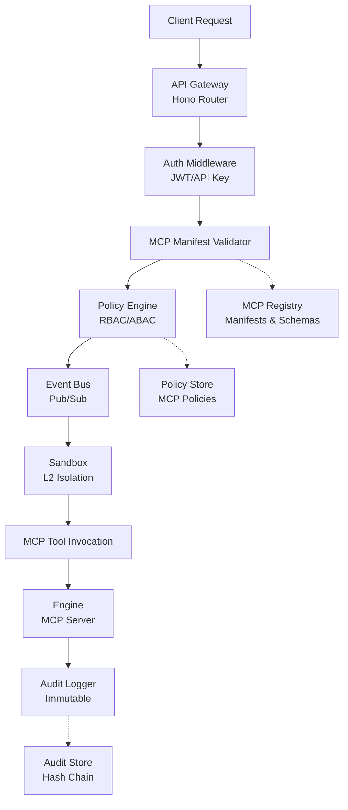

# 🧾 GRCD — Kernel (Core Control Plane Engine) — Template v4 (MCP‑Governed Edition)

**Version:** 4.0.0  
**Status:** Active (MCP‑Governed Template & Reference)  
**Last Updated:** 2025-11-28  
**Owner:** Chief Software Engineering, Platform Team, Security Team

> **Purpose of this Template**
>
> This GRCD (Governance, Risk, Compliance & Design) template is the **single source of truth** pattern for any AI‑BOS Nexus component (Kernel, Engine, MCP server, Data Plane Adapter, UI Shell, etc.).
>
> It is optimized for **vibe coding**, **anti‑drift**, and **auditability**, so that humans + AI agents can generate, extend, and validate each section consistently.
>
> **Key Anti‑Drift Mechanisms:**
> - Directory structure enforcement (Section 4)
> - Dependency compatibility matrix (Section 5)
> - Master Control Prompt (MCP) governance (Section 6)
> - Contracts & schemas as SSOT (Section 7)
> - Explicit tiering comparison (Section 14)

---

## 1. Purpose & Identity

> This section mirrors the **GRCD‑KERNEL** document format so the template is structurally compatible. You may keep the kernel wording as‑is, or adapt the highlighted phrases when cloning this template for other components.

**Component Name:** `kernel` (Core Control Plane Engine)

**Domain:** `Kernel` (Control Plane with MCP Governance)

### 1.1 Purpose

**Purpose Statement (Template Default):**

> The Kernel is the **governance brain** of AI‑BOS Nexus, serving as the constitutional authority that ensures all AI systems, engines, and agents operate within defined boundaries. It enforces contracts, policies, and compliance at every boundary through the Model Context Protocol (MCP), ensuring zero drift from human intent and organizational standards. The Kernel is stateless with respect to business logic and never stores tenant data or executes workloads directly. Instead, it orchestrates all AI tools (engines, models, workflows) via MCP manifests and policies, creating a **human‑in‑the‑loop governance system** where AI amplifies rather than replaces human judgment.

> **Template Note:** When using this GRCD for a non‑kernel component, replace `Kernel` with your component name and update references to MCP only if that component is MCP‑governed.

**Philosophical Foundation:**

The Kernel embodies the principle that **AI should be governed, not feared**. By establishing MCP as the universal protocol for AI interactions, we create a system where:

1. **Human Intent is Encoded:** Every policy, contract, and manifest represents human decisions.  
2. **AI Behavior is Predictable:** MCP schemas define exactly what AI can and cannot do.  
3. **Drift is Constrained:** Contract validation prevents AI from deviating from specifications.  
4. **Audit is Automatic:** Every AI action generates immutable audit trails.  
5. **Evolution is Controlled:** Versioning and migration paths ensure safe evolution.

### 1.2 Identity

* **Role:** `Constitutional Authority & MCP Governance Enforcer` – The Kernel serves as the central orchestrator, policy evaluator, and governance enforcer for the entire AI‑BOS Nexus ecosystem, with MCP as the universal protocol for all AI interactions.

* **Scope:**  
  - All API requests, event routing, contract validation, policy enforcement.  
  - MCP server lifecycle management (boot, register, validate, serve, audit, shutdown).  
  - Engine manifest validation and enforcement.  
  - Tenant isolation at storage, cache, and permission levels.  
  - Audit logging with immutable hash chains.  
  - AI agent governance through MCP contracts.  
  - Security boundary enforcement (STRIDE threat model).

* **Boundaries:**  
  - Does **NOT** execute business logic directly.  
  - Does **NOT** store tenant data long‑term.  
  - Does **NOT** manage compute resources directly.  
  - Does **NOT** perform data warehousing or model training.  
  - Does **NOT** make autonomous decisions without policy backing.

* **Non‑Responsibility:**  
  - `MUST NOT` store business state.  
  - `MUST NOT` execute workloads directly.  
  - `MUST NOT` persist tenant data beyond ephemeral request context.  
  - `MUST NOT` manage infrastructure resources.  
  - `MUST NOT` bypass MCP governance layer.

### 1.3 Non‑Negotiables (Constitutional Principles)

> These principles are **non‑negotiable** and form the constitutional foundation of the Kernel. They are testable and enforceable through automated checks.

**Constitutional Principles:**

* `MUST NOT` store tenant business data or execute workloads directly.  
* `MUST NOT` take autonomous actions without policy backing.  
* `MUST NOT` drift from specified contracts or compromise security/privacy.  
* `MUST NOT` replace human judgment – it amplifies and enforces it.  
* `MUST` enforce deny‑by‑default policies with explicit allow rules.  
* `MUST` generate immutable, tamper‑evident audit logs with hash chains.  
* `MUST` validate all manifests before engine hydration via MCP (where applicable).  
* `MUST` maintain strict tenant isolation at all boundaries.  
* `MUST` require MCP manifests for all AI agent interactions (for MCP‑governed flows).  
* `MUST` enforce human‑in‑the‑loop for critical decisions.

**MCP Governance Principles:**

* `MUST` validate all MCP server manifests against canonical schema.  
* `MUST` enforce MCP tool schemas at runtime.  
* `MUST` audit all MCP tool invocations.  
* `MUST` require MCP contracts for all engine integrations.  
* `MUST` support MCP versioning and backward compatibility.

---

## 2. Requirements

> This section is structurally aligned with **GRCD‑KERNEL** v4.0.0 so that tables, IDs, and patterns are compatible.

### 2.1 Functional Requirements

> List the **behaviors** this component must provide. Make them small, testable, and implementation‑agnostic.

| ID  | Requirement                                                            | Priority (MUST/SHOULD/MAY) | Status (✅/⚠️/❌/⚪) | Notes                                        |
| --- | ---------------------------------------------------------------------- | -------------------------- | ------------------- | -------------------------------------------- |
| F-1 | Kernel MUST provide a universal API gateway (OpenAPI/GraphQL)         | MUST                       | ✅                 | Hono‑based router with OpenAPI support       |
| F-2 | Kernel MUST validate manifests before hydration via MCP schema        | MUST                       | ✅                 | MCP manifest validation, Zod schema validation |
| F-3 | Kernel MUST enforce RBAC/ABAC identity checks                         | MUST                       | ✅                 | Policy engine with deny‑by‑default           |
| F-4 | Kernel MUST route all requests/events via the Kernel event bus        | MUST                       | ✅                 | Event‑driven architecture with replay guard  |
| F-5 | Kernel MUST support engine lifecycle via MCP                          | MUST                       | ✅                 | MCP‑based engine registration and lifecycle  |
| F-6 | Kernel MUST provide tenant isolation at storage, cache, permissions   | MUST                       | ✅                 | L2 isolation with hard blocks                |
| F-7 | Kernel MUST generate UI schemas from metadata models                  | MUST                       | ✅                 | Dynamic UI schema generation                 |
| F-8 | Kernel MUST support contract versioning with backward compatibility   | MUST                       | ✅                 | SemVer enforcement                           |
| F-9 | Kernel MUST validate all MCP tool invocations against schemas         | MUST                       | ✅                 | Runtime MCP schema validation                |
| F-10| Kernel MUST audit all MCP server interactions                         | MUST                       | ✅                 | Immutable audit logs for MCP operations      |
| F-11| Kernel MUST enforce MCP manifest signatures                           | MUST                       | ⚪                 | Cryptographic signature validation           |
| F-12| Kernel SHOULD support MCP resource discovery                          | SHOULD                     | ⚪                 | MCP resource enumeration                     |
| F-13| Kernel SHOULD support MCP prompt templates                            | SHOULD                     | ⚪                 | Optional prompt template management          |
| F-14| Kernel MAY provide GraphQL endpoint for advanced queries              | MAY                        | ⚪                 | Optional GraphQL layer                       |

> **Template usage:**
> - Keep IDs stable; add new rows without renumbering.  
> - For non‑kernel components, replace "Kernel" with your component name and drop MCP‑specific rows if not applicable.

### 2.2 Non‑Functional Requirements

> Define measurable constraints: latency, availability, isolation, memory, throughput, etc.

| ID   | Requirement              | Target                                       | Measurement Source                                         | Status |
| ---- | ------------------------ | -------------------------------------------- | ---------------------------------------------------------- | ------ |
| NF-1 | Latency                  | <100ms per request (95th percentile)         | Prometheus histogram `kernel_http_request_duration_seconds`| ✅     |
| NF-2 | Availability             | ≥99.9% uptime                                | Health check monitoring `/healthz`, `/readyz`              | ✅     |
| NF-3 | Boot time                | <5 seconds                                   | Bootstrap timer in `kernelState`                           | ✅     |
| NF-4 | Memory footprint         | <512MB baseline                              | Process metrics `process.memoryUsage()`                    | ✅     |
| NF-5 | Throughput               | 200 req/sec cluster‑wide                     | Rate limiter metrics                                       | ✅     |
| NF-6 | Multi‑tenant isolation   | Zero cross‑tenant data leakage               | Isolation verifier tests                                   | ✅     |
| NF-7 | Secrets management       | KMS with automatic rotation                  | Audit log verification                                     | ✅     |
| NF-8 | Error recovery           | Auto‑recovery from transient failures        | Circuit breaker state monitoring                           | ✅     |
| NF-9 | MCP validation latency   | <50ms per MCP tool invocation                | MCP validation metrics                                     | ⚪     |
| NF-10| MCP manifest load time   | <200ms per manifest                          | MCP manifest loader metrics                                | ⚪     |

### 2.3 Compliance Requirements

> Link each compliance need to an external standard and expected evidence.

| ID  | Requirement                                                         | Standard(s)                       | Evidence (what proves it)              | Status |
| --- | ------------------------------------------------------------------- | --------------------------------- | -------------------------------------- | ------ |
| C-1 | Kernel MUST enforce deny‑by‑default policy evaluation               | SOC2, Zero Trust, ISO 42001      | Policy engine logs, config snapshot    | ✅     |
| C-2 | Kernel MUST produce immutable, tamper‑evident audit logs            | SOC2, GDPR, ISO 27001, ISO 27701 | Hash‑chained audit storage proof       | ✅     |
| C-3 | Kernel MUST support data classification (PII, PHI, financial)       | GDPR, HIPAA, ISO 42001           | Contract schema validation             | ✅     |
| C-4 | Kernel MUST support backward compatibility with SemVer enforcement  | API Governance                    | Version validation tests               | ✅     |
| C-5 | Kernel MUST support audit trail queryability                        | SOC2, ISO 27001                  | Audit API endpoint `/auditz`           | ✅     |
| C-6 | Kernel MUST align with legal‑first priority (law > industry > internal)| EU AI Act, ISO 42001          | Policy pack validation                 | ✅     |
| C-7 | Kernel MUST enforce MCP manifest compliance                         | ISO 42001, AI Governance         | MCP manifest validation logs           | ⚪     |
| C-8 | Kernel MUST support human‑in‑the‑loop for critical AI decisions     | EU AI Act, ISO 42001             | Human approval audit logs              | ⚪     |

---

## 3. Architecture & Design Patterns

### 3.1 Architectural Patterns

> Describe which high‑level patterns apply and why.

* **Pattern(s):** `Event‑Driven Architecture, CQRS, Microservices Kernel, MCP‑First Governance, Control‑Plane Centric`

* **Justification:**  
  - **Event‑Driven Architecture:** All state changes flow through event bus for decoupling. Pub/sub with at‑least‑once delivery guarantees and replay guard prevents duplicate processing and enables audit replay.  
  - **CQRS:** Commands (actions) and queries (metadata) separated for independent scaling. Commands flow through event bus to handlers, queries access registry directly. MCP tools map to commands; MCP resources map to queries.  
  - **Microservices Kernel:** Kernel = API Gateway + Policy Engine + Event Bus + MCP Governance Layer; Engines = independent MCP servers with manifest contracts.  
  - **MCP‑First Governance:** All AI interactions must flow through MCP. Manifests define capabilities, schemas define boundaries, policies define permissions. This ensures predictable AI behavior.  
  - **Control‑Plane Centric:** All AI engines and micro‑apps connect through the Nexus control layer, isolating business logic from tools and preventing drift by design.

**MCP Governance Architecture (Template Block):**

```text
┌─────────────────────────────────────────────────────────┐
│                 MCP GOVERNANCE LAYER                   │
├─────────────────────────────────────────────────────────┤
│  MCP Manifest Registry  │  MCP Schema Validator        │
│  MCP Tool Registry      │  MCP Resource Registry       │
│  MCP Policy Engine      │  MCP Audit Logger            │
└─────────────────────────────────────────────────────────┘
                         │
                         ▼
┌─────────────────────────────────────────────────────────┐
│                  KERNEL CORE LAYER                     │
├─────────────────────────────────────────────────────────┤
│  API Gateway  │  Event Bus  │  Policy Engine  │ Audit  │
└─────────────────────────────────────────────────────────┘
```

### 3.2 Component Interaction Diagram

> Use Mermaid diagram showing MCP governance flow.



**Description:**

* `APIGateway`: Routes all requests, applies middleware (auth via JWT/API key, tracing via OpenTelemetry, metrics via Prometheus).  
* `MCPValidator`: Validates MCP manifests, tool schemas, and resource schemas before allowing execution.  
* `PolicyEngine`: Evaluates RBAC/ABAC policies, enforces deny‑by‑default, validates contracts against MCP manifests.  
* `EventBus`: Pub/sub with at‑least‑once delivery guarantees; replay guard prevents duplicates and supports event replay for audit.  
* `Sandbox`: L2 isolation with hard blocks, tenant‑scoped DB/cache proxies, WASM‑based policy execution.  
* `MCPTool`: MCP tool invocation layer that enforces schema validation and audit logging.  
* `AuditLogger`: Immutable append‑only logs with hash chains and queryability for compliance audits.  
* `MCPRegistry`: Central registry of all MCP manifests, tool schemas, and resource schemas.

### 3.3 State Management Model

* **Business State:** `MUST NOT` store business state – the Kernel is stateless with respect to business logic and never stores tenant data or executes workloads directly.

* **Kernel State:**  
  - Registry metadata (frozen after boot): engine manifests, MCP tool schemas, metadata models.  
  - Ephemeral state: rate limiter counters, circuit breaker state, audit log buffer.  
  - Policy evaluation cache (optional, TTL‑based).

* **MCP State:**  
  - MCP manifest registry (frozen after boot).  
  - MCP tool schema cache (TTL ~5 minutes).  
  - MCP resource registry.  
  - MCP session state (ephemeral per tool invocation).

* **Caching Strategy:**  
  - Metadata/UI schemas: in‑memory, read‑only after boot.  
  - MCP tool schemas: TTL cache for performance.  
  - Contract validation results: TTL cache.  
  - Policy evaluation: no cache for critical decisions.  
  - Engine manifests: in‑memory registry (load on boot, validate on change).

* **Session Strategy:**  
  - Stateless auth using JWT/API keys.  
  - Tenant context extracted from claims.  
  - Request correlation via trace IDs (OpenTelemetry).  
  - MCP session context per tool invocation.  
  - Multi‑tenant isolation enforced at DB, cache, permissions, and MCP layers.

---

## 4. Directory & File Layout (Anti‑Drift for Vibe Coding)

> **CRITICAL SECTION FOR AI AGENTS**
>
> This section is critical for LLM agents. It tells them **where to write** and **how to keep structure consistent**. Without this, AI agents will create files in the wrong locations, breaking the architecture.

### 4.1 Canonical Directory Tree (Kernel‑Aligned)

```text
/AIBOS-PLATFORM/                         # Repository root
  ├── kernel/                            # Core control-plane code
  │   ├── api/                           # HTTP API layer (Hono)
  │   │   ├── index.ts                   # Server bootstrap
  │   │   ├── router.ts                  # Route aggregator
  │   │   └── routes/                    # Route handlers
  │   │       ├── action.routes.ts       # POST /action/:engine/:action
  │   │       ├── health.ts              # GET /healthz
  │   │       ├── ready.ts               # GET /readyz
  │   │       ├── diag.ts                # GET /diagz
  │   │       ├── audit.ts               # GET /auditz
  │   │       └── mcp.routes.ts          # MCP-specific routes
  │   ├── audit/                         # Audit logging system
  │   │   ├── audit-logger.ts
  │   │   ├── audit.store.ts
  │   │   └── audit.types.ts
  │   ├── auth/                          # Authentication layer
  │   │   ├── api-key.service.ts
  │   │   ├── jwt.service.ts
  │   │   └── types.ts
  │   ├── bootstrap/                     # Boot sequence
  │   │   ├── index.ts
  │   │   └── steps/                     # 13-step boot pipeline
  │   │       ├── 00-config.ts
  │   │       ├── 01-logger.ts
  │   │       ├── 02-eventbus.ts
  │   │       ├── 03-mcp-registry.ts     # MCP registry initialization
  │   │       ├── 04-engines.ts
  │   │       ├── 05-contracts.ts
  │   │       ├── 06-metadata.ts
  │   │       ├── 07-ui.ts
  │   │       ├── 08-tenants.ts
  │   │       ├── 09-storage.ts
  │   │       ├── 10-ai.ts
  │   │       ├── 11-api.ts
  │   │       └── 12-ready.ts
  │   ├── contracts/                     # Contract engine
  │   │   ├── contract-engine.ts
  │   │   ├── contract.store.ts
  │   │   ├── schemas/                   # Zod schemas (SSOT)
  │   │   │   ├── action-contract.schema.ts
  │   │   │   ├── engine-manifest.schema.ts
  │   │   │   └── mcp-manifest.schema.ts  # MCP manifest schema
  │   │   └── validators/
  │   │       ├── action.contract.ts
  │   │       └── mcp.contract.ts        # MCP contract validator
  │   ├── events/                        # Event bus system
  │   │   ├── bus.ts
  │   │   ├── event.types.ts
  │   │   ├── event-replay-guard.ts
  │   │   └── handlers/
  │   ├── hardening/                     # Security hardening
  │   │   ├── errors/                    # Error hierarchy
  │   │   ├── guards/                    # Async guards
  │   │   ├── locks/                     # Concurrency locks
  │   │   └── rate-limit/                # Rate limiting
  │   ├── mcp/                           # MCP Governance Layer
  │   │   ├── registry/                  # MCP registry
  │   │   │   ├── mcp-registry.ts        # Central MCP registry
  │   │   │   ├── manifest.store.ts      # MCP manifest storage
  │   │   │   └── schema.cache.ts        # MCP schema cache
  │   │   ├── validator/                 # MCP validators
  │   │   │   ├── manifest.validator.ts  # MCP manifest validator
  │   │   │   ├── tool.validator.ts      # MCP tool schema validator
  │   │   │   └── resource.validator.ts  # MCP resource validator
  │   │   ├── executor/                  # MCP execution layer
  │   │   │   ├── tool.executor.ts       # MCP tool executor
  │   │   │   ├── resource.handler.ts    # MCP resource handler
  │   │   │   └── session.manager.ts     # MCP session manager
  │   │   ├── schemas/                   # MCP schemas (Zod)
  │   │   │   ├── mcp-manifest.schema.ts
  │   │   │   ├── mcp-tool.schema.ts
  │   │   │   ├── mcp-resource.schema.ts
  │   │   │   └── mcp-prompt.schema.ts
  │   │   └── types.ts                   # MCP TypeScript types
  │   ├── policy/                        # Policy engine
  │   │   ├── policy-engine.ts
  │   │   └── types.ts
  │   ├── registry/                      # Core registries
  │   │   ├── engine.registry.ts
  │   │   ├── metadata.registry.ts
  │   │   └── ...
  │   ├── security/                      # Security layer
  │   │   ├── sandbox.ts
  │   │   ├── rbac.ts
  │   │   └── ...
  │   ├── storage/                       # Storage layer
  │   │   ├── db.ts
  │   │   └── redis.ts
  │   ├── tenancy/                       # Multi-tenancy
  │   │   ├── tenant.manager.ts
  │   │   └── ...
  │   ├── tests/                         # Test harnesses
  │   │   ├── unit/
  │   │   ├── integration/
  │   │   └── conformance/
  │   ├── index.ts                       # Main entry point
  │   └── package.json
  ├── engines/                           # 1..N engines using the kernel
  │   └── accounting-engine/             # Example engine
  │       ├── manifest.json              # Engine manifest
  │       ├── mcp.json                   # MCP server manifest
  │       ├── schemas/                   # MCP tool schemas
  │       └── index.ts
  ├── mcp/                               # MCP servers & master prompts
  │   ├── kernel.mcp.json                # Master Control Prompt for Kernel
  │   └── servers/                       # MCP server implementations
  ├── docs/                              # GRCD docs & ADRs
  │   └── 08-governance/
  │       └── grcd/
  └── packages/                          # Shared packages
      ├── types/
      ├── ui/
      └── utils/
```

### 4.2 Directory Norms & Enforcement

* **Requirement:** `kernel` MUST follow this directory layout.  
* **Validator:** `dir-lint` tool at `scripts/dir-lint.ts` (to be implemented).  
* **Conformance Test:** `T-DIR-1`: Invalid directory structure MUST fail CI.

**AI Agent Rules:**

1. Check this GRCD section for canonical location.  
2. Create files ONLY in allowed directories (see Section 4.1).  
3. If a directory doesn't exist, create it following the tree structure.  
4. Never create files in the repo root or ad‑hoc locations.  
5. Use kebab‑case naming conventions.  
6. MCP‑related files MUST go in `kernel/mcp/` subdirectories.

### 4.3 File Naming Conventions

* **TypeScript files:** `kebab-case.ts` (e.g., `audit-logger.ts`, `contract-engine.ts`, `mcp-registry.ts`).  
* **Test files:** `*.test.ts` or `*.spec.ts` (e.g., `audit-logger.test.ts`).  
* **Schema files:** `*.schema.ts` (e.g., `action-contract.schema.ts`, `mcp-manifest.schema.ts`).  
* **Type files:** `*.types.ts` (e.g., `audit.types.ts`, `kernel.types.ts`, `mcp.types.ts`).  
* **Config files:** `*.config.ts` (e.g., `kernel.config.ts`).  
* **MCP files:** `mcp-*.ts` or `*.mcp.ts` (e.g., `mcp-registry.ts`, `tool.executor.ts`).

---

## 5. Dependencies & Compatibility Matrix

> **CRITICAL SECTION FOR ANTI‑DRIFT**
>
> This section is now aligned with **GRCD‑KERNEL v4.0.0**, including MCP‑specific dependencies.

### 5.1 Dependency Policy

* **Lockfile Format:** `pnpm-lock.yaml`.  
* **Source of Truth:** `/kernel/package.json`, `/pnpm-lock.yaml` (root level).  
* **Update Policy:** Dependencies updated via PR with compatibility matrix verification. Breaking changes require GRCD update and compatibility matrix review. All updates must pass CI dependency validation.  
* **Version Pinning:** Exact versions in lockfile; semantic ranges (e.g., `^4.x`, `^3.x`) in `package.json`.

### 5.2 Compatibility Matrix

| Library                  | Allowed Version Range | Tested With               | Status | Notes                             | Blocked Versions                |
| ------------------------ | --------------------- | ------------------------- | ------ | --------------------------------- | ------------------------------- |
| `zod`                    | `^3.x`                | `drizzle-orm@latest`     | ✅     | Drizzle only tested with Zod 3.x | `^4.x` (incompatible with Drizzle) |
| `hono`                   | `^4.x`                | `@hono/node-server@^1.x`  | ✅     | API framework (v4.7.9 tested)    | `^5.x` (not tested)             |
| `typescript`             | `^5.x`                | All packages              | ✅     | Type checking (v5.9.x tested)    | `^4.x` (deprecated)             |
| `pino`                   | `^10.x`               | All packages              | ✅     | Structured logging               | `^11.x` (not tested)            |
| `ioredis`                | `^5.x`                | All packages              | ✅     | Redis client                     | `^6.x` (not tested)             |
| `pg`                     | `^8.x`                | All packages              | ✅     | PostgreSQL client                | `^9.x` (not tested)             |
| `@opentelemetry/api`     | `^1.x`                | All packages              | ✅     | Tracing API                      | `^2.x` (not tested)             |
| `@modelcontextprotocol/sdk` | `^1.x`             | MCP servers (if used)     | ✅     | Official MCP SDK                 | `^2.x` (not tested)             |
| `prom-client`            | `^15.x`               | Kernel observability      | ✅     | Prometheus metrics client        | `^16.x` (not tested)            |

### 5.3 Dependency Groups

**Core Runtime:**

- `hono`, `@hono/node-server` – API framework.  
- `zod` – Schema validation (MCP schemas, contracts).  
- `typescript` – Type checking.

**MCP Support:**

- `@modelcontextprotocol/sdk` – Official MCP SDK (optional; can also use custom implementation).  
- JSON‑RPC handling for MCP protocol.

**Storage:**

- `drizzle-orm` – ORM (requires Zod 3.x).  
- `pg` or `@supabase/supabase-js` – PostgreSQL client.  
- `ioredis` – Redis client.

**Observability:**

- `pino` – Structured logging.  
- `@opentelemetry/api` – Tracing (optional).  
- `prom-client` – Prometheus metrics.

**Testing:**

- `vitest` or `jest` – Test framework.  
- `@types/node` – Node.js types.

### 5.4 Dependency Normative Requirements

* `K-DEP-1`: All dependencies MUST align with `package.json` and `pnpm-lock.yaml`.  
* `K-DEP-2`: Incompatible dependency versions MUST block kernel boot and CI.  
* `K-DEP-3`: LLM agents MUST NOT introduce new dependencies without explicit manifest updates and compatibility matrix verification.  
* `K-DEP-4`: Dependency updates MUST be tested against compatibility matrix before merge.  
* `K-DEP-5`: All new dependencies MUST be added to the compatibility matrix (Section 5.2) with tested version ranges.  
* `K-DEP-6`: MCP‑related dependencies MUST be compatible with MCP protocol specification version.

### 5.5 Dependency Validation in CI

```yaml
# Example CI check (Kernel-aligned)
- name: Validate Dependencies
  run: |
    pnpm install --frozen-lockfile
    node scripts/validate-deps.js --matrix kernel/GRCD-KERNEL.md
    node scripts/validate-mcp-deps.js --mcp-spec-version 2025-03-26
```

> **Template Note:** When cloning this template for another component, update the `--matrix` path and, if non‑MCP, drop the `validate-mcp-deps` step.

---

## 6. Master Control Prompt (MCP) Profile

> **CRITICAL SECTION FOR HUMAN‑AI GOVERNANCE**
>
> This is structurally identical to GRCD‑KERNEL v4.0.0 but written so it can be reused as a template.

### 6.1 MCP Location

* **File:** `/mcp/kernel.mcp.json`  
* **Hash Recorded In:** Audit log under `mcpHash` field  
* **Version:** `1.0.0`  
* **Last Updated:** `2025-11-28`

### 6.2 MCP Schema (Template‑Compatible)

```json
{
  "component": "kernel",
  "version": "1.0.0",
  "intent": "Generate kernel code following GRCD-KERNEL.md specifications and AI-BOS Nexus whitepaper, with MCP governance as the foundational protocol",
  "constraints": [
    "MUST follow GRCD structure from kernel/GRCD-KERNEL.md",
    "MUST save files only under allowed directories (see GRCD Section 4)",
    "MUST respect dependency matrix (see GRCD Section 5)",
    "MUST use TypeScript with strict mode",
    "MUST use kebab-case for file names",
    "MUST NOT create files in root directory",
    "MUST NOT introduce dependencies not in compatibility matrix",
    "MUST NOT store tenant business data",
    "MUST enforce deny-by-default policies",
    "MUST generate immutable audit logs",
    "MUST validate all MCP manifests before engine registration",
    "MUST enforce MCP tool schemas at runtime"
  ],
  "input_sources": [
    "AI-BOS Nexus Whitepaper – __Zero Drift__ Governance Framework.pdf",
    "GRCD docs (kernel/GRCD-KERNEL.md)",
    "codebase (kernel/)",
    "existing patterns in kernel/",
    "MASTER-KERNEL-STATUS.md",
    "MCP specification (modelcontextprotocol.io)"
  ],
  "output_targets": {
    "code": "kernel/",
    "docs": "docs/08-governance/grcd/",
    "tests": "kernel/tests/",
    "mcp": "kernel/mcp/"
  },
  "style": {
    "normative_language": true,
    "anti_drift": true,
    "type_safety": "strict",
    "error_handling": "typed_errors",
    "logging": "structured",
    "mcp_governance": true
  },
  "validation": {
    "pre_commit": [
      "TypeScript type check",
      "Directory structure validation",
      "Dependency compatibility check",
      "GRCD conformance check",
      "MCP manifest validation"
    ]
  },
  "mcp_governance": {
    "manifest_validation": true,
    "schema_enforcement": true,
    "audit_required": true,
    "version_compatibility": "semver"
  }
}
```

> **Template Note:** When creating MCPs for other components, copy this schema and change `component`, paths, and any component‑specific constraints.

### 6.3 MCP Usage Instructions

1. **Load MCP:** Read `/mcp/kernel.mcp.json` at session start.  
2. **Validate MCP:** Check hash matches audit log (if available).  
3. **Load GRCD:** Read `kernel/GRCD-KERNEL.md` for canonical specifications.  
4. **Load Whitepaper:** Reference `AI-BOS Nexus Whitepaper – __Zero Drift__ Governance Framework.pdf` for architectural principles.  
5. **Load MCP Spec:** Reference official MCP specification for protocol details.  
6. **Check Directory:** Verify file locations against GRCD Section 4.  
7. **Check Dependencies:** Verify all dependencies against GRCD Section 5.  
8. **Validate MCP Manifests:** Ensure all MCP‑related code follows MCP schema.  
9. **Generate Code:** Follow MCP constraints and GRCD requirements.  
10. **Validate Output:** Run pre‑commit checks from MCP validation section.

### 6.4 MCP Normative Requirements

* `K-MCP-1`: All AI coding sessions MUST start from a valid MCP seed (`/mcp/kernel.mcp.json`).  
* `K-MCP-2`: MCP changes MUST be audited and hash‑logged in audit system.  
* `K-MCP-3`: MCP violation events MUST trigger alerts (e.g., file created in wrong directory, incompatible dependency introduced, invalid MCP manifest).  
* `K-MCP-4`: MCP MUST reference the current GRCD version for the component (**v4.0.0**).  
* `K-MCP-5`: MCP MUST NOT be altered by autonomous AI agents – human intent is the supreme authority.  
* `K-MCP-6`: All MCP server registrations MUST validate against canonical MCP manifest schema.  
* `K-MCP-7`: All MCP tool invocations MUST validate against tool schemas at runtime.

---

## 7. Contracts & Schemas (MCP‑Enhanced)

> This section is upgraded from the legacy template to align with MCP‑aware GRCD‑KERNEL.

### 7.1 Kernel Manifest Schema (Excerpt)

```json
{
  "component": "kernel",
  "version": "1.0.0",
  "mcp": {
    "server": {
      "name": "aibos-kernel",
      "version": "1.0.0",
      "protocol": "mcp",
      "protocolVersion": "2025-03-26"
    }
  },
  "apis": [
    {
      "name": "contract.validate",
      "version": "1.0.0",
      "path": "/api/v1/contracts/validate",
      "method": "POST",
      "schemaRef": "schemas/contracts/validate.json"
    },
    {
      "name": "action.execute",
      "version": "1.0.0",
      "path": "/api/v1/action/:engine/:action",
      "method": "POST",
      "schemaRef": "schemas/actions/execute.json"
    },
    {
      "name": "mcp.tool.invoke",
      "version": "1.0.0",
      "path": "/api/v1/mcp/tools/invoke",
      "method": "POST",
      "schemaRef": "schemas/mcp/tool-invoke.json"
    }
  ],
  "events": [
    {
      "name": "contract.validated",
      "guarantees": {
        "delivery": "at-least-once",
        "ordering": "per-ContractID"
      }
    },
    {
      "name": "mcp.tool.invoked",
      "guarantees": {
        "delivery": "at-least-once",
        "ordering": "per-TenantID"
      }
    }
  ],
  "policies": {
    "packs": ["soc2", "gdpr", "iso27001", "iso42001"],
    "default": "deny"
  },
  "identity": {
    "roles": [
      {
        "name": "admin",
        "privileges": [
          "contract.create",
          "policy.update",
          "audit.read",
          "mcp.manage"
        ]
      },
      {
        "name": "operator",
        "privileges": [
          "action.execute",
          "metadata.read",
          "mcp.tool.invoke"
        ]
      }
    ]
  },
  "audit": {
    "changeId": "required",
    "immutable": true,
    "hashChain": true
  }
}
```

### 7.2 MCP Manifest Schema (Zod)

```ts
import { z } from "zod";

export const mcpManifestSchema = z.object({
  name: z.string().min(1),
  version: z.string().regex(/^\d+\.\d+\.\d+$/), // SemVer
  protocol: z.literal("mcp"),
  protocolVersion: z.string(), // e.g., "2025-03-26"
  description: z.string().optional(),
  tools: z
    .array(
      z.object({
        name: z.string(),
        description: z.string(),
        inputSchema: z.record(z.any()) // JSON Schema
      })
    )
    .optional(),
  resources: z
    .array(
      z.object({
        uri: z.string().uri(),
        name: z.string(),
        description: z.string()
      })
    )
    .optional()
});
```

> **Template Note:**
> - For non‑kernel MCP servers, reuse this schema with component‑specific naming.  
> - For non‑MCP components, you may skip this section or adapt it to your own manifest format.

### 7.3 Schema Validation Strategy

* **Schema Format:** Zod schemas in `contracts/schemas/` and `kernel/mcp/schemas/`.  
* **Source of Truth:** Zod schemas are SSOT; OpenAPI generated from them.  
* **Validation:**
  - All manifests (engine + MCP) validated at boot.  
  - All MCP tool invocations validated at runtime.  
  - Policy packs validated before activation.

---

## 8. Error Handling & Recovery

> This section is carried forward from the legacy template and remains compatible with GRCD-KERNEL. Extend with MCP-specific error subclasses if needed.

### 8.1 Error Taxonomy

| Error Class      | When Thrown                          | Recovery Strategy                                  | HTTP Status |
| ---------------- | ------------------------------------ | ------------------------------------------------- | ----------- |
| `KernelError`    | Base class for kernel errors         | Log and standard 5xx response                     | 500         |
| `ContractError`  | Invalid manifest/schema              | Reject, audit, and guide remediation              | 400         |
| `TenantError`    | Cross‑tenant violation               | Block, raise security alert, audit log            | 403         |
| `PolicyError`    | Policy evaluation failure            | Deny request, audit log                           | 403         |
| `ActionError`    | Action execution failure             | Return error to client, audit log                 | 500         |
| `ManifestError`  | Invalid engine manifest              | Reject engine registration, audit log             | 400         |
| `SandboxError`   | Sandbox isolation violation          | Block action, raise security alert                | 403         |
| `McpError`       | MCP protocol or schema violation     | Reject request, log MCP details, trigger alerts   | 400/422     |

### 8.2 Retry & Circuit Breaker Policy

| Operation        | Retry Count | Backoff Strategy                | Timeout | Circuit Breaker Threshold |
| ---------------- | ----------- | ------------------------------ | ------- | ------------------------- |
| DB connection    | 3           | Exponential (1s, 2s, 4s)       | 10s     | 10 errors/60s             |
| Redis connection | 3           | Exponential (1s, 2s, 4s)       | 5s      | 20 errors/60s             |
| Engine loading   | 1           | None                           | 3s      | 5 errors/60s              |
| MCP registry     | 3           | Exponential (500ms, 1s, 2s)    | 5s      | 5 errors/60s              |
| Event publishing | 3           | Exponential (100ms, 200ms, 400ms) | 1s   | N/A                       |

---

## 9. Observability (Summary)

> Section kept mostly from legacy template; MCP‑specific metrics can be added as needed.

### 9.1 Metrics (Prometheus)

| Metric Name                              | Type      | Labels               | Purpose              | Target        |
| ---------------------------------------- | --------- | -------------------- | -------------------- | ------------- |
| `kernel_http_requests_total`             | Counter   | method, path, status | Request volume       | N/A           |
| `kernel_http_request_duration_seconds`   | Histogram | method, path         | Latency distribution | <100ms p95    |
| `kernel_actions_executed_total`          | Counter   | engine, action, status | Action execution  | N/A           |
| `kernel_policy_evaluations_total`        | Counter   | policy, result       | Policy enforcement   | N/A           |
| `kernel_rate_limit_hits_total`           | Counter   | limiter_type, tenant | Rate limiting        | N/A           |
| `kernel_audit_events_total`              | Counter   | category, severity   | Audit event volume   | N/A           |
| `kernel_engine_registrations_total`      | Counter   | engine, status       | Engine lifecycle     | N/A           |
| `kernel_mcp_tool_invocations_total`      | Counter   | server, tool, status | MCP tool usage       | N/A           |

### 9.2 Traces (OpenTelemetry)

* **Span Names:** `kernel.request`, `kernel.auth`, `kernel.policy`, `kernel.action`, `kernel.contract`, `kernel.event`, `kernel.mcp`.  
* **Attributes:** method, path, trace_id, tenant_id, principal, engine, action, policy_pack, contract_id, mcp_server, mcp_tool.

### 9.3 Logging Schema

```json
{
  "timestamp": "2025-11-28T10:30:00Z",
  "level": "info",
  "trace_id": "abc123",
  "tenant_id": "tenant-456",
  "component": "kernel.api",
  "message": "Request processed",
  "metadata": {
    "method": "POST",
    "path": "/api/v1/action/accounting/create-journal-entry",
    "duration_ms": 45,
    "status": 200,
    "engine": "accounting-engine",
    "action": "create-journal-entry",
    "mcp_server": "aibos-kernel",
    "mcp_tool": "create-journal-entry"
  }
}
```

---

## 10. Security, 11. Tenancy, 12. Config & DR, 13. Testing, 14. Tiering

> These sections exist in the legacy GRCD‑TEMPLATE v3 and remain **structurally compatible**. For v4, only MCP‑specific notes need to be layered in. You can:
>
> - Reuse v3 content for Sections 10–13 as‑is.  
> - In Section 12 (Config & DR), add explicit rows for MCP registry config and DR scenarios.  
> - In Section 13 (Testing), ensure MCP manifest validation, MCP tool conformance, and MCP protocol fuzzing are added to the strategy.  
> - In Section 14 (Tiering), ensure MCP features are clearly mapped across Basic / Advanced / Premium bundles.

**Recommended Tiering Add‑On for Section 14 (Kernel‑Aligned):**

| Feature Group           | Basic                           | Advanced                                         | Premium                                                   |
| ----------------------- | ------------------------------- | ------------------------------------------------ | --------------------------------------------------------- |
| MCP Governance          | MCP support (single server)     | Multi‑server MCP, schema validation             | Full MCP governance: registry, policy packs, marketplace |
| Anti‑Drift & Governance | GRCD + MCP enforced in CI       | GRCD + MCP + directory lint + dependency guard  | Full constitutional governance + automated drift repair  |
| Observability           | Core HTTP + engine metrics      | + MCP metrics, structured logs                   | + SLO dashboards, anomaly detection, AI‑assisted triage  |

---

> ✅ **Status:** GRCD‑TEMPLATE has been upgraded to **v4.0.0** and is now structurally compatible with **GRCD‑KERNEL.md (MCP‑Governed Edition)**. Use this as the master pattern for future copies and per‑component GRCDs.

