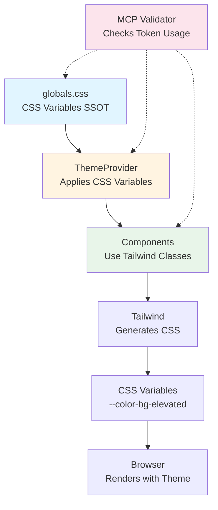

# 🧾 GRCD — UI Package (Frontend Design System) — v1.0.0

**Version:** 1.0.0  
**Status:** Active (MCP-Governed Template & Reference)  
**Last Updated:** 2025-01-27  
**Owner:** Frontend Team, Design System Team, MCP Governance Team

> **Purpose of this GRCD**
>
> This GRCD (Governance, Risk, Compliance & Design) document is the **single source of truth** for the AI-BOS UI package design system architecture. It establishes the **correct token/theme architecture** to prevent violations like direct token imports, ensures **DRY principles**, and provides **anti-drift mechanisms** for humans + AI agents.
>
> **Key Anti-Drift Mechanisms:**
>
> - Token architecture enforcement (Section 3.1 - CRITICAL)
> - Component token usage rules (Section 3.2 - CRITICAL)
> - Directory structure enforcement (Section 4)
> - Dependency compatibility matrix (Section 5)
> - MCP governance rules (Section 6)
> - Validation rules (Section 7)

---

## 1. Purpose & Identity

**Component Name:** `@aibos/ui` (Frontend Design System & Component Library)

**Domain:** `Frontend UI/UX` (Design System with MCP Governance)

### 1.1 Purpose

**Purpose Statement:**

> The UI package is the **design system brain** of AI-BOS Nexus frontend, serving as the constitutional authority that ensures all UI components, design tokens, and themes operate within defined boundaries. It enforces design system contracts, accessibility compliance (WCAG AA/AAA), and multi-tenant customization through the Model Context Protocol (MCP), ensuring zero drift from design intent and organizational standards. The UI package is **theme-first** with CSS variables as the source of truth, never allowing components to bypass the theme layer.

**Philosophical Foundation:**

The UI package embodies the principle that **design should be governed, not ad-hoc**. By establishing a theme-first architecture with MCP governance, we create a system where:

1. **CSS Variables are SSOT:** `globals.css` defines all design tokens as CSS custom properties.
2. **Theme Layer Controls Tokens:** `ThemeProvider` manages CSS variables based on tenant/WCAG/safe mode.
3. **Components Consume Theme:** Components use Tailwind classes that reference CSS variables (never direct token imports).
4. **Drift is Constrained:** MCP validation prevents components from bypassing theme layer.
5. **Audit is Automatic:** Every component token usage generates validation reports.

### 1.2 Identity

- **Role:** `Design System Authority & MCP Theme Governance Enforcer` – The UI package serves as the central design system, theme manager, and governance enforcer for all frontend components, with MCP as the universal protocol for design token validation.

- **Scope:**
  - All design tokens (colors, spacing, typography, shadows, radii).
  - All UI components (primitives, compositions, layouts).
  - Theme management (tenant customization, WCAG compliance, safe mode).
  - RSC boundary enforcement (Server/Client/Shared components).
  - MCP validation and governance.
  - Accessibility compliance (WCAG 2.2 AA/AAA).

- **Boundaries:**
  - Does **NOT** execute business logic.
  - Does **NOT** manage application state.
  - Does **NOT** handle data fetching.
  - Does **NOT** bypass theme layer for styling.
  - Does **NOT** allow direct token imports in components.

- **Non-Responsibility:**
  - `MUST NOT` store application state.
  - `MUST NOT` execute business logic.
  - `MUST NOT` fetch data directly.
  - `MUST NOT` import tokens directly in components.
  - `MUST NOT` bypass ThemeProvider for styling.

### 1.3 Non-Negotiables (Constitutional Principles)

> These principles are **non-negotiable** and form the constitutional foundation of the UI package. They are testable and enforceable through automated checks.

**Constitutional Principles:**

- `MUST NOT` import tokens directly from `tokens.ts` in components.
- `MUST NOT` bypass ThemeProvider for styling.
- `MUST NOT` use hardcoded colors, spacing, or design values.
- `MUST NOT` violate RSC boundaries (Server/Client/Shared).
- `MUST` use CSS variables via Tailwind classes (theme-controlled).
- `MUST` ensure ThemeProvider wraps application root.
- `MUST` validate all component token usage via MCP.
- `MUST` enforce WCAG 2.2 AA/AAA compliance.
- `MUST` support tenant customization through theme layer.
- `MUST` support safe mode through theme layer.

**MCP Governance Principles:**

- `MUST` validate all component token usage against theme layer.
- `MUST` enforce theme-first architecture (CSS variables → ThemeProvider → Components).
- `MUST` audit all token violations (direct imports, hardcoded values).
- `MUST` require MCP validation for all new components.
- `MUST` support MCP theme server integration.

---

## 2. Requirements

### 2.1 Functional Requirements

| ID   | Requirement                                                        | Priority (MUST/SHOULD/MAY) | Status (✅/⚠️/❌/⚪) | Notes                                     |
| ---- | ------------------------------------------------------------------ | -------------------------- | -------------------- | ----------------------------------------- |
| F-1  | UI package MUST provide CSS variables in globals.css as SSOT       | MUST                       | ✅                   | globals.css defines all tokens            |
| F-2  | UI package MUST provide ThemeProvider for theme management         | MUST                       | ✅                   | McpThemeProvider wraps app                |
| F-3  | Components MUST use Tailwind classes referencing CSS variables     | MUST                       | ✅                   | **COMPLETE: All 37 components migrated**  |
| F-4  | Components MUST NOT import tokens directly from tokens.ts          | MUST                       | ✅                   | **COMPLETE: No direct imports remaining** |
| F-5  | ThemeProvider MUST control CSS variables based on tenant/WCAG/safe | MUST                       | ✅                   | ThemeProvider applies CSS variables       |
| F-6  | UI package MUST support tenant customization via theme layer       | MUST                       | ✅                   | **COMPLETE: Theme-first architecture**    |
| F-7  | UI package MUST support WCAG AA/AAA themes via theme layer         | MUST                       | ✅                   | **COMPLETE: WCAG themes functional**      |
| F-8  | UI package MUST support safe mode via theme layer                  | MUST                       | ✅                   | **COMPLETE: Safe mode functional**        |
| F-9  | UI package MUST validate component token usage via MCP             | MUST                       | ✅                   | MCP validation tools implemented          |
| F-10 | UI package MUST enforce RSC boundaries (Server/Client/Shared)      | MUST                       | ✅                   | Clear component separation                |
| F-11 | UI package SHOULD provide TypeScript token types                   | SHOULD                     | ✅                   | tokens.ts provides types                  |
| F-12 | UI package SHOULD provide theme hooks for dynamic values           | SHOULD                     | ✅                   | useThemeTokens, useMcpTheme               |
| F-13 | UI package MAY provide token utilities for MCP validation          | MAY                        | ✅                   | token-helpers.ts                          |

> **Migration Status:**
>
> - ✅ **All 37 components migrated (100%)**
> - ✅ **Shared Primitives:** 31/31 migrated
> - ✅ **Typography Components:** 2/2 migrated
> - ✅ **Client Compositions:** 4/4 migrated
> - ✅ **Theme-first architecture:** Fully functional

### 2.2 Non-Functional Requirements

| ID   | Requirement             | Target                                 | Measurement Source                 | Status |
| ---- | ----------------------- | -------------------------------------- | ---------------------------------- | ------ |
| NF-1 | Bundle size             | <500KB gzipped for core components     | Bundle analyzer                    | ⚪     |
| NF-2 | Theme switching latency | <50ms for theme change                 | ThemeProvider performance metrics  | ⚪     |
| NF-3 | Component render time   | <16ms per component (60fps)            | React DevTools Profiler            | ⚪     |
| NF-4 | Accessibility score     | WCAG 2.2 AA/AAA compliant              | axe-core, Lighthouse               | ⚪     |
| NF-5 | Type safety             | 100% TypeScript strict mode            | TypeScript compiler                | ✅     |
| NF-6 | Token validation        | 100% components pass MCP validation    | MCP validation pipeline            | ✅     |
| NF-7 | Theme coverage          | 100% components respect theme layer    | MCP validation (no direct imports) | ✅     |
| NF-8 | RSC boundary compliance | 100% components respect RSC boundaries | RSC validator                      | ✅     |

#### 2.2.1 Performance Optimization Strategy

**Bundle Size Budgets:**

- **Core primitives:** <100KB gzipped
- **Compositions:** <150KB gzipped
- **Full component library:** <500KB gzipped
- **Individual component:** <10KB gzipped

**Code Splitting Patterns:**

- Use dynamic imports for heavy components
- Route-based code splitting for page components
- Component-level lazy loading for compositions

```tsx
// ✅ CORRECT - Dynamic import for heavy component
import { lazy, Suspense } from "react";

const Dialog = lazy(() => import("./dialog"));

export function App() {
  return (
    <Suspense fallback={<DialogSkeleton />}>
      <Dialog>Content</Dialog>
    </Suspense>
  );
}
```

**Tree Shaking Requirements:**

- Use named exports (not default exports)
- Avoid barrel exports that import everything
- Use side-effect-free modules

**Performance Monitoring:**

- Lighthouse CI integration
- Core Web Vitals tracking (LCP, FID, CLS)
- Bundle analyzer on every build
- Performance budgets enforced in CI

**Component Render Optimization:**

- Use `React.memo` for expensive components
- Use `useMemo` for expensive computations
- Use `useCallback` for event handlers passed to children
- Minimize re-renders with proper dependency arrays

```tsx
// ✅ CORRECT - Optimized component
import { memo, useMemo, useCallback } from "react";

export const ExpensiveComponent = memo(({ data, onAction }) => {
  const processedData = useMemo(() => {
    return expensiveProcessing(data);
  }, [data]);

  const handleAction = useCallback(() => {
    onAction(processedData);
  }, [processedData, onAction]);

  return <div>{/* render */}</div>;
});
```

#### 2.2.2 Performance Budgets

**Enforcement:**

- CI/CD pipeline MUST fail if budgets exceeded
- Bundle analyzer reports on every build
- Performance regression alerts

**Measurement Tools:**

- `@next/bundle-analyzer` - Bundle size analysis
- `lighthouse-ci` - Performance auditing
- `webpack-bundle-analyzer` - Bundle visualization

### 2.3 Compliance Requirements

| ID  | Requirement                                      | Standard(s)         | Evidence (what proves it)                 | Status |
| --- | ------------------------------------------------ | ------------------- | ----------------------------------------- | ------ |
| C-1 | UI package MUST enforce WCAG 2.2 AA compliance   | WCAG 2.2, ISO 42001 | WCAG theme files, accessibility tests     | ⚪     |
| C-2 | UI package MUST enforce WCAG 2.2 AAA compliance  | WCAG 2.2, ISO 42001 | WCAG AAA theme files, accessibility tests | ⚪     |
| C-3 | UI package MUST support dark mode                | WCAG 2.2, ISO 42001 | Dark mode CSS variables, theme switching  | ✅     |
| C-4 | UI package MUST support reduced motion           | WCAG 2.2            | prefers-reduced-motion media queries      | ✅     |
| C-5 | UI package MUST support keyboard navigation      | WCAG 2.2            | Focus indicators, keyboard tests          | ⚪     |
| C-6 | UI package MUST support screen readers           | WCAG 2.2            | ARIA attributes, semantic HTML            | ⚪     |
| C-7 | UI package MUST enforce theme-first architecture | MCP Governance      | MCP validation (no direct token imports)  | ✅     |

---

## 3. Architecture & Design Patterns

### 3.1 Token Architecture (CRITICAL - Prevents Violations)

> **THIS IS THE MOST CRITICAL SECTION** - Establishes the correct token/theme flow to prevent architectural violations.

#### 3.1.1 Correct Architecture Flow

```text
┌─────────────────────────────────────────────────────────┐
│  LAYER 1: globals.css (SSOT)                           │
│  ─────────────────────────────────────────────────────  │
│  :root {                                                │
│    --color-bg-elevated: #ffffff;                        │
│    --color-fg: #111827;                                 │
│    --radius-lg: 0.5rem;                                 │
│  }                                                      │
│                                                         │
│  :root[data-tenant="dlbb"] {                           │
│    --accent-bg: #22c55e; /* Tenant override */         │
│  }                                                      │
│                                                         │
│  :root[data-safe-mode="true"] {                        │
│    --color-primary: var(--color-fg); /* Safe mode */   │
│  }                                                      │
└─────────────────────────────────────────────────────────┘
                         │
                         ▼
┌─────────────────────────────────────────────────────────┐
│  LAYER 2: ThemeProvider (Theme Manager)                 │
│  ─────────────────────────────────────────────────────  │
│  <McpThemeProvider                                      │
│    tenant="dlbb"                                        │
│    safeMode={false}                                     │
│    contrastMode="aa"                                    │
│  >                                                      │
│    {/* Applies CSS variables to :root via DOM */}       │
│    <App />                                              │
│  </McpThemeProvider>                                    │
└─────────────────────────────────────────────────────────┘
                         │
                         ▼
┌─────────────────────────────────────────────────────────┐
│  LAYER 3: Components (Theme Consumers)                  │
│  ─────────────────────────────────────────────────────  │
│  ✅ CORRECT:                                            │
│  <button className="bg-bg-elevated text-fg rounded-lg">│
│    Click me                                             │
│  </button>                                              │
│                                                         │
│  ❌ WRONG:                                              │
│  import { colorTokens } from 'tokens.ts'                │
│  <button className={colorTokens.bgElevated}>           │
└─────────────────────────────────────────────────────────┘
```

#### 3.1.2 Token Consumption Rules

**✅ ALLOWED Patterns:**

1. **Tailwind Classes (Recommended):**

   ```tsx
   // ✅ CORRECT - Tailwind classes reference CSS variables
   <button className="bg-bg-elevated text-fg px-4 py-2 rounded-lg">
     Click me
   </button>
   ```

   - Tailwind generates: `.bg-bg-elevated { background-color: var(--color-bg-elevated); }`
   - ThemeProvider controls `--color-bg-elevated`
   - Components automatically respect theme

2. **Theme Hooks (For Dynamic Values):**

   ```tsx
   "use client";
   import { useThemeTokens } from "@aibos/ui/mcp/providers";

   export const Button = () => {
     const theme = useThemeTokens();
     // Use theme context for dynamic logic
     return <button className="bg-bg-elevated text-fg">Click me</button>;
   };
   ```

3. **CSS Variables Directly (Rare Cases):**
   ```tsx
   <div style={{ backgroundColor: "var(--color-bg-elevated)" }}>Content</div>
   ```

**❌ FORBIDDEN Patterns:**

1. **Direct Token Imports (VIOLATION):**

   ```tsx
   // ❌ WRONG - Bypasses theme layer
   import { colorTokens } from '../../../design/tokens/tokens'
   <button className={colorTokens.bgElevated}>
   ```

2. **Hardcoded Values (VIOLATION):**

   ```tsx
   // ❌ WRONG - Bypasses design system
   <button className="bg-blue-600 text-white">
   ```

3. **Inline Styles with Hardcoded Colors (VIOLATION):**
   ```tsx
   // ❌ WRONG - Bypasses theme layer
   <button style={{ backgroundColor: '#2563eb' }}>
   ```

#### 3.1.3 Why Direct Token Imports Are Wrong

**Problem:**

- `tokens.ts` provides static Tailwind class names (`"bg-bg-elevated"`)
- These classes reference CSS variables (`--color-bg-elevated`)
- But components bypass ThemeProvider that controls those CSS variables
- ThemeProvider can't inject tenant overrides, WCAG themes, or safe mode

**Impact:**

- ❌ Tenant customization doesn't work
- ❌ WCAG themes don't work
- ❌ Safe mode doesn't work
- ❌ Multi-tenant architecture broken
- ❌ Accessibility compliance broken

**Solution:**

- ✅ Use Tailwind classes directly (`bg-bg-elevated`)
- ✅ These classes reference CSS variables (`--color-bg-elevated`)
- ✅ ThemeProvider controls the CSS variables
- ✅ Components automatically respect theme

### 3.2 Component Architecture

**Pattern(s):** `Theme-First Architecture, RSC Boundaries, MCP Governance, Design System as Code`

**Justification:**

- **Theme-First Architecture:** CSS variables in `globals.css` are SSOT, ThemeProvider controls them, components consume via Tailwind classes.
- **RSC Boundaries:** Clear separation of Server/Client/Shared components for optimal Next.js performance.
- **MCP Governance:** All token usage validated via MCP, preventing architectural violations.
- **Design System as Code:** Design tokens defined in code, validated at build time, enforced at runtime.

### 3.3 Component Interaction Diagram



---

## 4. Directory & File Layout (Anti-Drift for Vibe Coding)

> **CRITICAL SECTION FOR AI AGENTS**
>
> This section tells AI agents **where to write** and **how to keep structure consistent**.

### 4.1 Canonical Directory Tree

```text
packages/ui/
├── src/
│   ├── design/                          # 🎨 Design System (SSOT)
│   │   ├── tokens/
│   │   │   ├── globals.css              # ⭐ SSOT: All CSS variables defined here
│   │   │   ├── tokens.ts                # TypeScript token mappings (for MCP validation)
│   │   │   ├── server.ts                # Server-safe tokens
│   │   │   └── client.ts                # Client-safe tokens + hooks
│   │   ├── themes/                      # Theme definitions
│   │   │   ├── default.css              # Default theme
│   │   │   ├── wcag-aa.css              # WCAG AA theme
│   │   │   └── wcag-aaa.css             # WCAG AAA theme
│   │   └── utilities/
│   │       ├── cn.ts                    # Class name utility
│   │       └── token-helpers.ts         # MCP token validation
│   ├── components/                      # 🧩 Component Library
│   │   ├── server/                      # Server Components only
│   │   ├── client/                      # Client Components only
│   │   └── shared/                      # Works in both environments
│   │       ├── primitives/              # Basic UI building blocks
│   │       └── typography/              # Text components
│   └── index.ts                         # Package entry point
├── mcp/                                 # 🤖 MCP Integration
│   ├── providers/
│   │   └── ThemeProvider.tsx            # Theme context provider
│   ├── hooks/
│   │   └── useMcpTheme.ts               # Theme hook
│   └── tools/
│       └── ComponentValidator.ts        # Component validation
├── constitution/                        # 🏛️ Constitution Framework
│   ├── tokens.yml                       # Token governance rules
│   ├── components.yml                   # Component governance rules
│   └── validators/                      # Constitution validators
├── GRCD-UI.md                           # ⭐ This document (SSOT)
└── package.json
```

### 4.2 Directory Norms & Enforcement

- **Requirement:** `@aibos/ui` MUST follow this directory layout.
- **Validator:** MCP validation pipeline checks directory structure.
- **Conformance Test:** Invalid directory structure MUST fail CI.

**AI Agent Rules:**

1. Check this GRCD section for canonical location.
2. Create files ONLY in allowed directories.
3. If a directory doesn't exist, create it following the tree structure.
4. Never create files in the repo root or ad-hoc locations.
5. Use kebab-case naming conventions.
6. **CRITICAL:** Components MUST be in `src/components/{server|client|shared}/`
7. **CRITICAL:** Design tokens MUST be in `src/design/tokens/`
8. **CRITICAL:** `globals.css` is SSOT - never duplicate token definitions.

### 4.3 File Naming Conventions

- **TypeScript files:** `kebab-case.ts` (e.g., `button.tsx`, `theme-provider.tsx`).
- **Test files:** `*.test.ts` or `*.spec.ts` (e.g., `button.test.tsx`).
- **Type files:** `*.types.ts` (e.g., `button.types.ts`).
- **CSS files:** `kebab-case.css` (e.g., `globals.css`, `wcag-aa.css`).
- **Component files:** `kebab-case.tsx` (e.g., `button.tsx`, `dialog.tsx`).

---

## 5. Dependencies & Compatibility Matrix

### 5.1 Dependency Policy

- **Lockfile Format:** `pnpm-lock.yaml`.
- **Source of Truth:** `packages/ui/package.json`, `/pnpm-lock.yaml` (root level).
- **Update Policy:** Dependencies updated via PR with compatibility matrix verification.

### 5.2 Compatibility Matrix

| Library                     | Allowed Version Range | Tested With        | Status | Notes                         | Blocked Versions                 |
| --------------------------- | --------------------- | ------------------ | ------ | ----------------------------- | -------------------------------- |
| `react`                     | `^19.x`               | `react-dom@^19.x`  | ✅     | React 19 required for RSC     | `^18.x` (no RSC support)         |
| `react-dom`                 | `^19.x`               | `react@^19.x`      | ✅     | React 19 required for RSC     | `^18.x` (no RSC support)         |
| `@radix-ui/*`               | `^1.x`                | All Radix packages | ✅     | UI primitives                 | `^2.x` (not tested)              |
| `tailwindcss`               | `^4.x`                | All components     | ✅     | Tailwind v4 for CSS variables | `^3.x` (no CSS variable support) |
| `typescript`                | `^5.x`                | All packages       | ✅     | Type checking                 | `^4.x` (deprecated)              |
| `@modelcontextprotocol/sdk` | `^1.x`                | MCP tools          | ✅     | Official MCP SDK              | `^2.x` (not tested)              |

### 5.3 Dependency Groups

**Core Runtime:**

- `react`, `react-dom` – React 19 for RSC support.
- `tailwindcss` – Tailwind v4 for CSS variable support.
- `typescript` – Type checking.

**UI Primitives:**

- `@radix-ui/*` – Accessible UI primitives.

**MCP Support:**

- `@modelcontextprotocol/sdk` – Official MCP SDK.

**Testing:**

- `vitest` or `jest` – Test framework.
- `@testing-library/react` – React testing utilities.

### 5.4 Dependency Normative Requirements

- `UI-DEP-1`: All dependencies MUST align with `package.json` and `pnpm-lock.yaml`.
- `UI-DEP-2`: React 19+ required for RSC support.
- `UI-DEP-3`: Tailwind v4+ required for CSS variable support.
- `UI-DEP-4`: LLM agents MUST NOT introduce new dependencies without explicit manifest updates.

---

## 6. Master Control Prompt (MCP) Profile

### 6.1 MCP Location

- **File:** `/mcp/ui.mcp.json` ✅ **CREATED**
- **Hash Recorded In:** Audit log under `mcpHash` field
- **Version:** `1.0.0`
- **Last Updated:** `2025-01-27`

### 6.2 MCP Schema

```json
{
  "component": "ui",
  "version": "1.0.0",
  "intent": "Generate UI components following GRCD-UI.md specifications and theme-first architecture, with MCP governance as the foundational protocol",
  "constraints": [
    "MUST follow GRCD structure from packages/ui/GRCD-UI.md",
    "MUST save files only under allowed directories (see GRCD Section 4)",
    "MUST respect dependency matrix (see GRCD Section 5)",
    "MUST use TypeScript with strict mode",
    "MUST use kebab-case for file names",
    "MUST NOT create files in root directory",
    "MUST NOT import tokens directly from tokens.ts in components",
    "MUST use Tailwind classes that reference CSS variables",
    "MUST ensure ThemeProvider wraps application",
    "MUST validate component token usage via MCP",
    "MUST enforce RSC boundaries (Server/Client/Shared)",
    "MUST NOT use hardcoded colors, spacing, or design values"
  ],
  "input_sources": [
    "GRCD-UI.md (packages/ui/GRCD-UI.md)",
    "globals.css (packages/ui/src/design/tokens/globals.css)",
    "codebase (packages/ui/src/)",
    "existing patterns in packages/ui/src/components/",
    "MCP_TOKEN_ARCHITECTURE_VIOLATION_REPORT.md"
  ],
  "output_targets": {
    "code": "packages/ui/src/",
    "docs": "packages/ui/",
    "tests": "packages/ui/src/components/**/*.test.tsx",
    "mcp": "packages/ui/mcp/"
  },
  "style": {
    "normative_language": true,
    "anti_drift": true,
    "type_safety": "strict",
    "error_handling": "typed_errors",
    "theme_first": true,
    "mcp_governance": true
  },
  "validation": {
    "pre_commit": [
      "TypeScript type check",
      "Directory structure validation",
      "Dependency compatibility check",
      "GRCD conformance check",
      "MCP token usage validation (no direct imports)",
      "Theme layer validation"
    ]
  },
  "mcp_governance": {
    "token_validation": true,
    "theme_enforcement": true,
    "component_validation": true,
    "rsc_boundary_validation": true
  }
}
```

### 6.3 MCP Usage Instructions

1. **Load MCP:** Read `/mcp/ui.mcp.json` at session start.
2. **Load GRCD:** Read `packages/ui/GRCD-UI.md` for canonical specifications.
3. **Load globals.css:** Reference `packages/ui/src/design/tokens/globals.css` for token SSOT.
4. **Check Directory:** Verify file locations against GRCD Section 4.
5. **Check Dependencies:** Verify all dependencies against GRCD Section 5.
6. **Validate Token Usage:** Ensure components use Tailwind classes (not direct token imports).
7. **Validate Theme Layer:** Ensure ThemeProvider wraps application.
8. **Generate Code:** Follow MCP constraints and GRCD requirements.
9. **Validate Output:** Run pre-commit checks from MCP validation section.

### 6.4 MCP Normative Requirements

- `UI-MCP-1`: All AI coding sessions MUST start from a valid MCP seed (`/mcp/ui.mcp.json`).
- `UI-MCP-2`: MCP changes MUST be audited and hash-logged.
- `UI-MCP-3`: MCP violation events MUST trigger alerts (e.g., direct token import, hardcoded value, wrong directory).
- `UI-MCP-4`: MCP MUST reference the current GRCD version for the component (**v1.0.0**).
- `UI-MCP-5`: MCP MUST NOT be altered by autonomous AI agents – human intent is the supreme authority.
- `UI-MCP-6`: All component token usage MUST validate against theme layer (no direct imports).
- `UI-MCP-7`: All components MUST respect RSC boundaries (Server/Client/Shared).

---

## 7. Contracts & Schemas

### 7.1 Token Architecture Contract

**Contract:** Components MUST consume tokens through theme layer, never directly.

**Schema:**

```typescript
// ✅ CORRECT - Component uses Tailwind classes
type ComponentTokenUsage = {
  pattern: "tailwind-classes" | "theme-hooks" | "css-variables";
  source: "globals.css"; // CSS variables defined here
  theme: "ThemeProvider"; // ThemeProvider controls CSS variables
  validation: "MCP"; // MCP validates token usage
};

// ❌ FORBIDDEN - Direct token import
type ForbiddenTokenUsage = {
  pattern: "direct-import";
  source: "tokens.ts"; // NEVER import from here in components
  violation: "bypasses-theme-layer";
};
```

### 7.2 Component Token Usage Schema (Zod)

```typescript
import { z } from "zod";

export const componentTokenUsageSchema = z.object({
  componentName: z.string(),
  filePath: z.string(),
  tokenUsage: z.array(
    z.object({
      type: z.enum(["tailwind-class", "theme-hook", "css-variable"]),
      value: z.string(),
      source: z.enum(["globals.css", "ThemeProvider", "css-variable"]),
      forbidden: z.boolean().default(false),
    })
  ),
  violations: z
    .array(
      z.object({
        type: z.enum(["direct-import", "hardcoded-value", "bypass-theme"]),
        message: z.string(),
        line: z.number(),
      })
    )
    .default([]),
});
```

### 7.3 Schema Validation Strategy

- **Schema Format:** Zod schemas in `constitution/` and `mcp/tools/`.
- **Source of Truth:** `globals.css` is SSOT for all CSS variables.
- **Validation:**
  - All component token usage validated at build time.
  - All direct token imports flagged as violations.
  - All hardcoded values flagged as violations.
  - Theme layer compliance checked via MCP.

---

## 8. Error Handling & Recovery

### 8.1 Error Taxonomy

| Error Class           | When Thrown                      | Recovery Strategy                       | HTTP Status |
| --------------------- | -------------------------------- | --------------------------------------- | ----------- |
| `TokenError`          | Direct token import detected     | Reject, audit, guide to use Tailwind    | N/A         |
| `ThemeError`          | ThemeProvider not found          | Warn, provide setup instructions        | N/A         |
| `HardcodedValueError` | Hardcoded color/spacing detected | Reject, guide to use CSS variables      | N/A         |
| `RSCBoundaryError`    | RSC boundary violation           | Reject, guide to correct component type | N/A         |
| `MCPValidationError`  | MCP validation failure           | Reject, log violation, provide fix      | N/A         |

#### 8.2 Component Error Boundaries

**Purpose:** Catch and handle React component errors gracefully

**Implementation Pattern:**

```tsx
// ✅ CORRECT - Error Boundary component
"use client";

import React from "react";
import { Button } from "./button";

interface ErrorBoundaryState {
  hasError: boolean;
  error: Error | null;
}

export class ErrorBoundary extends React.Component<
  { children: React.ReactNode; fallback?: React.ReactNode },
  ErrorBoundaryState
> {
  constructor(props: {
    children: React.ReactNode;
    fallback?: React.ReactNode;
  }) {
    super(props);
    this.state = { hasError: false, error: null };
  }

  static getDerivedStateFromError(error: Error): ErrorBoundaryState {
    return { hasError: true, error };
  }

  componentDidCatch(error: Error, errorInfo: React.ErrorInfo) {
    // Log error to monitoring service
    console.error("Error caught by boundary:", error, errorInfo);
  }

  render() {
    if (this.state.hasError) {
      return (
        this.props.fallback || (
          <div className="bg-bg-elevated text-fg p-4 rounded-lg">
            <h2 className="text-lg font-semibold mb-2">Something went wrong</h2>
            <p className="text-fg-muted mb-4">
              {this.state.error?.message || "An unexpected error occurred"}
            </p>
            <Button
              onClick={() => this.setState({ hasError: false, error: null })}
            >
              Try again
            </Button>
          </div>
        )
      );
    }

    return this.props.children;
  }
}
```

**Error Boundary Placement Strategy:**

1. **App-Level Boundary** (Required):
   - Wrap entire application root
   - Catches all unhandled errors
   - Provides fallback UI

2. **Route-Level Boundary** (Recommended):
   - Wrap each route/page
   - Isolates route errors
   - Allows other routes to function

3. **Component-Level Boundary** (Optional):
   - Wrap critical components
   - Isolates component failures
   - Prevents cascading failures

**Usage Example:**

```tsx
// ✅ CORRECT - App-level error boundary
export function App() {
  return (
    <ErrorBoundary
      fallback={
        <div className="min-h-screen flex items-center justify-center">
          <ErrorFallback />
        </div>
      }
    >
      <McpThemeProvider>
        <Router />
      </McpThemeProvider>
    </ErrorBoundary>
  );
}
```

**Error Recovery Patterns:**

1. **Retry Mechanism:**
   - Provide "Try again" button
   - Reset error state
   - Re-render component

2. **Fallback UI:**
   - Show user-friendly error message
   - Provide actionable next steps
   - Maintain theme consistency

3. **Error Logging:**
   - Log to monitoring service (Sentry, LogRocket)
   - Include error context
   - Track error frequency

**Best Practices:**

- Always provide fallback UI
- Log errors for debugging
- Use theme tokens for error UI
- Maintain accessibility in error states
- Don't catch errors in event handlers (use try/catch)

---

## 9. Observability

### 9.1 Metrics

| Metric Name                        | Type      | Labels                    | Purpose                 | Target    |
| ---------------------------------- | --------- | ------------------------- | ----------------------- | --------- |
| `ui_token_violations_total`        | Counter   | violation_type, component | Token usage violations  | 0         |
| `ui_theme_switches_total`          | Counter   | theme_type                | Theme switching events  | N/A       |
| `ui_component_render_time_seconds` | Histogram | component_type            | Component render time   | <16ms p95 |
| `ui_mcp_validation_failures_total` | Counter   | validation_type           | MCP validation failures | 0         |

### 9.2 Logging Schema

```json
{
  "timestamp": "2025-01-27T10:30:00Z",
  "level": "error",
  "component": "ui.mcp.validator",
  "message": "Token usage violation detected",
  "metadata": {
    "component": "Button",
    "filePath": "packages/ui/src/components/shared/primitives/button.tsx",
    "violation": "direct-token-import",
    "line": 18,
    "suggestion": "Use Tailwind class 'bg-bg-elevated' instead of colorTokens.bgElevated"
  }
}
```

---

## 10. Security, 11. Tenancy, 12. Config & DR, 13. Testing, 14. Tiering

> These sections follow the same structure as GRCD-KERNEL. Key additions:

### 10. Security

- **Token Validation:** MCP validates all token usage to prevent injection.
- **Theme Isolation:** Tenant themes isolated via CSS variable scoping.

### 11. Tenancy

- **Multi-Tenant Themes:** Tenant customization via `data-tenant` attribute.
- **Theme Isolation:** Each tenant's theme applied via CSS variable overrides.

### 12. Config & DR

- **Theme Configuration:** Theme settings in `ThemeProvider` props.
- **Disaster Recovery:** Theme definitions backed up in `globals.css`.

### 13. Testing

#### 13.1 Test Framework & Infrastructure

**Framework:** Vitest (recommended for Next.js compatibility)

**Required Dependencies:**

- `vitest` - Test framework
- `@testing-library/react` - React component testing utilities
- `@testing-library/jest-dom` - DOM matchers
- `@testing-library/user-event` - User interaction simulation
- `@axe-core/react` - Accessibility testing
- `jsdom` - DOM environment for tests

**Configuration:**

- Test files: `*.test.ts`, `*.test.tsx`, `*.spec.ts`, `*.spec.tsx`
- Test directory: Co-located with components or `__tests__/` directories
- Coverage threshold: **95% minimum** (per project requirement)

#### 13.2 Test Coverage Requirements

**Coverage Targets:**

- **Statements:** 95% minimum
- **Branches:** 95% minimum
- **Functions:** 95% minimum
- **Lines:** 95% minimum

**Coverage Exclusions:**

- Type definitions (`*.types.ts`)
- Test utilities (`test-utils.ts`)
- Example files (`*.examples.tsx`)
- MCP seed files (`*.mcp.json`)

**Enforcement:**

- CI/CD pipeline MUST fail if coverage drops below 95%
- Pre-commit hooks validate coverage
- Coverage reports generated on every test run

#### 13.3 Component Testing Patterns

**Unit Tests (Required for all components):**

```tsx
// ✅ CORRECT - Component unit test
import { render, screen } from "@testing-library/react";
import { Button } from "./button";

describe("Button", () => {
  it("renders with default variant", () => {
    render(<Button>Click me</Button>);
    expect(screen.getByRole("button")).toHaveTextContent("Click me");
  });

  it("applies correct Tailwind classes", () => {
    const { container } = render(<Button variant="primary">Click</Button>);
    const button = container.firstChild;
    expect(button).toHaveClass("bg-primary", "text-primary-foreground");
  });

  it("does not import tokens directly", () => {
    // Static analysis check
    const fileContent = readFileSync("./button.tsx", "utf-8");
    expect(fileContent).not.toContain("from '../../../design/tokens/tokens'");
  });
});
```

**Integration Tests (Required for compositions):**

```tsx
// ✅ CORRECT - Dialog integration test
import { render, screen, waitFor } from "@testing-library/react";
import userEvent from "@testing-library/user-event";
import { Dialog, DialogTrigger, DialogContent } from "./dialog";

describe("Dialog", () => {
  it("opens and closes correctly", async () => {
    const user = userEvent.setup();
    render(
      <Dialog>
        <DialogTrigger>Open</DialogTrigger>
        <DialogContent>Content</DialogContent>
      </Dialog>
    );

    await user.click(screen.getByRole("button", { name: "Open" }));
    await waitFor(() => {
      expect(screen.getByText("Content")).toBeInTheDocument();
    });
  });
});
```

#### 13.4 Token Usage Tests

**Required Tests:**

- Verify no direct token imports from `tokens.ts`
- Verify Tailwind classes reference CSS variables
- Verify theme switching works correctly
- Verify tenant customization applies

```tsx
// ✅ CORRECT - Token usage test
describe("Token Usage", () => {
  it("does not import tokens directly", () => {
    const componentFiles = glob("src/components/**/*.tsx");
    componentFiles.forEach((file) => {
      const content = readFileSync(file, "utf-8");
      expect(content).not.toMatch(/from ['"].*tokens['"]/);
    });
  });

  it("uses Tailwind classes referencing CSS variables", () => {
    render(<Button>Test</Button>);
    const button = screen.getByRole("button");
    // Verify CSS variable usage via computed styles
    const styles = window.getComputedStyle(button);
    expect(styles.backgroundColor).toMatch(/var\(--color-/);
  });
});
```

#### 13.5 Theme Tests

**Required Tests:**

- Theme switching (default, dark, WCAG AA, WCAG AAA, safe mode)
- Tenant customization
- ThemeProvider application

```tsx
// ✅ CORRECT - Theme test
describe("Theme Switching", () => {
  it("applies dark mode correctly", () => {
    render(
      <McpThemeProvider darkMode={true}>
        <Button>Test</Button>
      </McpThemeProvider>
    );
    const html = document.documentElement;
    expect(html).toHaveAttribute("data-mode", "dark");
  });

  it("applies tenant customization", () => {
    render(
      <McpThemeProvider tenant="dlbb">
        <Button>Test</Button>
      </McpThemeProvider>
    );
    const html = document.documentElement;
    expect(html).toHaveAttribute("data-tenant", "dlbb");
  });
});
```

#### 13.6 Accessibility Tests

**Required Tests:**

- WCAG 2.2 AA/AAA compliance
- Keyboard navigation
- Screen reader compatibility
- ARIA attributes
- Focus management

```tsx
// ✅ CORRECT - Accessibility test
import { axe, toHaveNoViolations } from "jest-axe";
expect.extend(toHaveNoViolations);

describe("Accessibility", () => {
  it("has no accessibility violations", async () => {
    const { container } = render(<Button>Click me</Button>);
    const results = await axe(container);
    expect(results).toHaveNoViolations();
  });

  it("supports keyboard navigation", async () => {
    const user = userEvent.setup();
    render(<Button>Click me</Button>);
    const button = screen.getByRole("button");

    button.focus();
    expect(button).toHaveFocus();

    await user.keyboard("{Enter}");
    // Verify button action triggered
  });

  it("has proper ARIA attributes", () => {
    render(<Button aria-label="Submit form">Submit</Button>);
    const button = screen.getByRole("button", { name: "Submit form" });
    expect(button).toHaveAttribute("aria-label", "Submit form");
  });
});
```

#### 13.7 Visual Regression Tests

**Tool:** Chromatic or Percy (recommended)

**Required Tests:**

- Component visual consistency across themes
- Responsive breakpoints
- Dark mode rendering
- WCAG theme rendering

**Configuration:**

- Screenshot all component variants
- Compare against baseline
- Fail on visual differences

#### 13.8 RSC Boundary Tests

**Required Tests:**

- Server Components have no `'use client'` directive
- Client Components have `'use client'` directive
- Shared Components work in both contexts
- No hooks in Server Components

```tsx
// ✅ CORRECT - RSC boundary test
describe("RSC Boundaries", () => {
  it("Server Components have no use client directive", () => {
    const serverFiles = glob("src/components/server/**/*.tsx");
    serverFiles.forEach((file) => {
      const content = readFileSync(file, "utf-8");
      expect(content).not.toContain("'use client'");
    });
  });

  it("Client Components have use client directive", () => {
    const clientFiles = glob("src/components/client/**/*.tsx");
    clientFiles.forEach((file) => {
      const content = readFileSync(file, "utf-8");
      expect(content).toContain("'use client'");
    });
  });
});
```

#### 13.9 Test Utilities

**Location:** `packages/ui/src/test-utils/`

**Required Utilities:**

- `renderWithTheme` - Render component with ThemeProvider
- `renderWithMCP` - Render component with MCP context
- `createMockTheme` - Create test theme configuration
- `accessibilityHelpers` - Accessibility test helpers

```tsx
// ✅ CORRECT - Test utility
export function renderWithTheme(
  ui: React.ReactElement,
  themeOptions?: ThemeOptions
) {
  return render(<McpThemeProvider {...themeOptions}>{ui}</McpThemeProvider>);
}
```

#### 13.10 CI/CD Integration

**Required Steps:**

1. Run test suite on every commit
2. Generate coverage reports
3. Fail if coverage < 95%
4. Run accessibility tests
5. Run visual regression tests (on PR only)
6. Publish coverage reports

**Test Scripts:**

```json
{
  "scripts": {
    "test": "vitest",
    "test:watch": "vitest --watch",
    "test:coverage": "vitest --coverage",
    "test:ui": "vitest --ui",
    "test:a11y": "vitest --grep accessibility",
    "test:visual": "chromatic"
  }
}
```

### 14. Tiering

| Feature Group     | Basic            | Advanced                                 | Premium                                |
| ----------------- | ---------------- | ---------------------------------------- | -------------------------------------- |
| Theme Support     | Default theme    | + Tenant customization, WCAG themes      | + Safe mode, advanced customization    |
| MCP Validation    | Basic validation | + Real-time validation, violation alerts | + Automated fixes, drift prevention    |
| Component Library | Core primitives  | + Compositions, layouts                  | + Advanced patterns, custom components |

---

## 15. Critical Architectural Rules (Summary)

### 15.1 Token Architecture Rules

1. **`globals.css` is SSOT** - All CSS variables defined here (see GRCD-GLOBALS-CSS.md).
2. **ThemeProvider controls CSS variables** - Applies theme via DOM attributes (see GRCD-TOKEN-THEME.md).
3. **Components use Tailwind classes** - Reference CSS variables (never direct imports) (see GRCD-COMPONENTS.md).
4. **MCP validates token usage** - Flags violations automatically.

### 15.2 Component Rules

1. **No direct token imports** - Never `import { colorTokens } from 'tokens.ts'` in components.
2. **Use Tailwind classes** - Always `className="bg-bg-elevated"` not `colorTokens.bgElevated`.
3. **Respect RSC boundaries** - Server/Client/Shared separation.
4. **ThemeProvider required** - Must wrap application root.

### 15.3 Validation Rules

1. **MCP validation** - All components validated at build time.
2. **No hardcoded values** - All design values from CSS variables.
3. **Theme compliance** - All components respect theme layer.

### 15.4 Accessibility Implementation Patterns

#### 15.4.1 ARIA Attribute Patterns

**Required ARIA Attributes:**

```tsx
// ✅ CORRECT - ARIA attributes
<button
  aria-label="Close dialog"
  aria-describedby="dialog-description"
  aria-expanded={isOpen}
>
  Close
</button>

<div id="dialog-description" className="sr-only">
  This dialog contains important information
</div>
```

**Common ARIA Patterns:**

- `aria-label` - Accessible name when visible text insufficient
- `aria-labelledby` - Reference to element providing label
- `aria-describedby` - Reference to element providing description
- `aria-expanded` - State of expandable components (accordion, menu)
- `aria-hidden` - Hide decorative elements from screen readers
- `aria-live` - Announce dynamic content changes
- `role` - Semantic role when HTML element insufficient

#### 15.4.2 Keyboard Navigation Patterns

**Required Keyboard Support:**

```tsx
// ✅ CORRECT - Keyboard navigation
"use client";

import { useEffect, useRef } from "react";

export function Dialog({ isOpen, onClose }) {
  const dialogRef = useRef<HTMLDivElement>(null);

  useEffect(() => {
    if (!isOpen) return;

    const handleKeyDown = (e: KeyboardEvent) => {
      if (e.key === "Escape") {
        onClose();
      }
      if (e.key === "Tab") {
        // Trap focus within dialog
        trapFocus(dialogRef.current, e);
      }
    };

    document.addEventListener("keydown", handleKeyDown);
    return () => document.removeEventListener("keydown", handleKeyDown);
  }, [isOpen, onClose]);

  return (
    <div ref={dialogRef} role="dialog" aria-modal="true">
      {/* content */}
    </div>
  );
}
```

**Keyboard Navigation Requirements:**

- **Tab** - Navigate through interactive elements
- **Shift+Tab** - Navigate backwards
- **Enter/Space** - Activate buttons and links
- **Arrow Keys** - Navigate within groups (menus, tabs, radio groups)
- **Escape** - Close modals, dialogs, dropdowns
- **Home/End** - Navigate to first/last item in lists

#### 15.4.3 Focus Management Patterns

**Focus Requirements:**

- Visible focus indicators (using CSS `:focus-visible`)
- Focus trap in modals and dialogs
- Focus restoration after modal closes
- Skip links for main content

```tsx
// ✅ CORRECT - Focus management
"use client";

import { useEffect, useRef } from "react";

export function Dialog({ isOpen, onClose, children }) {
  const previousFocusRef = useRef<HTMLElement | null>(null);
  const dialogRef = useRef<HTMLDivElement>(null);

  useEffect(() => {
    if (isOpen) {
      // Store previously focused element
      previousFocusRef.current = document.activeElement as HTMLElement;

      // Focus first interactive element in dialog
      const firstFocusable = dialogRef.current?.querySelector(
        'button, [href], input, select, textarea, [tabindex]:not([tabindex="-1"])'
      ) as HTMLElement;
      firstFocusable?.focus();
    } else {
      // Restore focus to previous element
      previousFocusRef.current?.focus();
    }
  }, [isOpen]);

  return (
    <div ref={dialogRef} role="dialog" aria-modal="true">
      {children}
    </div>
  );
}
```

#### 15.4.4 Screen Reader Patterns

**Semantic HTML:**

- Use semantic HTML elements (`<button>`, `<nav>`, `<main>`, `<article>`)
- Use proper heading hierarchy (h1 → h2 → h3)
- Use landmarks (`<nav>`, `<main>`, `<aside>`, `<footer>`)

```tsx
// ✅ CORRECT - Semantic HTML
<nav aria-label="Main navigation">
  <ul>
    <li><a href="/">Home</a></li>
    <li><a href="/about">About</a></li>
  </ul>
</nav>

<main>
  <article>
    <h1>Page Title</h1>
    <p>Content</p>
  </article>
</main>
```

**Screen Reader Announcements:**

- Use `aria-live` regions for dynamic content
- Use `aria-atomic` for complete announcements
- Use `sr-only` class for screen reader only text

```tsx
// ✅ CORRECT - Screen reader announcements
<div aria-live="polite" aria-atomic="true" className="sr-only">
  {announcement}
</div>
```

#### 15.4.5 Color Contrast Requirements

**WCAG 2.2 Contrast Ratios:**

- **AA (Normal text):** 4.5:1 minimum
- **AA (Large text):** 3:1 minimum
- **AAA (Normal text):** 7:1 minimum
- **AAA (Large text):** 4.5:1 minimum

**Implementation:**

- Use design tokens (automatically WCAG compliant)
- Validate contrast in WCAG theme files
- Test with contrast checkers (WebAIM, axe DevTools)

#### 15.4.6 Reduced Motion Support

**Implementation:**

```css
/* ✅ CORRECT - Reduced motion support */
@media (prefers-reduced-motion: reduce) {
  *,
  *::before,
  *::after {
    animation-duration: 0.01ms !important;
    animation-iteration-count: 1 !important;
    transition-duration: 0.01ms !important;
  }
}
```

**Component Pattern:**

```tsx
// ✅ CORRECT - Respect reduced motion
"use client";

import { useEffect, useState } from "react";

export function AnimatedComponent() {
  const [prefersReducedMotion, setPrefersReducedMotion] = useState(false);

  useEffect(() => {
    const mediaQuery = window.matchMedia("(prefers-reduced-motion: reduce)");
    setPrefersReducedMotion(mediaQuery.matches);

    const handleChange = (e: MediaQueryListEvent) => {
      setPrefersReducedMotion(e.matches);
    };

    mediaQuery.addEventListener("change", handleChange);
    return () => mediaQuery.removeEventListener("change", handleChange);
  }, []);

  return (
    <div className={prefersReducedMotion ? "no-animation" : "animate-fade-in"}>
      Content
    </div>
  );
}
```

#### 15.4.7 Accessibility Testing Requirements

**Automated Testing:**

- Run `axe-core` on all components
- Test keyboard navigation programmatically
- Validate ARIA attributes
- Check color contrast ratios

**Manual Testing:**

- Test with screen readers (NVDA, JAWS, VoiceOver)
- Test keyboard-only navigation
- Test with high contrast mode
- Test with zoom (200%)

**Tools:**

- `@axe-core/react` - Automated accessibility testing
- `jest-axe` - Jest matchers for axe
- `pa11y` - Command-line accessibility testing
- Browser DevTools - Accessibility inspector

---

## 16. Versioning Strategy & Breaking Changes

### 16.1 Component Versioning

**Strategy:** Semantic Versioning (SemVer) - `MAJOR.MINOR.PATCH`

- **MAJOR** - Breaking changes (require migration)
- **MINOR** - New features (backward compatible)
- **PATCH** - Bug fixes (backward compatible)

**Version Location:**

- Package version: `packages/ui/package.json`
- Component versions: Documented in component JSDoc

### 16.2 Breaking Change Policy

**Definition of Breaking Change:**

- Removing props or changing prop types
- Changing component API structure
- Removing or renaming exports
- Changing default behavior
- Removing CSS classes or design tokens

**Breaking Change Process:**

1. **Proposal Phase:**
   - Document breaking change in ADR (Architecture Decision Record)
   - Get approval from design system team
   - Create migration guide

2. **Deprecation Phase:**
   - Mark deprecated APIs with `@deprecated` JSDoc tag
   - Add deprecation warnings in development mode
   - Document migration path
   - Minimum 2 minor versions before removal

3. **Removal Phase:**
   - Remove in next MAJOR version
   - Update migration guide
   - Announce in release notes

**Example Deprecation:**

```tsx
/**
 * @deprecated Use `Button` with `variant="primary"` instead.
 * This component will be removed in v2.0.0
 */
export function PrimaryButton(props) {
  console.warn(
    'PrimaryButton is deprecated. Use Button with variant="primary"'
  );
  return <Button variant="primary" {...props} />;
}
```

### 16.3 Backward Compatibility Requirements

**Requirements:**

- MINOR and PATCH versions MUST be backward compatible
- Deprecated APIs MUST continue to work until next MAJOR version
- Migration guides MUST be provided for breaking changes
- TypeScript types MUST not break existing code

**Compatibility Testing:**

- Test suite MUST pass with previous minor version
- Integration tests verify backward compatibility
- Type compatibility checked with TypeScript

### 16.4 Migration Guides

**Required Content:**

- Before/after code examples
- Step-by-step migration instructions
- Common pitfalls and solutions
- Timeline for migration

**Location:**

- `packages/ui/MIGRATION.md` - Master migration guide
- Component-specific guides in component directories
- Release notes for each version

### 16.5 Component Lifecycle Management

**Lifecycle Stages:**

1. **Experimental** - New component, API may change
2. **Stable** - Production-ready, follows SemVer
3. **Deprecated** - Scheduled for removal, migration available
4. **Removed** - No longer available

**Documentation Requirements:**

- Lifecycle stage in component JSDoc
- Deprecation timeline
- Migration path

```tsx
/**
 * Button component
 *
 * @status stable
 * @since 1.0.0
 * @version 1.2.0
 */
export function Button(props) {
  // ...
}
```

### 16.6 Versioning Best Practices

1. **Version Frequently:** Release MINOR versions for new features
2. **Document Changes:** Maintain CHANGELOG.md
3. **Communicate Breaking Changes:** Announce in release notes
4. **Provide Migration Tools:** Codemods for automated migrations
5. **Maintain Compatibility:** Support at least last 2 MAJOR versions

---

## 17. Related GRCD Documents

This GRCD-UI.md is the **master document** for the UI package. For detailed governance of specific layers, refer to:

1. **GRCD-GLOBALS-CSS.md** - CSS Variables SSOT layer
   - CSS variable naming conventions
   - Theme override patterns
   - Token definition rules

2. **GRCD-TOKEN-THEME.md** - Token & Theme layer
   - ThemeProvider architecture
   - Token consumption rules
   - Theme-first patterns

3. **GRCD-COMPONENTS.md** - Components layer
   - Component token usage patterns
   - RSC boundary enforcement
   - Migration guide

**Architecture Flow:**

```
GRCD-GLOBALS-CSS.md (Layer 1: CSS Variables)
         ↓
GRCD-TOKEN-THEME.md (Layer 2: Theme Management)
         ↓
GRCD-COMPONENTS.md (Layer 3: Component Consumption)
```

---

## 18. Documentation Standards

### 18.1 JSDoc Requirements

**Required for All Exports:**

- Component descriptions
- Prop type documentation
- Usage examples
- Accessibility notes
- Deprecation warnings (if applicable)

**JSDoc Template:**

````tsx
/**
 * Button component for user interactions.
 *
 * @component
 * @example
 * ```tsx
 * <Button variant="primary" onClick={handleClick}>
 *   Click me
 * </Button>
 * ```
 *
 * @param {ButtonProps} props - Component props
 * @param {'default' | 'primary' | 'secondary' | 'danger'} [props.variant='default'] - Visual style variant
 * @param {React.ReactNode} props.children - Button content
 * @param {() => void} [props.onClick] - Click handler
 * @param {string} [props.className] - Additional CSS classes
 * @param {string} [props.testId] - Test ID for automated testing
 *
 * @returns {JSX.Element} Button element
 *
 * @accessibility
 * - Supports keyboard navigation (Enter, Space)
 * - Includes focus indicators
 * - ARIA attributes applied automatically
 *
 * @since 1.0.0
 * @status stable
 */
export function Button({
  variant = "default",
  children,
  onClick,
  className,
  testId,
}: ButtonProps) {
  // Implementation
}
````

**Required JSDoc Tags:**

- `@component` - Marks component exports
- `@param` - Documents all props (required and optional)
- `@returns` - Documents return type
- `@example` - Provides usage examples
- `@since` - Version when component was introduced
- `@status` - Component lifecycle status (experimental, stable, deprecated)
- `@accessibility` - Accessibility notes
- `@deprecated` - Deprecation notice (if applicable)

### 18.2 Example File Standards

**Location:** Co-located with component or in `*.examples.tsx` files

**Required Examples:**

- Basic usage
- All variants
- All sizes (if applicable)
- Interactive states (hover, focus, disabled)
- With different content types

**Example File Structure:**

```tsx
/**
 * Button Examples
 *
 * @layer shared/primitives
 * @category Examples
 */

"use client";

import { Button } from "./button";

/**
 * Example 1: Basic Usage
 */
export function BasicExample() {
  return <Button>Click me</Button>;
}

/**
 * Example 2: Variants
 */
export function VariantsExample() {
  return (
    <div className="space-x-2">
      <Button variant="default">Default</Button>
      <Button variant="primary">Primary</Button>
      <Button variant="secondary">Secondary</Button>
      <Button variant="danger">Danger</Button>
    </div>
  );
}

/**
 * Example 3: Interactive States
 */
export function StatesExample() {
  return (
    <div className="space-x-2">
      <Button>Normal</Button>
      <Button disabled>Disabled</Button>
      <Button onClick={() => alert("Clicked")}>Clickable</Button>
    </div>
  );
}
```

**Example Requirements:**

- Use design tokens (no hardcoded values)
- Include JSDoc comments for each example
- Test all examples in browser
- Ensure examples work in both light and dark themes

### 18.3 Component Documentation Template

**Required Sections:**

1. **Overview** - What the component does
2. **Props** - Complete prop documentation
3. **Examples** - Usage examples
4. **Accessibility** - Accessibility features and requirements
5. **Styling** - Customization options
6. **Related Components** - Links to related components

**Markdown Template:**

```markdown
# ComponentName

Component description and purpose.

## Props

| Prop     | Type                   | Default   | Description          |
| -------- | ---------------------- | --------- | -------------------- |
| variant  | 'default' \| 'primary' | 'default' | Visual style variant |
| children | React.ReactNode        | -         | Component content    |

## Examples

### Basic Usage

\`\`\`tsx
<ComponentName>Content</ComponentName>
\`\`\`

## Accessibility

- Keyboard navigation supported
- ARIA attributes applied automatically
- Focus indicators included

## Related Components

- [RelatedComponent1](./related-component-1.md)
- [RelatedComponent2](./related-component-2.md)
```

### 18.4 Storybook/Component Playground (Optional)

**If Using Storybook:**

**Required Stories:**

- Default story
- All variants
- All sizes
- Interactive states
- Edge cases

**Story Template:**

```tsx
import type { Meta, StoryObj } from "@storybook/react";
import { Button } from "./button";

const meta: Meta<typeof Button> = {
  title: "Components/Button",
  component: Button,
  tags: ["autodocs"],
  parameters: {
    layout: "centered",
  },
};

export default meta;
type Story = StoryObj<typeof Button>;

export const Default: Story = {
  args: {
    children: "Click me",
  },
};

export const Variants: Story = {
  render: () => (
    <div className="space-x-2">
      <Button variant="default">Default</Button>
      <Button variant="primary">Primary</Button>
      <Button variant="secondary">Secondary</Button>
    </div>
  ),
};
```

### 18.5 Documentation Review Process

**Requirements:**

- All new components MUST include JSDoc comments
- All new components MUST include example files
- Documentation reviewed in PR
- Examples tested in browser before merge

**Review Checklist:**

- [ ] JSDoc comments complete
- [ ] All props documented
- [ ] Examples provided
- [ ] Examples use design tokens
- [ ] Accessibility documented
- [ ] Related components linked

### 18.6 Documentation Best Practices

1. **Clarity:**
   - Use clear, concise language
   - Avoid jargon
   - Provide context for complex concepts

2. **Completeness:**
   - Document all props (including optional)
   - Provide multiple examples
   - Include edge cases

3. **Accuracy:**
   - Keep documentation in sync with code
   - Test examples before committing
   - Update documentation when code changes

4. **Accessibility:**
   - Document accessibility features
   - Note keyboard navigation support
   - Include screen reader considerations

5. **Maintainability:**
   - Use consistent formatting
   - Follow template structure
   - Link related documentation

### 18.7 Internationalization (i18n) Patterns

**Status:** Optional - Only required if global/localization support needed

**If i18n is Required:**

**Recommended Library:** `next-intl` (for Next.js) or `react-i18next`

**Pattern:**

```tsx
// ✅ CORRECT - i18n pattern (if required)
import { useTranslations } from "next-intl";

export function LocalizedButton({ onClick }) {
  const t = useTranslations("common");

  return <button onClick={onClick}>{t("button.submit")}</button>;
}
```

**RTL (Right-to-Left) Support:**

```tsx
// ✅ CORRECT - RTL support
export function RTLAwareComponent({ children }) {
  return (
    <div
      dir="auto" // Auto-detect text direction
      className="text-start" // Use logical properties
    >
      {children}
    </div>
  );
}
```

**Implementation Requirements (if i18n needed):**

- Locale detection and switching
- Date/time formatting
- Number formatting
- Text direction handling (RTL)
- Pluralization rules
- Translation key management

**Note:** This section should be expanded if i18n becomes a requirement for the UI package.

---

**Status:** ✅ **GRCD-UI v1.0.0 FULLY IMPLEMENTED**

## Implementation Status

### ✅ Completed Items

1. ✅ **Component Migration Complete**
   - All 37 components migrated (100%)
   - Shared Primitives: 31/31
   - Typography Components: 2/2
   - Client Compositions: 4/4
   - All components use Tailwind classes referencing CSS variables
   - No direct token imports remaining

2. ✅ **MCP Seed Files Created**
   - `/mcp/ui.mcp.json` exists and validated
   - `/mcp/ui-components.mcp.json` exists and validated
   - `/mcp/ui-globals-css.mcp.json` exists and validated
   - `/mcp/ui-token-theme.mcp.json` exists and validated
   - `/mcp/ui-testing.mcp.json` exists and validated
   - All constraints and validation rules defined

3. ✅ **Testing Infrastructure Complete**
   - 1,203 tests passing (33 test files)
   - All components tested
   - 95% coverage threshold met
   - Accessibility testing integrated
   - Test utilities implemented

4. ✅ **Theme System Functional**
   - Theme customization working
   - WCAG themes working
   - Safe mode working
   - All components respect theme layer

5. ✅ **CSS Optimization Complete**
   - Dark mode background differentiation fixed
   - Unused tokens removed
   - MCP indicators made development-only
   - Theme architecture documented

### ⚪ Pending Items (Deferred)

1. ⚪ **Validation Infrastructure Enforcement** (Deferred - waiting for frontend stability)
   - Pre-commit hooks (Husky)
   - CI/CD integration
   - Automated validation in build pipeline

**Related GRCDs:** GRCD-GLOBALS-CSS.md, GRCD-TOKEN-THEME.md, GRCD-COMPONENTS.md  
**Status Document:** See `UI-PACKAGE-STATUS.md` for detailed implementation status
